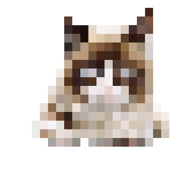

**Pixelating images in terminal**

<p align="center">
  <a href="https://youtu.be/Cj3x51iJdvM"></a>
</p>

- [What this homework is about](#what-this-homework-is-about)
- [Prerequisites](#prerequisites)
- [Here is what you will implement exactly](#here-is-what-you-will-implement-exactly)
- [‼️‼️ Detailed requirements: read this whole section carefully\*\* ‼️‼️](#️️-detailed-requirements-read-this-whole-section-carefully-️️)
  - [The expected project structure](#the-expected-project-structure)
  - [Submodules and the `external` folder](#submodules-and-the-external-folder)
    - [FTXUI library](#ftxui-library)
      - [FTXUI library by example](#ftxui-library-by-example)
      - [What the example does](#what-the-example-does)
    - [The stb library](#the-stb-library)
      - [The stb library by example](#the-stb-library-by-example)
      - [What the example does](#what-the-example-does-1)
  - [The libraries (and CMake targets) that you have to implement](#the-libraries-and-cmake-targets-that-you-have-to-implement)
    - [`pixelator::StbImageDataView` class](#pixelatorstbimagedataview-class)
    - [`pixelator::Image` class](#pixelatorimage-class)
    - [The `pixelator::PixelateImage` function](#the-pixelatorpixelateimage-function)
    - [`pixelator::Drawer` class](#pixelatordrawer-class)
  - [The binary to test your data](#the-binary-to-test-your-data)
  - [Namespace](#namespace)
  - [Tests for libraries](#tests-for-libraries)
- [How your code is checked](#how-your-code-is-checked)
- [That's it!](#thats-it)

## What this homework is about
The aim of this homework is to further familiarize ourselves with creating full projects in C++ using CMake, making use of everything we've learned in the last couple of lectures.

The way we are addressing this is by designing a program that is able to load an image from disk and show its pixelated version directly in the terminal.

So, after you are done, you should be able to call your program with a path to an image and see its pixelated version in the terminal:
```bash
cd homework_5/pixelator
./build/examples/pixelate ~/Pictures/grumpy_cat.png
# The image will be printed after the previous call
```

| Original image  |      Pixelated image      |
| :-------------: | :-----------------------: |
|  |  |

## Prerequisites
Please make sure you've done the previous homework and that you're comfortable with all lectures since that homework until this one. The [readme](../../readme.md) is a convenient way to check this.

## Here is what you will implement exactly
The functionality that you will implement in this homework can be summarized in the following diagram:


While you _will_ implement parts of each of the above boxes, some of the functionality (`Load` and `Draw`) is partially handled by external libraries that you will have to use correctly.

> :bulb: The description of this homework project is quite extensive and might be a bit confusing. It _is_ a larger project if you are a beginner and while I tried to provide as much clarity as possible, the implementation _will_ take a long time. You can count multiple hours (maybe even days) to implement everything described below. This is normal and figuring all of these things out is part of the fun. So give yourself time and enjoy implementing this project as much as you can.

## ‼️‼️ Detailed requirements: read this whole section carefully** ‼️‼️
In this part we will go over each of the block above as well as through the project structure.

### The expected project structure
The project has to be implemented in the `homework_5` folder in your homework repository (that you can [create from this template](https://github.com/cpp-for-yourself/homeworks) if you haven't done so before). If the structure of the project does not follow this guide the automatic checking won't work.

The project must follow the template described in the [CMake](../../lectures/cmake.md) and [GoogleTest](../../lectures/googletest.md) lectures.

Here is how the structure of the project folder will look like:
```bash
homework_5/
└── pixelator/
    ├── CMakeLists.txt
    ├── external
    │   ├── CMakeLists.txt
    │   ├── stb/         # Stb library as a submodule
    │   ├── ftxui/       # Ftxui library as a submodule
    │   └── googletest/  # Googletest library as a submodule
    ├── examples
    │   ├── CMakeLists.txt
    │   ├── pixelate.cpp
    ├── pixelator/
    │   ├── test_data/
    │   │   └── test.png    # Test data, see below
    │   ├── CMakeLists.txt  # Defines all libraries
    │   ├── pixelate_image.hpp
    │   ├── pixelate_image.cpp
    │   ├── pixelate_image_test.cpp
    │   └── # rest of your files
    ├── .clang-format
    └── readme.md  # Description of your project. Go nuts!
```

> :bulb: For your convenience, I am also providing an [empty project skeleton](pixelator) that you will have to fill in with your code.

### Submodules and the `external` folder
In this homework we make use of 3 external libraries:
- [Googletest](https://github.com/google/googletest) to test our code
- [ftxui](https://github.com/ArthurSonzogni/FTXUI) to print stuff to the terminal
- [stb](https://github.com/nothings/stb) to load an image from disk using code in `stb_image.h` file

To add all the submodules, navigate to the `homework_5/pixelator/` folder and execute the following:
```bash
git submodule add https://github.com/ArthurSonzogni/FTXUI.git external/ftxui
git submodule add https://github.com/google/googletest.git external/googletest
git submodule add https://github.com/nothings/stb.git external/stb
```
For your convenience, I am providing the rest of the [`external`](pixelator/external/) folder in the empty [project skeleton](pixelator/).

Below you will find a description of each of the above (excluding Googletests, which you should already be familiar with)

#### FTXUI library
This is a library to print anything your heart desires to the terminal. It is a modern library that is easy to integrate with our code through CMake. We can use the target it generates upon build like this:
```cmake
target_link_libraries(your_target PUBLIC ftxui::screen)
```

> :bulb: It is a good exercise to read the readme of that project to figure out how to use it. You will need this skill _a lot_ in your C++ journey.

##### FTXUI library by example
We will mostly just be using the `ftxui::Screen` and `ftxui::Color` classes from the `ftxui` library. We can use them like this:
```cpp
#include "ftxui/screen/color.hpp"
#include "ftxui/screen/screen.hpp"

namespace {
const ftxui::Color kYellowishColor = ftxui::Color::RGB(255, 200, 100);
}

int main() {
  const ftxui::Dimensions dimensions{ftxui::Dimension::Full()};
  ftxui::Screen screen{ftxui::Screen::Create(dimensions)};
  auto &pixel_left = screen.PixelAt(10, 10);
  pixel_left.background_color = kYellowishColor;
  pixel_left.character = ' ';
  auto &pixel_right = screen.PixelAt(11, 10);
  pixel_right.background_color = kYellowishColor;
  pixel_right.character = ' ';
  screen.Print();
  return 0;
}
```

##### What the example does
- We initialize the dimensions of the screen using the `ftxui` library
- We create an `ftxui::Screen` from these dimensions, which takes up all the space that is available in our terminal
- We take a reference to two "pixels" (actually characters in our terminal) and set them to the color we selected
- We print the `ftxui::Screen` contents to the terminal, which we should see as the output of our program

> :bulb: Note that you can also create dimensions of custom size using `ftxui::Dimension::Fixed(int_size)`, which is useful for tests.

> :bulb: Note that we have to set color to 2 "pixels" in order to print a _square_. If we only set the color to one, we will only print a rectangle instead of a square.

> :bulb: The above example is available in the project skeleton that I provide alongside this homework. You can find this file [here](pixelator/examples/use_ftxui.cpp).

#### The stb library
We use a single header from the `stb` library, namely `stb_image.h` to load our image from disk. For your convenience, this library is also set up as an external library and wrapped into a CMake target `stb::stb` that can be used as follows:
```cmake
target_link_libraries(your_target PUBLIC stb::stb)
```

##### The stb library by example
The `stb` library provides a couple of utilities of interest to us:
- `image_data = stbi_load(...)` that loads the data from the file and returns a raw pointer to `unsigned char` array representing colors of the image in the following order: `RGBARGBARGBA...` where, `RGB` stands for values for the red, green and blue from 0 to 255, and `A` represents transparency
- `stbi_image_free(image_data)` that allows to free the memory allocated to store the image that we loaded from disk

Let's see how we can use these functions in the actual code:
```cpp
// Make sure to have this in EXACTLY one cpp file
// The best place for this is the cpp file of your library
// that holds a class that wraps around the stb_image data
// For more see here: https://github.com/nothings/stb#faq
#define STB_IMAGE_IMPLEMENTATION
#include "stb/stb_image.h"

#include <filesystem>
#include <iostream>

namespace {
static constexpr auto kLoadAllChannels{0};

// A dummy color structure. Use ftxui::Color in actual code.
struct Color {
  int red;
  int green;
  int blue;
};

}  // namespace

int main(int argc, char **argv) {
  if (argc < 2) { std::cerr << "No image provided.\n"; }
  const std::filesystem::path image_path{argv[1]};
  if (!std::filesystem::exists(image_path)) {
    std::cerr << "No image provided.\n";
  }

  // Load the data
  int rows{};
  int cols{};
  int channels{};
  // This call also populates rows, cols, channels.
  auto image_data{
      stbi_load(image_path.c_str(), &cols, &rows, &channels, kLoadAllChannels)};
  std::cout << "Loaded image of size: [" << rows << ", " << cols << "] with "
            << channels << " channels\n";
  if (!image_data) {
    std::cerr << "Failed to load image data from file: " << image_path
              << std::endl;
  }

  // The data is stored sequentially, in this order per pixel: red, green, blue,
  // alpha This patterns repeats for every pixel of the image, so the resulting
  // data layout is: [rgbargbargba...]
  int query_row = 3;
  int query_col = 2;
  const auto index{channels * (query_row * cols + query_col)};
  const Color color{
      image_data[index], image_data[index + 1], image_data[index + 2]};
  std::cout << "Color at pixel: [" << query_row << ", " << query_col
            << "] =  RGB: (" << color.red << ", " << color.green << ", "
            << color.blue << ")\n";

  // We must explicitly free the memory allocated for this image.
  // The reason for this is that stb_image is a C library,
  // which has no classes and no RAII in the form about which we talked before.
  // Now you see why people want to write C++ and not C? ;)
  stbi_image_free(image_data);
  return 0;
}

```

The above example can be built and called as follows:
```bash
./build/examples/use_stb_image pixelator/test_data/test.png
```

##### What the example does
- We get the path provided by the user. This path is stored in `argv[1]`. We convert it to the `std::filesystem::path` and check if the file exists
- We load the image using the `stbi_load` function. Note here that because the function is coming from the C interface, it operates on raw memory. We will have to wrap this raw memory into something that allows us to work with it safely. This function returns us the data stored in the image in the `RGBA` format where each value is an `unsigned char` of value in the range from 0 to 255. It also populates the variables `rows`, `cols` and `channels` the pointers to which we provide into the function call
- We can now query the data that we just loaded. Because the colors are stored in a single array, we have to compute the index of the start of any particular pixel, which we do and store this value in the `index` variable. You will have to use this formula in your code too
- We print the RGB value of the pixel at a given location by taking the appropriate values form the `image_data` array
- We free the memory allocated for our image using the `stbi_image_free` function. Note that we will implement a memory safe wrapper around these data in this exercise

If everything goes well the program will print:
```
Loaded image of size: [6, 4] with 4 channels
Color at pixel: [3, 2] =  RGB: (255, 255, 255)
```

> :bulb: Note that this example is also provided as part of the skeleton for the project so that you can play around with it. You can find it [here](pixelator/examples/use_stb_image.cpp).

### The libraries (and CMake targets) that you have to implement

There will be 4 libraries (more concretely, library CMake targets):
- `stb_image_data_view` - A library that encapsulates the work with the external STB image library and makes using the data loaded from disk nicer
- `image` - A library that encapsulates an image that can be created for example by the `PixelateImage` function from the next point in this list
- `pixelate_image` - A library that provides the function `PixelateImage` that pixelates a provided `StbImageDataView`
- `drawer` - A library that implements a drawer - a class capable of drawing a pixelated image to the terminal


These libraries must all be defined in the `pixelator/CMakeLists.txt` so that the binaries in the `examples` folder and the tests could be linked against those.

Let's specify what these classes must do and, even more importantly, which interface they must follow.

#### `pixelator::StbImageDataView` class
This class must live in the `pixelator/stb_image_data_view.hpp` header file and must be wrapped into a CMake library with the name `stb_image_data_view` so that it can be linked against other targets.

The `StbImageDataView` class wraps the usage of the `stb` external library. It must have the following interface:

```cpp
// There must be a size struct in some file, either this or some other header
struct Size {
  int row;
  int col;
};

// Some path to an image on disk.
const std::filesystem::path image_path{...};
// We must be able to load the image from a path and store its data
// internally in the image object.
// We should also be able to create an empty image
pixelator::StbImageDataView image{image_path};
pixelator::StbImageDataView empty_image{};

// We must have simple accessors
const pixelator::Size size = image.size();
const int rows = image.rows();
const int cols = image.cols();
// Returns true if and only if the image size is 0.
const bool empty = image.empty();

// We must be able to get a color by row and column.
// Note that we return a copy of the color here.
int row = 4;
int col = 2;
const ftxui::Color color = image.at(row, col);

// We should be able to move the images
pixelator::StbImageDataView other_image = std::move(image);
empty_image = std::move(image);

// ❌ The following code must NOT compile, copying the StbImageDataView should
// NOT be allowed
pixelator::StbImageDataView other_image = image;  // ❌ Must not compile
empty_image = image;                              // ❌ Must not compile

// At the end, the StbImageDataView objects should free the underlying memory
// upon destruction.
```

> :bulb: It is your task to figure out which data this class must store. As long as the class correctly conforms to the required interface _what_ is stored within it is not important.

#### `pixelator::Image` class

This class must live in the `pixelator/image.hpp` header file and must be wrapped into a CMake library with the name `image` so that it can be linked against other targets.

This class represents an image that we can modify in our program. Intuitively, it should store a vector of pixel colors and allow us to get and manipulate these colors provided their coordinate. In the following snippet we describe this interface in more detail:

```cpp
// Can be created empty
pixelator::Image empty_image{};

// Can be created with size provided.
const auto rows{42};
const auto cols{23};
pixelator::Image image{rows, cols};

// Has all the useful methods to get its size.
empty_image.empty();  // Should be true.
image.empty();  // Should be false.
image.rows();  // Should be equal to rows.
image.cols();  // Should be equal to cols.
image.size();  // Should return pixelator::Size{rows, cols}.

// Should provide read access to the colors.
// All pixels must be initialized.
image.at(0, 0) == ftxui::Color{};

// Should provide write access to the colors.
const ftxui::Color yellowish{ftxui::Color::RGB(255, 200, 100)};
image.at(4, 2) = yellowish;
image.at(4, 2) == yellowish;  // Should be true.

// We should be able to copy an image
const pixelator::Image image_copy{image};
image_copy.at(4, 2) == yellowish;  // Should be true.

// We should be able to move an image
const pixelator::Image image_moved{std::move(image)};
image_moved.at(4, 2) == yellowish;  // Should be true.
```

#### The `pixelator::PixelateImage` function
This function must be declared in the `pixelator/pixelate_image.hpp` header file and must be wrapped into a CMake library with the name `pixelate_image` so that it can be linked against other targets.

This is the meat of this homework. Intuitively, this function should take the original image (stored as `StbImageDataView`) and the requested new size. It should then return a new `pixelator::Image` object that holds the pixelated version of the original image. Here is this interface in code:

```cpp
// Use the test image provided in the project skeleton for tests.
const auto kImagePath{"../../tui_pixelator/test_data/test.png"};
const pixelator::StbImageDataView image{kImagePath};
const auto pixelated_image = pixelator::PixelateImage(image, pixelator::Size{3, 2});

// Note that if the size is larger than the original image the method returns the pixelator::Image object of the same size as the input image with all the pixels having the same values as the original image.
```

As you can see the interface is quite simple. But the devil is in the detail. You will have to think of a way to "sample" the color when changing to a smaller size.

You will also have to handle the "aspect ratio". Meaning that the scaling factor for both rows and columns should be the same. You can choose it by picking the minimum one as follows:
```cpp
// static_cast<float>(number) converts (aka "casts") a number to float.
const auto factor_cols = smaller_size.cols / static_cast<float>(image.cols());
const auto factor_rows = smaller_size.rows / static_cast<float>(image.rows());
const auto smallest_factor = std::min(factor_cols, factor_rows);
```

You might also make use of a function that can scale the coordinates downwards and upwards depending on the provided scale parameter:
```cpp
int Scale(int number, float factor) {
  return static_cast<int>(number * factor);
}
```

With this you should be well equipped to write this function.

#### `pixelator::Drawer` class
Finally, there should be the `pixelator::Drawer` class in the corresponding header `pixelator/drawer.hpp` that allows, well, to draw the `pixelator::Image` instance to the terminal using the `ftxui` library (more precisely of `ftxui::Screen` class) under the hood.

Here is the interface that this class must conform to:
```cpp
// We should be able to create a drawer either of fixed size or of the maximum size that the terminal is capable of. Read the ftxui docs to understand these parameters better.
pixelator::Drawer full_screen_drawer{ftxui::Dimension::Full()};
pixelator::Drawer fixed_screen_drawer{ftxui::Dimension::Fixed(42)};

// All the following must be true.
// Note that the number of cols should be twice the number of rows, see explanation below the code block.
fixed_screen_drawer.rows() == 42;
fixed_screen_drawer.cols() == 84;
fixed_screen_drawer.size() == Size{42, 84};

// We should be able to set a pixelated image to our drawer.
const auto kImagePath{"../../tui_pixelator/test_data/test.png"};
const pixelator::StbImageDataView image{kImagePath};
const auto pixelated_image = pixelator::PixelateImage(image, pixelator::Size{3, 2});
full_screen_drawer.Set(pixelated_image);

// We should be able to print to the terminal by calling ftxui::Screen functions under the hood.
full_screen_drawer.Draw();  // Draws to the terminal.
full_screen_drawer.ToString();  // Prints to string, used for testing.
```

> :bulb: There is one **important** aspect of the `Drawer` to note here. Remember the example [above](#ftxui-library-by-example) on the usage of `ftxui` and how we had to set 2 columns for 1 row in order to draw a square pixel? We have to do the same trick here. So remember to set the number of columns for the drawer as **double** of the provided rows.

> :bulb: Note that `ftxui::Screen` uses X and Y to describe coordinates, while we use rows and columns. Generally, `rows` correspond to `Y`, while `cols` correspond to `X`. It _is_ confusing, so don't worry if you don't get it right straight away.

### The binary to test your data
The binary that loads an image from disk, pixelates it and outputs it to the terminal, is already provided to you in the project skeleton. You can find it here: [`pixelator/examples/pixelate.cpp`](pixelator/examples/pixelate.cpp).

> :bulb: Note that you will have to add the needed CMake target on your own.

### Namespace
All functions and classes in this project must live in the `pixelator` namespace.

### Tests for libraries
All of the libraries must have unit tests using the `googletest` framework available as a submodule in the project's `external` folder, just like it is presented in the [Googletest](../../lectures/googletest.md) lecture. All of the tests must live in the same folder as the file that contains the code that they test and must be registered through `ctest`.

## How your code is checked
There is a number of levels of checks to satisfy the homework checker bot.
- First, your code will be built as is
- Then your tests will be called
- After that your binary will be called with the test image as input
- Finally, the bot will inject an additional test folder `validation_test` into the root of your project and run the custom-designed tests defined there

Every step above will show up as a separate line in the output from the homework checker in your PR and wiki.

## That's it!
Congratulations! You've implemented this relatively complex project in relatively modern C++! On to the next challenge! Do share your thoughts on the whole process in the [discussions page](https://github.com/orgs/cpp-for-yourself/discussions/categories/general) :pray:
