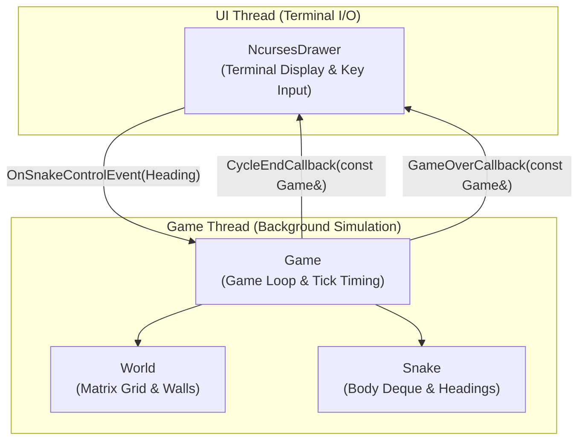

# The Final Project: The Snake Game

<p align="center">
  
</p>

- [What this homework is about](#what-this-homework-is-about)
- [Prerequisites](#prerequisites)
- [How to approach this project (Read this first!)](#how-to-approach-this-project-read-this-first)
- [Architecture and High-Level Overview](#architecture-and-high-level-overview)
- [‼️‼️ Detailed requirements: read this whole section carefully ‼️‼️](#️️-detailed-requirements-read-this-whole-section-carefully-️️)
  - [The expected project structure](#the-expected-project-structure)
  - [External dependencies](#external-dependencies)
  - [The libraries (and CMake targets) that you have to implement](#the-libraries-and-cmake-targets-that-you-have-to-implement)
    - [`snake::core::Vector2D` class template](#snakecorevector2d-class-template)
    - [`snake::core::Matrix` class template](#snakecorematrix-class-template)
    - [`snake::game::Heading` enum and direction operator](#snakegameheading-enum-and-direction-operator)
    - [`snake::game::World` class](#snakegameworld-class)
    - [`snake::game::Snake` class](#snakegamesnake-class)
    - [`snake::game::Game` class (Engine & Concurrency)](#snakegamegame-class-engine--concurrency)
  - [Provided components: CoordinateGenerator & NcursesDrawer](#provided-components-coordinategenerator--ncursesdrawer)
  - [Connecting everything in `main.cpp`](#connecting-everything-in-maincpp)
  - [Writing your own unit tests](#writing-your-own-unit-tests)
  - [Suggested step-by-step milestones](#suggested-step-by-step-milestones)
- [How your code is checked](#how-your-code-is-checked)
- [That's it!](#thats-it)

---

## What this homework is about
Congratulations on reaching the final project of the **C++ for Yourself** course!

In this project, we are going to build a fully playable terminal version of the classic game **Snake**.

The player steers a snake around a bordered arena using the keyboard arrow keys. The objective is to eat randomly spawning fruit to grow in length and increase your score, all while avoiding colliding with the surrounding walls or with the snake's own body.

After you have built the project, you will be able to launch and play your game directly in your terminal:
```bash
cd homework_snake/snake
cmake -B build
cmake --build build
./build/snake/main
```

> :bulb: **Controls:**
> - **Arrow Keys** (Up, Down, Left, Right): Steer the snake.
> - **`q`** or **Escape**: Quit the game.

---

## Prerequisites
Please make sure you are comfortable with the topics covered in previous lectures and homeworks:
- Classes, RAII, and move semantics ([Move Semantics](../../lectures/move_semantics.md))
- Class templates and operator overloading ([Templates](../../lectures/templates.md))
- Using `std::optional` for error handling ([Error Handling](../../lectures/error_handling.md))
- Storing callables and callbacks using `std::function` ([`std::function`](../../lectures/std_function.md))
- Lambdas in modern C++ ([Lambdas](../../lectures/lambdas.md))
- Basic multithreading with `std::thread`, `std::mutex`, and `std::lock_guard` ([Parallelism](../../lectures/parallelism.md))
- Unit testing with GoogleTest and CMake ([CMake](../../lectures/cmake.md), [GoogleTest](../../lectures/googletest.md))

---

## How to approach this project (Read this first!)

> [!IMPORTANT]
> **Take your time — this is a multi-stage project:**
> This final project is intentionally designed to be challenging and substantial. It brings together almost everything you have learned throughout this course.
>
> - **Do not try to rush it in a single sitting.** Treat it as a multi-stage software project. Give yourself multiple days or sessions, taking it strictly one step at a time.
> - **Making mistakes is an essential part of learning.** Expect compiler errors, off-by-one index bugs, and race conditions. Wrestling with these issues, understanding *why* they happened, and solving them yourself is where true engineering competence is forged.
> - **Please resist the urge to use AI assistants (ChatGPT, Copilot, etc.).** Having an AI write the code or debug your logic robs you of the very struggle that turns novice programmers into confident software engineers. You have all the lecture materials, your prior homeworks, and compiler diagnostics. Face the challenge on your own — you can do it!

---

## Architecture and High-Level Overview

To build a robust, testable interactive game, we strictly separate **game logic** from **presentation and user input**. The game simulation lives in its own background thread and communicates with the display drawer purely through callbacks (`std::function`).



Notice how `Game`, `Snake`, and `World` have **zero dependency** on the UI or terminal escape codes! This makes the entire game engine 100% testable in automated headless CI environments without requiring an interactive terminal.

---

## ‼️‼️ Detailed requirements: read this whole section carefully ‼️‼️

### The expected project structure

The project has to be implemented in the `homework_snake` folder in your repository. The directory structure is organized as follows:

```bash
homework_snake/
└── snake/
    ├── CMakeLists.txt
    ├── external/
    │   ├── CMakeLists.txt
    │   ├── cmake/CPM.cmake
    │   ├── gtest.cmake
    │   ├── abseil.cmake
    │   └── fmt.cmake
    ├── examples/
    │   ├── CMakeLists.txt
    │   └── simulate_game.cpp     # Headless simulation for testing/CI
    ├── snake/
    │   ├── CMakeLists.txt
    │   ├── main.cpp              # Game entrypoint
    │   ├── core/
    │   │   ├── CMakeLists.txt
    │   │   ├── vector_2d.h
    │   │   ├── vector_2d.cpp
    │   │   ├── vector_2d_test.cpp
    │   │   ├── matrix.h
    │   │   ├── matrix.cpp
    │   │   └── matrix_test.cpp
    │   ├── game/
    │   │   ├── CMakeLists.txt
    │   │   ├── heading.h
    │   │   ├── coordinate_generator.h  # [Provided]
    │   │   ├── world.h / world.cpp / world_test.cpp
    │   │   ├── snake.h / snake.cpp / snake_test.cpp
    │   │   └── game.h  / game.cpp  / game_test.cpp
    │   └── ui/                         # [Provided]
    │       ├── CMakeLists.txt
    │       ├── terminal_input.h
    │       └── ncurses_drawer.h
    │       └── ncurses_drawer.cpp
    ├── .clang-format
    └── readme.md
```

> :bulb: An empty starter skeleton with boilerplate CMake files, minimal smoke tests, and provided utilities is available in the [`snake`](snake/) folder.

---

### External dependencies

The project relies on three external libraries:
- **Googletest** for unit testing.
- **{fmt}** for formatted terminal string output.
- **Abseil (absl)** for efficient hash containers (`absl::flat_hash_set`).

These are managed automatically via `CPM.cmake` in the `external/` folder. When you configure your CMake project, CPM will automatically fetch the correct versions.

---

### The libraries (and CMake targets) that you have to implement

All your code must live inside the `snake` namespace (e.g. `snake::core` and `snake::game`). Below are the conceptual descriptions and behavioral requirements for each component.

#### `snake::core::Vector2D` class template
- **Header:** `snake/core/vector_2d.h`
- **Target:** Part of CMake library `core`

**Conceptual Role:**
Represents a generic 2D spatial coordinate or direction vector `Vector2D<T>`.

**Requirements & Invariants Tested by Validation Tests:**
1. **Construction & Factory Methods:**
   - Default constructor must initialize coordinates to 0.
   - `FromXY(T x, T y)` creates a vector where `x() == x` and `y() == y`.
   - `FromRowCol(T row, T col)` creates a vector from grid coordinates. In terminal graphics and matrices, **row corresponds to $Y$** and **col corresponds to $X$**. Therefore, for a vector created via `FromRowCol(row, col)`, `row()` and `y()` must equal `row`, while `col()` and `x()` must equal `col`.
2. **Vector Arithmetic:**
   - Overloaded `operator+(const Vector2D& lhs, const Vector2D& rhs)` must perform coordinate-wise addition.
3. **Type Aliases:**
   - Provide standard aliases: `Vector2i` (`Vector2D<std::int32_t>`), `Vector2f`, `Vector2d`.

---

#### `snake::core::Matrix` class template
- **Header:** `snake/core/matrix.h`
- **Target:** Part of CMake library `core`

**Conceptual Role:**
Represents a generic 2D dense grid `Matrix<T>` backed internally by a flat, continuous `std::vector<T>`.

**Requirements & Invariants Tested by Validation Tests:**
1. **Dimensions & Storage:**
   - Must provide `rows()` and `cols()` accessors.
   - Constructor `Matrix(rows, cols, init_val)` must initialize a continuous internal vector of size `rows * cols` with the provided initial value.
   - Must provide `data()` accessor returning a reference to the underlying `std::vector<T>`.
2. **2D-to-1D Indexing (`index(row, col)`):**
   - The element access operators `operator()` and checked access `at()` are already provided and delegate to an internal helper `index(row, col)`.
   - You need to implement `index(row, col)` to map 2D coordinates to a 1D continuous array index following row-major order: `index = row * cols + col`.
3. **Iterators:**
   - Iterators (`begin()`, `end()`, `cbegin()`, `cend()`) forward to the underlying vector so that `Matrix<T>` works with range-based `for` loops.

---

#### `snake::game::Heading` enum and direction operator
- **Header:** `snake/game/heading.h`
- **Target:** Part of CMake library `game`

**Conceptual Role:**
Defines directional movement (`kUp`, `kDown`, `kLeft`, `kRight`) and rules for direction transitions.

**Requirements & Invariants Tested by Validation Tests:**
1. **Bitwise Cancellation:**
   - Overload `operator&(Heading a, Heading b)` returning an underlying integer type.
   - The bitmasks assigned to the enum values must be designed such that **opposite headings always produce 0**:
     - `(Heading::kUp & Heading::kDown) == 0`
     - `(Heading::kLeft & Heading::kRight) == 0`
   - Any orthogonal pair (e.g. `kUp & kLeft`, `kDown & kRight`) must produce a **non-zero** value.
   - This allows instant detection of illegal 180-degree turn requests.

---

#### `snake::game::World` class
- **Header:** `snake/game/world.h` / `snake/game/world.cpp`
- **Target:** Part of CMake library `game`

**Conceptual Role:**
Manages the arena grid using your `Matrix<CellType>`.

**Requirements & Invariants Tested by Validation Tests:**
1. **Cell Types:**
   - Define `enum class CellType { kEmpty, kWall, kFruit };`.
2. **Bounds-Checked Cell Access:**
   - `cell(const core::Vector2i& coordinate)` must return `std::optional<CellType>`.
   - For valid coordinates within $[0, \text{rows})$ and $[0, \text{cols})$, return the `CellType`.
   - For any out-of-bounds coordinates (negative or $\ge$ dimensions), return `std::nullopt` without throwing or crashing.
   - Provide `SetCell(coordinate, type)` to update cell contents.
3. **Box World Creation:**
   - Static factory method `CreateBoxWorld(rows, cols)` must return a `World` where all outer perimeter cells (`row == 0`, `row == rows - 1`, `col == 0`, `col == cols - 1`) are initialized to `CellType::kWall`, and all interior cells are `CellType::kEmpty`.

---

#### `snake::game::Snake` class
- **Header:** `snake/game/snake.h` / `snake/game/snake.cpp`
- **Target:** Part of CMake library `game`

**Conceptual Role:**
Encapsulates the state and movement invariants of the snake.

**Requirements & Invariants Tested by Validation Tests:**
1. **Body Representation & Movement:**
   - Store the snake's body coordinates in a container (e.g. `std::deque<core::Vector2i>`).
   - `head()` and `head_position()` return the coordinate of the front of the snake.
   - `length()` returns the current number of links in the body.
   - `Advance()` moves the snake forward by one cell in its current heading direction:
     - The new head coordinate is added to the front.
     - If the snake has reached its target length, the tail coordinate is popped from the back.
     - If the snake runs into its own body, `Advance()` must return `false`. Otherwise, it returns `true`.
2. **Steering & 180° Reversal Rejection:**
   - `Turn(Heading new_heading)` updates the direction. If `new_heading` is directly opposite to the current heading, the request must be **ignored**, preserving the current direction.
3. **Growth Invariant:**
   - `EatFruit()` signals that the snake has consumed fruit. It increases the expected length.
   - Calling `EatFruit()` does **not** instantly grow the body; the growth occurs on subsequent `Advance()` calls because the tail is not popped until the new expected length is reached.
4. **Fast Membership:**
   - `Contains(cell)` must efficiently return whether `cell` is part of the snake's body.

---

#### `snake::game::Game` class (Engine & Concurrency)
- **Header:** `snake/game/game.h` / `snake/game/game.cpp`
- **Target:** Part of CMake library `game`

**Conceptual Role:**
The multithreaded simulation engine coordinating the `World` and `Snake`.

**Requirements & Invariants Tested by Validation Tests:**
1. **Lifecycle & Thread Management:**
   - `Game(World&& world, Snake&& snake)` takes ownership of the world and snake via move semantics.
   - `Start(initial_cycle_period)` sets `is_running_ = true`, generates an initial fruit, and launches the simulation loop (`GameLoop`) on a background `std::thread`.
   - `End()` stops the loop.
   - Destructor must safely join the background thread if joinable.
2. **Simulation Tick (`NextCycle`):**
   - Must be thread-safe: synchronize access to internal state using `std::mutex` and `std::lock_guard`.
   - Advances the snake. If `!snake_.Advance()` (self-collision), the simulation ends.
   - Checks the cell at the new head position:
     - If the cell is out of bounds or a wall, the simulation ends.
     - If the cell contains fruit: the snake eats the fruit, the cell is cleared, a new fruit is generated, and the loop delay is decreased (speeding up the game).
   - If the game continues, returns the next cycle duration. If game over, returns `std::nullopt`.
3. **Callbacks & Steering:**
   - Provide `RegisterCycleEndCallback` and `RegisterGameOverCallback` using `std::function`.
   - Invoke `cycle_end_callback_` on each loop iteration (allowing the UI to redraw).
   - Invoke `game_over_callback_` when the loop exits.
   - `OnSnakeControlEvent(Heading)` allows external threads (like the UI input thread) to safely steer the snake.
   - `score()` returns the current snake length.

---

### Provided components: CoordinateGenerator & NcursesDrawer

To keep your focus squarely on modern C++ and clean design, we have pre-built the terminal I/O components for you:

1. **`snake::game::CoordinateGenerator`** (`snake/game/coordinate_generator.h`):
   Generates random coordinates using `std::mt19937` and uniform distributions.
2. **`snake::ui::TerminalIo`** (`snake/ui/terminal_input.h`):
   Handles low-level POSIX terminal control (`termios`), raw mode, cursor hiding, and non-blocking input parsing.
3. **`snake::ui::NcursesDrawer`** (`snake/ui/ncurses_drawer.h` / `.cpp`):
   Translates world coordinates to terminal character coordinates and handles incremental screen drawing.

---

### Connecting everything in `main.cpp`

In `snake/main.cpp`, you will instantiate your components and wire them together:
1. Create the `NcursesDrawer`, `World`, `CoordinateGenerator`, and `Snake`.
2. Instantiate `Game` by moving the world and snake into it.
3. Hook up the game callbacks (`CycleEndCallback`, `GameOverCallback`, and random coordinate generator) to the drawer.
4. Start the game engine thread.
5. Hook up the drawer's input callbacks (`SnakeDirectionChangeCallback` and exit callback) to steer the game.
6. Call `drawer.WaitForInput()` on the main thread to run the interactive input loop.

---

### Writing your own unit tests

> [!IMPORTANT]
> The starter project provides only minimal smoke tests in each test file (`vector_2d_test.cpp`, `matrix_test.cpp`, etc.).
>
> Writing thorough unit tests is a major part of this assignment. You are expected to write your own test cases covering the behavioral requirements outlined above. When you submit your code, our automated checker will run your tests, and then inject our comprehensive validation test suite to verify all requirements.

---

### Suggested step-by-step milestones

Follow this incremental roadmap to build the project without getting overwhelmed:

- [ ] **Milestone 1 (Core Math):** Implement `Vector2D` and `Matrix::index()`. Write unit tests in `vector_2d_test.cpp` and `matrix_test.cpp` verifying constructors, coordinate mapping, operators, and bounds checking.
- [ ] **Milestone 2 (Game Rules):** Implement `Heading`, `World`, and `Snake`. Write unit tests verifying wall generation, 180-degree turn rejection, movement, fruit growth, and self-collision.
- [ ] **Milestone 3 (Game Engine & Concurrency):** Implement `Game` with `std::thread`, `std::mutex`, and `NextCycle()`. Write unit tests verifying that callbacks fire, walls end the game, eating fruit increments the score, and multithreading causes no data races.
- [ ] **Milestone 4 (Integration & Play!):** Connect everything in `main.cpp`, build the executable, run `./build/snake/main`, and enjoy playing the game you built from scratch!

---

## How your code is checked

When you submit your homework, the automated homework checker bot will run the following pipeline:
1. **Configure & Build:** Your project is configured with strict compiler flags (`-Wall -Wextra -Wpedantic`) and built.
2. **Student Tests:** All unit tests defined in your project are executed via `ctest`.
3. **Injected Validation Tests:** Hidden validation tests are injected in four distinct stages (`core`, `world`, `snake`, and `game`) to verify edge cases and requirements for each component independently.
4. **Headless Simulation:** The bot executes `./build/examples/simulate_game` to confirm end-to-end simulation correctness in a non-interactive environment.

---

## That's it!
You are about to build a full-featured, multi-threaded interactive game from scratch using modern C++. Take your time, write clean tests, embrace the errors as learning opportunities, and have fun!

If you have questions or encounter tricky bugs, share them in the course [Discussions page](https://github.com/orgs/cpp-for-yourself/discussions)!
