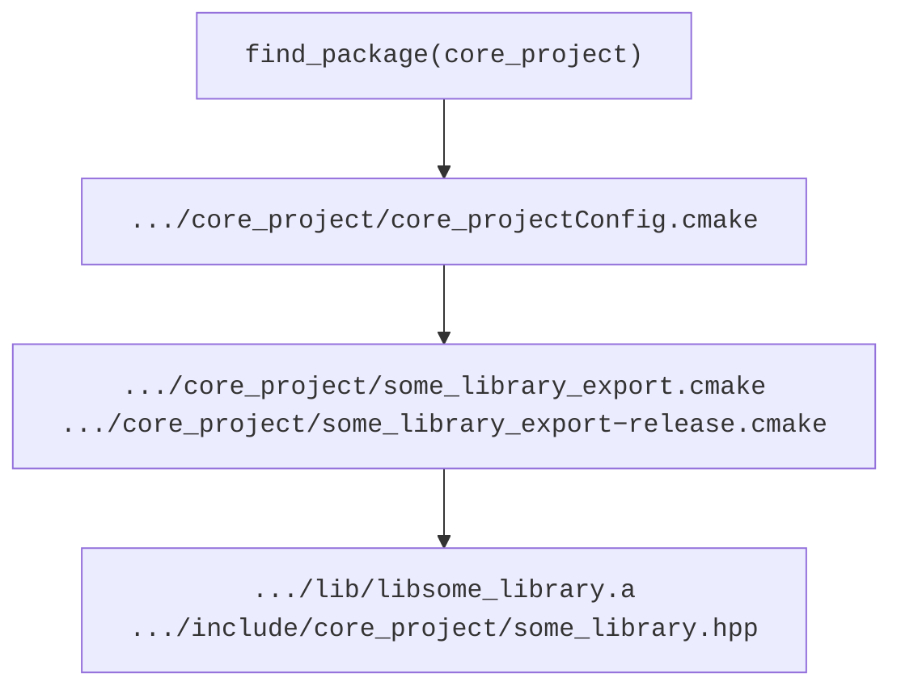

**Reusing projects with CMake**

- [Disclaimer](#disclaimer)
- [What does `find_package` do?](#what-does-find_package-do)
  - [Search modes](#search-modes)
    - [Module mode](#module-mode)
    - [Config mode](#config-mode)
  - [How do the config files look like?](#how-do-the-config-files-look-like)
  - [What are the export files?](#what-are-the-export-files)
  - [Summary of reusing targets](#summary-of-reusing-targets)
- [How to make `core_project` available to `dependent_project`](#how-to-make-core_project-available-to-dependent_project)
  - [Project skeleton](#project-skeleton)
  - [Installing a package](#installing-a-package)
    - [1. Copying headers](#1-copying-headers)
    - [2. Copying binaries](#2-copying-binaries)
    - [3. Creating export files](#3-creating-export-files)
    - [4. Creating config files](#4-creating-config-files)
- [How to use the installed package](#how-to-use-the-installed-package)
- [Summary](#summary)


<p align="center">
  <a href="https://youtu.be/blah"></a>
</p>

We talked about [CMake](cmake.md) before, why we use it, what it is and how to create various libraries and binaries with it. That all was very useful, but targeted the development of a single, potentially even large project. If we want to develop multiple interdependent projects or make our CMake project reusable by others what we know so far is not enough.

One way of doing this within the CMake world is the `find_package` machinery which allows us to find previously-installed CMake packages and use their libraries in a new project. As an example, this `dependent_project` uses an already-installed `core_project` by calling `find_package(core_project REQUIRED)`:

```cmake
cmake_minimum_required(VERSION 3.16..3.24)
project(dependent_project
    VERSION 0.0.1
    DESCRIPTION "Sample project that uses the core project"
    LANGUAGES CXX)

# Set CMAKE_BUILD_TYPE if user did not provide it.
if(NOT CMAKE_BUILD_TYPE)
  set(CMAKE_BUILD_TYPE Release CACHE INTERNAL "Build type")
endif()
message(STATUS "CMAKE_BUILD_TYPE: ${CMAKE_BUILD_TYPE}")

find_package(core_project REQUIRED)

add_executable(print_hello print_hello.cpp)
target_link_libraries(print_hello PRIVATE core_project::some_library)
```

The `REQUIRED` keyword is optional and just makes sure CMake fails if it cannot find the project we ask it to find. After the `find_package` is called, the `print_hello` executable can use the functionality from `some_library` which is part of the `core_project`.

For completeness, the file `print_hello.cpp` looks as one would expect -- it includes the necessary header and calls a function `core_project::PrintHello`:

```cpp
#include "core_project/some_library.hpp"

int main() {
  core_project::PrintHello();
  return 0;
}
```

<!-- org: use travolta animation -->
Note how we do not create the `some_library` before linking it to our new executable `print_hello` as it gets exported from the previously-installed `core_project` and the project builds when we call the commands we already know:

```cmd
cmake -DCMAKE_PREFIX_PATH="/tmp/install"  -S . -B build
cmake --build build -j 12
```

That is at least if the `core_package` is successfully installed into the `/tmp/install` folder in this example.

And as a final proof, we can of course run our executable `print_hello`:

```cmd
./build/print_hello
Hello World!
```

So let's dive in and see how all of this works!

<!-- Intro -->

## Disclaimer

This is quite a nuanced topic and I'd like to start with a disclaimer that there are many ways to structure CMake projects and even more ways to make these projects talk to each other. My aim for today is to show the *concept* here and not to cover *all* the possible details. As a result, I show just one way that works for me to keep things short. I'm sure there are other ways equally good if not better to achieve very similar behavior and I am always super interested to know what works for you!

<!-- So please comment below this video and let's discuss it! -->

That being said, I believe that the things we're talking about here are more of less universal and can be applied to any concrete CMake project design with minor adaptations.

## What does `find_package` do?

With that out of the way, I we can start our deep dive by understanding what the `find_package` does under the hood. And, just as in all the other topics we've already covered, there is of course **no black magic** here.
<!-- org: Show the no black magic animation from before -->

<!-- org: Show the code again -->

It is logical that in order to use the `core_project::some_library` target `find_package` must somehow provide us with it. What this really means is that the `find_package` command must somehow `include` all the CMake code that creates the needed `core_project::some_library` target as well as sets the required compiler and linker flags for it.

Finding the code that sets all the `core_project` targets is not too hard, provided we know where to look for it. To this end let us assume that `core_project` has been installed into `/tmp/install` folder before and try to understand all of the steps that `find_package` takes to allow us to use the `core_project`'s targets. We'll get to *how* it was installed there towards the end of this tutorial.

### Search modes

<!-- org: show wiki excerpt -->
If we read CMake docs, there are two modes in which [`find_package`](https://cmake.org/cmake/help/v3.16/command/find_package.html) operates: the **module mode** and **config mode**.

#### Module mode

By default when we call `find_package(core_project)` in our `CMakeLists.txt`, CMake first tries to use the **module mode** and looks for a file `Findcore_project.cmake` in the path stored under the `CMAKE_MODULE_PATH` CMake variable as well as among the default modules provided with the CMake installation. Once found, CMake `include`s that file, which, in CMake world, means that it executes all the code from that file.

<!-- org: show code again with `CONFIG` or `NO_MODULE` -->
If CMake is unable to find the required `Find*.cmake` file, or if we explicitly provide `CONFIG` or `NO_MODULE` as part of the `find_package` signature, it switches to the **config mode** instead.

```cmake
find_package(core_project CONFIG REQUIRED)
```

<!-- org: show drake meme -->

> 🚨 The default CMake behavior is a bit confusing here. You see, while **module mode** is the default one, in modern CMake we want to use **config mode** most of the time.

#### Config mode

On the surface **config mode** works in a very similar manner to the **module mode**. For a call `find_package(core_project CONFIG)` or `find_package(core_project NO_MODULE)` CMake looks for a file `core_projectConfig.cmake` or for `core_project-config.cmake` using quite a comprehensive [search procedure](https://cmake.org/cmake/help/v3.16/command/find_package.html#search-procedure) starting with the path specified in the `CMAKE_PREFIX_PATH` CMake variable.

However, the similarities end on this surface level. The [full command](https://cmake.org/cmake/help/v3.16/command/find_package.html#full-signature-and-config-mode) has many more settings, and, even more importantly, it is possible to generate the needed config files almost completely automatically. This was not the case in the module mode, where most of the `Find*.cmake` files had to be written by hand. As you might imagine, this makes the config mode setup much more maintainable and versatile. To the degree of my knowledge that's the main reason why we prefer it to the module mode.

So in today's tutorial, I'm going to focus exclusively on the **config mode** as a more modern way, but please let me know if you'd like to hear about the module mode too as it might still be useful to understand how it works when working with legacy code.

### How do the config files look like?

Now that we know where and for which files `find_package` looks, we can take a peek inside these files. As we've mentioned before, because we call `find_package(core_project)`, we expect to find a file `core_projectConfig.cmake` in a subfolder of the `CMAKE_PREFIX_PATH` folder. In our case, we are able to find the file that matches our description and is placed in the right folder: `/tmp/install/share/cmake/core_project/core_projectConfig.cmake`, remember that we set `${CMAKE_PREFIX_PATH}` to be `/tmp/install`. This file is not very large, but the most important part of it is that it includes another CMake file:

```cmake
include ( "${CMAKE_CURRENT_LIST_DIR}/some_library_export.cmake" )
```

Looking around the same folder, we are then also able to find the `some_library_export.cmake` file, which has a lot more auto-generated code in it. Today, we don't care about most of this code, and focus on the relevant parts only starting with the creation of an `IMPORTED` library:

```cmake
# Create imported target core_project::some_library
add_library(core_project::some_library STATIC IMPORTED)
```

The keyword `IMPORTED` simply indicates that an existing binary file will be provided for this library at a later point. A bit later, we'll also talk about how this changes if our library has dependencies or is a different kind of library altogether, like a header-only one.

A bit lower within the same `some_library_export.cmake` file, there is another relevant part of code:

```cmake
# Load information for each installed configuration.
get_filename_component(_DIR "${CMAKE_CURRENT_LIST_FILE}" PATH)
file(GLOB CONFIG_FILES "${_DIR}/some_library_export-*.cmake")
foreach(f ${CONFIG_FILES})
  include(${f})
endforeach()
```

### What are the export files?

Here, CMake is instructed to look for additional CMake files to include and if we look around the folder that contains the `some_library_export.cmake` file we will find more files that look similar, for example `some_library_export-release.cmake`. This name depends on the configuration we used during build, having a `release` suffix in our case as we use `Release` configuration by default. If we look into this new file, we'll eventually find the code that sets all the relevant properties of our `IMPORTED` library target, including its language, its binary file location, and the location of its headers:

```cmake
# Import target "core_project::some_library" for configuration "Release"
set_property(TARGET core_project::some_library APPEND PROPERTY IMPORTED_CONFIGURATIONS RELEASE)
set_target_properties(core_project::some_library PROPERTIES
  IMPORTED_LINK_INTERFACE_LANGUAGES_RELEASE "CXX"
  IMPORTED_LOCATION_RELEASE "${_IMPORT_PREFIX}/lib/libsome_library.a"
  INTERFACE_INCLUDE_DIRECTORIES "${_IMPORT_PREFIX}/include/"
)
```

The rest of the code in these files is not as relevant to us as it mostly performs some checks so that CMake is sure that all the necessary files are actually present on the system. Feel free to read into it when you get the time.

So, you see, we've found the commands that create the targets that we require and set their relevant properties. As a final piece of the puzzle, if we examine the `lib` and `include` folders in our `CMAKE_PREFIX_PATH`, we'll eventually find the files `${CMAKE_PREFIX_PATH}/lib/libsome_library.a` as well as `${CMAKE_PREFIX_PATH}/include/core_project/some_library.hpp`.

### Summary of reusing targets

<!-- Diagram goes here -->

We have now traced the full path that CMake takes in order for us to be able to use targets from another project. To recap, we start with a call to `find_package`, which looks for a `*Config.cmake` file, that includes the necessary `export` files that point towards the headers and relevant binary files:



## How to make `core_project` available to `dependent_project`

So far so good. We now understand how a library within a `dependent_project` is able to use the library from the `core_project` after a `find_package` call. Now is a great time to figure out how these export files are actually created as well as how the header files and all the binary files land into the install folder in the first place.

We'll actually follow the diagram that we've just introduced in reverse, starting at the bottom and making it all the way to its top.

### Project skeleton

Clearly, `core_project` must have the needed headers and create the `some_library` target before attempting to install all of these. For the sake of our example, this library has a single function `PrintHello` that is declared in a header file:

`core_project/core_project/some_library.hpp`:

```cpp
#pragma once

namespace core_project {

void PrintHello();

} // namespace core_project
```

With the implementation of this function living in the corresponding source file:

`core_project/core_project/some_library.cpp`

```cpp
#include "core_project/some_library.hpp"

#include <iostream>

namespace core_project {

void PrintHello() {
    std::cout << "Hello, world!" << std::endl;
 }

} // namespace core_project
```

The CMake part of this project is pretty standard too - it declares a new project, chooses build type to be `Release` if the user did not provide one and delegates the target creation to other `CMakeLists.txt` files within the `core_project` and `examples` folders:

`core_project/CMakeLists.txt`:

```cmake
cmake_minimum_required(VERSION 3.16..3.24)
project(core_project
    VERSION 0.0.1
    DESCRIPTION "Project to illustrate installation"
    LANGUAGES CXX)

# Set CMAKE_BUILD_TYPE if user did not provide it.
if(NOT CMAKE_BUILD_TYPE)
  set(CMAKE_BUILD_TYPE Release CACHE STRING "" FORCE)
endif()
message(STATUS "CMAKE_BUILD_TYPE: ${CMAKE_BUILD_TYPE}")

add_subdirectory(core_project)
add_subdirectory(examples)
```

These other `CMakeLists.txt` files are, again, nothing special and we've seen their kind before.

In the `core_project/CMakeLists.txt` we use a `LIBRARY_NAME` variable for convenience, create our library target, set its C++ standard to C++17, indicate to it and its descendants where to look for the includes, and, finally, create an alias for this library that is prefixed by the `${PROJECT_NAME}`. Strictly speaking, this alias is not required but it *is* a good practice to use the library in the same way from within the project as well as in other projects. We will see why a bit later.

`core_project/core_project/CMakeLists.txt`:

```cmake
set(LIBRARY_NAME some_library)
add_library(${LIBRARY_NAME} ${LIBRARY_NAME}.cpp)
target_compile_features(${LIBRARY_NAME} PUBLIC cxx_std_17)
target_include_directories(${LIBRARY_NAME} PUBLIC
  $<BUILD_INTERFACE:${CMAKE_SOURCE_DIR}>
  $<INSTALL_INTERFACE:include/>
)
add_library(${PROJECT_NAME}::${LIBRARY_NAME} ALIAS ${LIBRARY_NAME})
```

And just to test that our library actually works, let's also add some example executable `print_hello` in `examples/CMakeLists.txt`, linking it to the `core_project::some_library` target:

`core_project/examples/CMakeLists.txt`:

```cmake
add_executable(print_hello print_hello.cpp)
target_link_libraries(print_hello PRIVATE core_project::some_library)
```

For now we have done nothing new, we've already done very similar things before in the previous lectures on CMake. So we already know that we can easily configure and build our project with CMake as follows:

```bash
# Requires relatively modern CMake TODO: which version?
cmake -S . -B build
cmake --build build -j 12
```

Once it builds, we can run the example binaries without any issues:

```cmd
./build/examples/print_hello
Hello world!
```

So far so good. But we are still unable to use this library from our `dependent_project` aren't we? All of the special `export` and `Config` files are missing!

> :bulb: The act of creating those as well as copying all the headers and binaries into the needed folders where they can be found by other projects is called **installing** a package.

And our `core_project` does not know how to **install** itself! So how do we make it all work?

### Installing a package

This process of installing a CMake package starts by calling an `install` command after configuring and building the project:

```bash
cmake  -S . -B build                         # Configure.
cmake --build build -j 12                    # Build.
cmake --install build --prefix /tmp/install  # Install.
```

This installation process usually involves a couple of steps. It must:

1. Copy all the needed headers into some `include` folder
2. Copy all of the binary libraries into a `lib` folder and all executables into a `bin` folder (typically)
3. Create the appropriate `*_export.cmake` files that create and configure the imported libraries
4. Create the config file that includes all of the needed `export` files

However, if we try to "install" our package now, nothing will happen!

To make all of the actions we've just talked about happen we'll need to write some more CMake code. But fear not, there is a number of different built-in CMake `install` commands that help us in most of these steps. So let's look at all of these steps in detail.

#### 1. Copying headers

Our first step is to copy the headers over. To this end, let's add the following code to the end of `core_project/core_project/CMakeLists.txt` file:

```cmake
install(
    DIRECTORY ${CMAKE_CURRENT_SOURCE_DIR}
    FILES_MATCHING PATTERN "*.hpp"
    DESTINATION include
)
```

This finds all the `*.hpp` files in the folder specified under `DIRECTORY`, in our case `core_project/core_project` and copies that directory and all the matching files into the `include` folder, as the `DESTINATION` option specifies.

So if we add the above code, and try installing our package again:

```bash
cmake  -S . -B build                         # Configure.
cmake --build build -j 12                    # Build.
cmake --install build --prefix /tmp/install  # Install.
```

we'll be able to find the only header of our project installed into the expected location: `/tmp/install/include/core_project/some_library.hpp`.

```cmd
λ › tree /tmp/install
/tmp/install
└── include
    └── core_project
        └── some_library.hpp
```

We only have one library for now but I hope it is easy to imagine that we can do this for any number of libraries. I prefer to add these install statements on a per-folder basis. This way we do not have to add too much code while keeping the folder structure intact.

#### 2. Copying binaries

Now that the headers are all installed, we need to do the same for all the binary files. We do this by adding another `install` command to `core_project/core_project/CMakeLists.txt`:

```cmake
install(TARGETS ${LIBRARY_NAME})
```

As well as one more to `core_project/examples/CMakeLists.txt` for installing our example binaries:

```cmake
install(TARGETS print_hello)
```

This will automatically install all executables to a `bin` folder and all of the binary libraries to a `lib` folder.

After running the install command again, we'll see that we now also have all of the binaries installed:

```cmd
λ › tree /tmp/install
/tmp/install
├── bin
│   └── print_hello
├── include
│   └── core_project
│       └── some_library.hpp
└── lib
    └── libsome_library.a
```

With this, all of our binary and header files are where we want them to be. But we still need to somehow tell CMake where to find them!

#### 3. Creating export files

For that we need to create and install all those `*export` files we've talked about at the start of this tutorial.

One classical way to do this is to change all those `install(TARGETS ...)` commands for each of our library targets (one in our case) to add an `EXPORT` entry to them:

```cmake
install(
    TARGETS ${LIBRARY_NAME}
    EXPORT ${LIBRARY_NAME}_export  # <-- this one
)
```
Now this command not only installs the binary into the `install` folder but it also associates it with the `_export` file.

But this command alone is not enough for us as it does not actually copy the created `_export` file to the install folder, we can see it by running install again and not finding the `_export` file in the install folder. However, we *do* find it in the build folder!

So what remains is to copy this already generated file to the install folder, which we can do by using yet another `install` command:

```cmake
install(EXPORT ${LIBRARY_NAME}_export
    FILE ${LIBRARY_NAME}_export.cmake
    NAMESPACE ${PROJECT_NAME}::
    DESTINATION share/cmake/${PROJECT_NAME}
)
```

Now if we run our install procedure again, we'll notice that the `_export` file can be found in the `/tmp/install/share/cmake/core_project`:

```cmd
λ › tree /tmp/install
/tmp/install
├── bin
│   └── print_hello
├── include
│   └── core_project
│       └── some_library.hpp
├── share
│   └── cmake
│       └── core_project
│           ├── some_library_export-release.cmake
│           └── some_library_export.cmake
└── lib
    └── libsome_library.a
```

Note also the `NAMESPACE` option that will add the required prefix to all targets that we export *within the export files*. Super handy to disambiguate our targets from any other ones. Also, this matches our own `ALIAS` that we created before, keeping everything nice and consistent.

#### 4. Creating config files

Finally, with the export files in-place we are just left with creating the missing config files so that `find_package` could find all the export files we've just created. This process is a bit convoluted and involved a couple of steps.

We start by actually creating the needed `config` file by calling `configure_package_config_file` from the `CMakePackageConfigHelpers` that we include into our main `CMakeLists.txt` file:

```cmake
include(CMakePackageConfigHelpers)

# Create a config file that CMake looks for when we call FindPackage(core_project)
configure_package_config_file(${CMAKE_CURRENT_SOURCE_DIR}/cmake/Config.cmake.in
 "${CMAKE_CURRENT_BINARY_DIR}/${PROJECT_NAME}Config.cmake"
 INSTALL_DESTINATION "share/cmake/${PROJECT_NAME}"
)
```

For this to work we need to create a "template file" that, in its simplest form includes all the export files we created before:

`${CMAKE_CURRENT_SOURCE_DIR}/cmake/Config.cmake.in`

```cmake
@PACKAGE_INIT@

include("${CMAKE_CURRENT_LIST_DIR}/some_library_export.cmake")

check_required_components(core_project)
```

We can specify all of the export files by hand, like we just did, but we can also use a glob expression that matches *any* file that ends in `*_export.cmake`.

`${CMAKE_CURRENT_SOURCE_DIR}/cmake/Config.cmake.in`

```cmake
@PACKAGE_INIT@

# Automatically include all exported library files
file(GLOB EXPORT_FILES "${CMAKE_CURRENT_LIST_DIR}/*_export.cmake")
foreach(EXPORT_FILE ${EXPORT_FILES})
    include(${EXPORT_FILE})
endforeach()

check_required_components(core_project)
```

Passing this `cmake.in` file into `configure_package_config_file` we create `${CMAKE_CURRENT_BINARY_DIR}/${PROJECT_NAME}Config.cmake` in the current build folder. Note that this file is still not "installed", i.e., it is not present in the install folder just yet!

Before we install it, we'll also need to generate another very similar file `${CMAKE_CURRENT_BINARY_DIR}/${PROJECT_NAME}ConfigVersion.cmake` by calling the `write_basic_package_version_file` command:

```cmake
# Create a versioned config file that CMake uses to compare version of the package.
write_basic_package_version_file(
 ${PROJECT_NAME}ConfigVersion.cmake
 VERSION ${PACKAGE_VERSION}
 COMPATIBILITY AnyNewerVersion
)
```

This command generates a file needed if we want to specify a version of our package. We can select a version to match our project version as well as what the compatibility of this version is. This plays a role when we specify a version within the `find_package(core_package VERSION 0.9)` command. We will not go into more details here but I'm sure after this tutorial everyone should be able to look it up in the docs.

Finally, our last step is to copy the just-generated config files into the install folder, which we can do with yet another `install(FILES ...)` command.

```cmake
# Copy these files into the install directory.
install(
 FILES
 ${CMAKE_CURRENT_BINARY_DIR}/${PROJECT_NAME}Config.cmake
 ${CMAKE_CURRENT_BINARY_DIR}/${PROJECT_NAME}ConfigVersion.cmake
 DESTINATION
 share/cmake/${PROJECT_NAME}
)
```

And now we're done with installing! If we now look at how the `install` folder tree looks like, it will contain all of our headers, all our binary files as well as the export and config files needed to configure all of the targets, should someone look for them.

## How to use the installed package

Now is a good time to specify how exactly we would look for these files. We do this by adding a `find_package` call to our `dependent_project` of course. We've already seen this at the start of this tutorial:

```cmake
cmake_minimum_required(VERSION 3.16..3.24)
project(dependent_project
    VERSION 0.0.1
    DESCRIPTION "Sample project that uses the core project"
    LANGUAGES CXX)

# Set CMAKE_BUILD_TYPE if user did not provide it.
if(NOT CMAKE_BUILD_TYPE)
  set(CMAKE_BUILD_TYPE Release CACHE INTERNAL "Build type")
endif()
message(STATUS "CMAKE_BUILD_TYPE: ${CMAKE_BUILD_TYPE}")

find_package(core_project REQUIRED CONFIG)

add_executable(print_hello print_hello.cpp)
target_link_libraries(print_hello PRIVATE core_project::some_library)
```

And just as before, we can configure and build this project. However, there is a slight change from before. Because we've installed our `core_package` into a custom folder, `/tmp/install` in our case, we need to tell CMake where to look for packages by providing it with a `CMAKE_PREFIX_PATH`:

```bash
cd dependent_project
cmake -DCMAKE_PREFIX_PATH="/tmp/install"  -S . -B build
cmake --build build -j 12
```

Et voila! This builds our `dependent_project` without issues and we can run the binary that we've just built too:

```cmd
./build/print_hello
Hello World!
```

## Summary

There was quite some content here but we've now covered all the basics one needs to know about installing packages. This process changes over the years and, just as we move to a more target-based build, we are probably also moving away from what is presented here and towards a more target-based install. But as it stands now, I believe that what we've covered today is still the most popular way to install packages and can be found in most CMake projects in the wild with slight differences here and there, which, after this tutorial, should be easier to spot and understand.
