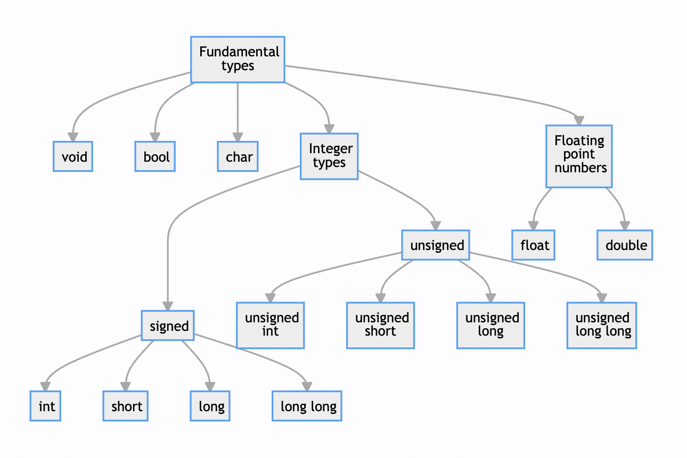
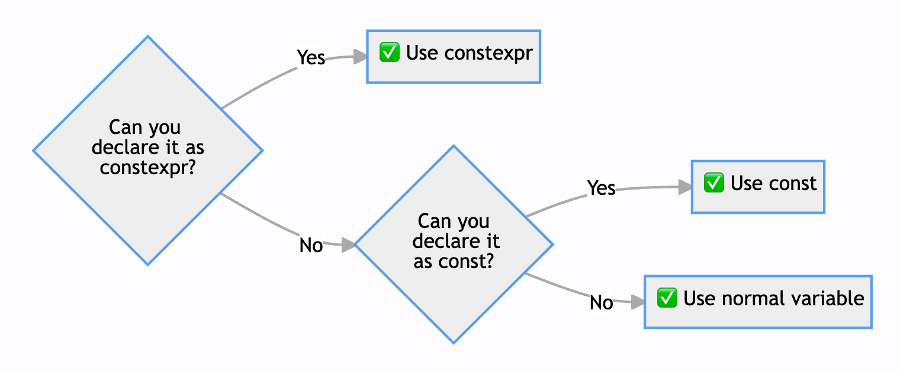

# Basics of C++
#### Variables of fundamental types
- How to create variables
- Fundamental types
- Naming variables
- `const`, `constexpr`
- References

#### 📺 Watch the related [YouTube video](https://youtu.be/0z0gvv_Tb_U)! 

---
# Prerequisites:
- [Hello world dissection lecture](hello_world_dissection.md)

---
# Special symbols used in slides
- 🎨 - Style recommendation
- 🎓 - Software design recommendation
- 😱 - **Not** a good practice! Avoid in real life!
- ✅ - Good practice!
- ❌ - Whatever is marked with this is wrong
- 🚨 - Alert! Important information!
- 💡 - Hint or a useful exercise

Style (🎨) and software design (🎓) recommendations mostly come from [Google Style Sheet](https://google.github.io/styleguide/cppguide.html) and the [CppCoreGuidelines](https://isocpp.github.io/CppCoreGuidelines/CppCoreGuidelines)

---

# Declaring variables
Variable declaration follows one of the following patterns:
<!--
`CPP_SKIP_SNIPPET`
-->
```cpp
Type variable_name;  // 😱 Uninitialized! Contains random value!
Type variable_name = value;
Type variable_name{value};  // Follows "uniform initialization"
Type variable_name{};       // "Value initialization"
Type variable_name(value);  // 😱 Mostly not used nowadays
```
- Every variable **has a type** - one of the defining features of C++
- Variables, once declared cannot change their type

---

# Naming variables

- Name **must** start with a letter
- C++ is case sensitive:
  `some_var` $\ne$ `some_Var` $\ne$ `someVar`
- 🎨 Give variables **meaningful names**
- 🎨 Don't be afraid to **use longer names**
- 🎨 Name variables in `snake_case`
  (all lowercase, underscores separate words)
- 🎨:x: **Don't include type** in the name
- 🎨:x: **Don't use negation** in the name

See [Google naming rules](https://google.github.io/styleguide/cppguide.html#General_Naming_Rules) for more details

---

# [Fundamental types](https://en.cppreference.com/w/cpp/language/types) in C++


---
# What they mean
- `void` type to represent "nothing" (stay tuned)
- **Integer** types represent integer numbers. Different types cover different ranges of values
- **Boolean** type: `bool` to represent `true` or `false`
- **Character** type: `char` used to:
  - represent characters like `'a'` or `'\n'`
  - represent raw memory (stay tuned)
- `float` and `double` are used to represent floating point numbers:
  - `float` - **single** precision floating point number
  - `double` - **double** precision floating point number

---

# Variables of fundamental types
<!--
`CPP_SETUP_START`
int main() {
  $PLACEHOLDER
  return 0;
}
`CPP_SETUP_END`
-->
```cpp
char caret_return = '\n';      // Single character
int meaning_of_life = 42;      // Integer number
short smaller_int{42};         // Short number (using {})
long bigger_int = 42L;         // Long number (L is a literal)
float fraction = 0.01f;        // Single precision float
double precise_num = 0.01;     // Double precision float
double scientific = 2.42e-10;  // Double precision float
auto some_int{42};             // Automatic type [int] (using {})
auto some_float = 13.0F;       // Automatic type [float]
auto some_double = 13.0;       // Automatic type [double]
bool this_is_fun = false;      // Boolean: true or false
```
There are also `unsigned` equivalents for integer types
<!--
`CPP_SETUP_START`
int main() {
  $PLACEHOLDER
  return 0;
}
`CPP_SETUP_END`
-->
```cpp
unsigned int meaning_of_life = 42U;   // Unsigned integer number
unsigned long bigger_int = 42UL;      // Unsigned long number
auto number = 42'232'424ul;  // Automatic type [unsigned long]
auto number_copy = number;   // Automatic type [unsigned long]
unsigned long explicit_copy = number; // This works too!
```

---

# Difference between integer types
- The difference is in the range of representable values
- We will talk about this later in the course
- We can get the range for any type `T`: 
  - `std::numeric_limits<T>::min()` - minimum value
  - `std::numeric_limits<T>::max()` - maximum value
  - they live in the `<limits>` header

```cpp
#include <limits>
#include <cstdio>

int main() {
  std::printf("Min: %d, max: %d\n",
         std::numeric_limits<int>::min(),
         std::numeric_limits<int>::max());                   
  return 0;
}
```
:bulb: Try it with other integer types!

---

# Always initialize all variables! 🚨

(unless measured slow, stay tuned to a later point in the course)
<!--
`CPP_SETUP_START`
int main() {
  $PLACEHOLDER
  return 0;
}
`CPP_SETUP_END`
-->
```cpp
int sad_uninitialized_variable;  // 😱 Really, don't do this!
```
<!--
`CPP_SETUP_START`
int main() {
  $PLACEHOLDER
  return 0;
}
`CPP_SETUP_END`
-->
```cpp
bool initializing_is_good = true;  // ✅ Always initialize!
bool use_uniform_initialization{true};
auto also_works_with_auto{true};
auto this_works_too = true;
```
# Also use "value initialization"
<!--
`CPP_SKIP_SNIPPET`
-->
```cpp
bool set_to_default_value{};  // Initialize to false
int some_int_number{};        // Initialize to 0
double some_double_number{};  // Initialize to 0.0
float some_float_number{};    // Initialize to 0.0F
auto does_not_work{};         // ❌ no info on the type!
```
---

# Uninitialized variable example 😱

Let's consider an example:
```cpp
#include <cstdio>
int main() {
    double uninitialized_variable;  // 😱 Don't do this!
    std::printf("%e\n", uninitialized_variable);
}
```
Here is the typical output:
```
λ › ./test
2.14188e-314
λ › ./test
2.12718e-314
λ › ./test
2.12991e-314
```
- The value of `uninitialized_variable` is "undefined"
- Your results will (probably) be different!
- Relying on this value causes **"Undefined Behavior"** (**UB**)

---

# Initialization vs assignment
We can also **initialize** the variables from other variables
<!--
`CPP_SETUP_START`
int main() {
  int other_int{};
  $PLACEHOLDER
  return 0;
}
`CPP_SETUP_END`
-->
```cpp
int some_int{other_int};
auto some_int_copy = some_int;
```
Also, we can **assign** a value to an **existing** variable
```
some_int_copy = 42;
some_int = some_int_copy;
```
# How to tell one from another? :thinking:
Both initialization and assignment use `=` to set value
Here is a rule of thumb to tell them apart :+1:
- If a statement **creates a new variable** - it is an **initialization**
- If not - it is an **assignment**

---

# const and constexpr
`const` - constant, `constexpr` - constant expression
<div class="grid-container">
<div>

### `const`
- Can be used for constants created at **run time**
- Can be initialized with **any** provided value
- _Sometimes_ will be available at compile time
<!--
`CPP_SETUP_START`
int main() {
  $PLACEHOLDER
  return 0;
}
`CPP_SETUP_END`
-->
```cpp
int a = 42;
const int b = a;    // ✅
const int c = 23;   // ✅
const int d = c;    // ✅
const auto e = c;   // ✅
```

</div>

<div>

### `constexpr`
- Can only be used for constants created at 
  **compile time**
- Can only be initialized from a `constexpr` value
<!--
`CPP_SKIP_SNIPPET`
-->
```cpp
int a = 42;
const int a_const = 42;
constexpr int b = a;        // ❌
constexpr int c = a_const;  // ❌
constexpr int d = 23;       // ✅
constexpr int e = d;        // ✅
constexpr auto f = d;       // ✅
```

</div>
</div>

<!-- 
- Run time means whatever happens since we started the program
- Compile time means whatever happens while the program is compiling
- Computation happens at compile time and the result is stored to a variable
 -->

---

# When to use const and constexpr?
Here is the rule of thumb to declare **anything**:



There are some exemptions from this rule, but it mostly works

---

# References to variables
- We can create a **reference** to any variable
- Allows to **borrow** a variable to a different context
- Use `&` to state that a variable is a reference
  `float & ref = original_variable;`
- Reference is part of the type:
  variable `ref` has type `<OriginalType> &`
- Changing a reference changes the variable and vice versa
  <!--
  `CPP_SETUP_START`
  int main() {
    $PLACEHOLDER
    return 0;
  }
  `CPP_SETUP_END`
  -->
  ```c++
  int some_variable = 42;
  int& some_variable_ref = some_variable;
  some_variable_ref = 23;
  // some_variable is now == 23
  ```
- Yields performance gain as references **avoid copying data**
  Will be more important when we talk about functions later

---

# Const with references

- References are fast but reduce control
- To avoid unwanted changes use `const`
  `const auto & ref = original_variable;`
- Here type of `ref` is `const <OriginalType> &`

```cpp
#include <cstdio>

int main() {
  int number = 42;  
  int& ref = number; // Name has to fit on the slides ¯\_(ツ)_/¯
  const int& const_ref = number;
  std::printf("ref: %d, const_ref: %d\n", ref, const_ref);
  ref = 0;
  std::printf("ref: %d, const_ref: %d\n", ref, const_ref);
  number = 23;
  std::printf("ref: %d, const_ref: %d\n", ref, const_ref);
  return 0;
}
```

---

# All variables live in scopes
- There is a single **global scope** (outside of all functions)
- Local scopes start with `{` and end with `}`
- All variables **live in the scope** where they have been declared
- All variables die in the **end of their scope**
- 🚨 This is the core principle of C++ memory management!
- Variables can "shadow" other variables from outer scopes
```cpp
constexpr auto kGlobalVariable{42};

int main() {  // Start of main scope
  float some_float = 13.13F;  // Create variable
  {  // New inner scope
    auto some_float = 42.42F;  // "Shadows" some_float
    auto another_float = some_float;  // Copy variable
  }  // another_float and the shadow of some_float die
  return 0;
}  // Variable some_float dies
// kGlobalVariable dies at the end of the program
```

---

# Naming of constants
- 🎨 Name constants in the **global scope** in `CamelCase` starting with a small letter `k`:
<!--
`CPP_SETUP_START`
int main() {
  $PLACEHOLDER
  return 0;
}
`CPP_SETUP_END`
-->
```cpp
constexpr float kImportantFloat = 42.42f;
const int kHello{42};
```
- 🎨 Name constants in any **local scope** in `snake_case`
<!--
`CPP_SETUP_START`
int main() {
  $PLACEHOLDER
  return 0;
}
`CPP_SETUP_END`
-->
```cpp
const auto local_scope_constant{42UL};
```
- Keyword `const` is part of the variable's type:
  variable `kHello` above has type `const int`

Check out the [Google C++ Style Guide](https://google.github.io/styleguide/cppguide.html#Constant_Names) for more details


---

# Some operations on variables
- All **character**, **integer** and **floating point** types are [**arithmetic**](https://en.cppreference.com/w/c/language/arithmetic_types)
- Arithmetic operations: `+`, `-`, `*`, `/`, `%` (modulo division)
- Comparisons `<`, `>`, `<=`, `>=`, `==` return `bool`
- `a += 1` $\Leftrightarrow$ `a = a + 1`, same for `-=`, `*=`, `/=`, etc.
- Avoid `==` for floating point types
  (we'll cover a better way later)
### Be careful with unsigned integers!
```cpp
#include <cstdio>
int main() {
    std::printf("%u\n", 23U - 42U);
    return 0;
}
```
Prints `4294967277` due to an "underflow" (stay tuned)

---

# More operations on variables
- Logical operations defined over boolean variables:
  **or**: `||`, **and**: `&&`, **not**: `!`
  <!--
  `CPP_SETUP_START`
  int main() {
    bool is_hungry, is_rich, is_warm;
    $PLACEHOLDER
    return 0;
  }
  `CPP_SETUP_END`
  -->
  ```cpp
  bool is_happy = (!is_hungry && is_warm) || is_rich;
  ```
- Additional operations on integer variables:
- `/` is integer division: i.e. `7 / 3 == 2`
- `%` is modulo division: i.e. `7 % 3 == 1`
- **Increment** operator: `a++` $\Leftrightarrow$ `++a` $\Leftrightarrow$ `a += 1`
- **Decrement** operator: `a--` $\Leftrightarrow$ `--a` $\Leftrightarrow$ `a -= 1`
- There is a slight difference between them, stay tuned
- ❌ **Do not** use de- increment operators within another expression, i.e., 😱 `a = (a++) + ++b` 😱

---
# Live coding

- write `main()` function
- add a **constant**
- use `printf` to print it
- add **other variables** and **print** them, also use `auto`
- create variables from **operations** and use them on variables
  - Create a variable with `+`, or `/`
  - Use `+` after a variable
- Showcase the UB when `double` left uninitialized
- Try to assign a `double` to an `unsigned int`
- Showcase the **underflow** with unsigned integers

---


