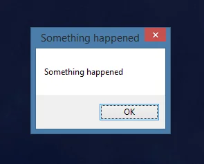

**Error Handling in C++**

<p align="center">
  <a href="https://youtu.be/dummy_link"></a>
</p>

- [Disclaimer](#disclaimer)
- [What Do We Mean by “Error”?](#what-do-we-mean-by-error)
- [Setting up the example: **a comparison game**](#setting-up-the-example-a-comparison-game)
  - [Rules of the game](#rules-of-the-game)
  - [Initial code of the game](#initial-code-of-the-game)
- [Unrecoverable errors: **fail early**](#unrecoverable-errors-fail-early)
  - [Our first unrecoverable error encounter](#our-first-unrecoverable-error-encounter)
  - [How to deal with unrecoverable errors](#how-to-deal-with-unrecoverable-errors)
    - [Catch them as early as possible](#catch-them-as-early-as-possible)
    - [Use `CHECK` macro to fail early](#use-check-macro-to-fail-early)
    - [Don't use `assert`](#dont-use-assert)
    - [Complete the example yourself](#complete-the-example-yourself)
  - [How to minimize number of unrecoverable errors](#how-to-minimize-number-of-unrecoverable-errors)
- [Recoverable errors: **handle and proceed**](#recoverable-errors-handle-and-proceed)
  - [Exceptions](#exceptions)
    - [How to use exceptions](#how-to-use-exceptions)
    - [A case for exceptions for both "recoverable" and "unrecoverable" errors](#a-case-for-exceptions-for-both-recoverable-and-unrecoverable-errors)
    - [Why not just use exceptions](#why-not-just-use-exceptions)
      - [Exceptions are (sometimes) expensive](#exceptions-are-sometimes-expensive)
      - [Exceptions hide the error path](#exceptions-hide-the-error-path)
      - [Exceptions are banned in many code bases](#exceptions-are-banned-in-many-code-bases)
  - [Returning errors explicitly can work better if done well](#returning-errors-explicitly-can-work-better-if-done-well)
    - [Returning a value indicating error does not always work 😱](#returning-a-value-indicating-error-does-not-always-work-)
    - [Returning an error code breaks "pure functions" 😱](#returning-an-error-code-breaks-pure-functions-)
    - [Using `std::optional`: **a better way**](#using-stdoptional-a-better-way)
    - [Using `std::expected`: **add context**](#using-stdexpected-add-context)
  - [Performance Considerations for `std::optional` and `std::expected`](#performance-considerations-for-stdoptional-and-stdexpected)
    - [Error type size matters](#error-type-size-matters)
    - [Return value optimization with `std::optional` and `std::expected`](#return-value-optimization-with-stdoptional-and-stdexpected)
  - [Summary](#summary)

When writing C++ code, much like in real life, we don’t always get what we want. The good news is that C++ comes packed with the tools to let us be prepared for this eventuality!

Today we’re talking about error handling. What options we have, which trade-offs they come with, and what tools modern C++ gives us to make our lives a bit easier.

Buckle up! There is a lot to cover and quite some nuance in this topic! There will also inevitably be some statements that are quite opinionated and I can already see people with pitchforks and torches coming for me... so... I'm sure it's gonna be fun!

<!-- Add a video from shreck?
Link: https://www.youtube.com/watch?v=Waa9UqVP4KI
-->

# Disclaimer

This is definitely *not* a one-size-fits-all topic. C++ is huge, powerful, and used across every domain imaginable for a long-long time.

*My* perspective comes from domains like robotics and automotive—where predictability and safety are of highest importance. What works for us may not work for everyone.

However, I believe that what we talk about today fits many other domains with minimal adaptation and is grounded in relatively sane reasoning. Where possible, I’ll try to mention multiple possible options and if I *do* miss an important one—please let me know!

<!-- in the comments -->

<!-- And, on this note, your comments and likes are the only ways I get any feedback from shouting into the void! So please do not shy away from sharing what you think, positive or negative! I value every nugget of feedback I can get!

Now, back to error handling. -->

# What Do We Mean by “Error”?

Before we go into how to handle errors, however, let’s clarify what we mean when we think about an "error" in programming.

At the highest level: an error is something that happens when a program doesn’t produce the result we expect.

I tend to think of errors belonging to one of two broad groups:

- **Unrecoverable errors** — where the program reaches a state in which recovery is impossible or meaningless.
- **Recoverable errors** — where the program can detect that something went wrong, and has ways to proceed following an alternative path.

Some languages, like Rust, bake this distinction [directly into the language design](https://doc.rust-lang.org/book/ch09-00-error-handling.html). C++ doesn’t, making the topic of error handling slightly more nuanced.

But, for my money, this classification, while not universal, is still useful. So let's talk a bit more in-depth about these kinds of errors and the intuition behind them.

# Setting up the example: **a comparison game**

## Rules of the game

There is a lot of ground to cover here and to not get lost, I would like to introduce a small example that will guide us and help illustrate all of the concepts we are talking about today.

To this end, let's model a simple puzzle game. In this game a player start with an array of numbers generated for them. This array gets compared to some reference array, also generated for this game. The player wins if, when comparing numbers one-by-one, they have the higher number more times.

To make it an actual *game*, we need to give the player at least *some* control over their numbers. So we allow them to use a certain budget that can be used to increase the any in their array.

## Initial code of the game

Now let's spend a couple of minutes to set up the code for all what we've just discussed.

To start off, we'll probably need a class `Game` that would hold the reference as well as the player numbers. It also needs a way:

- to print the current state of the game;
- to check if they player won by comparing the player's numbers with reference ones one-by-one and keeping the score;
- to change the player number if there is still budget for this provided a `ChangeEntry` object, a tiny `struct` with `index` and `value` in our case.

This `change_entry` must come from somewhere, so we need a way to ask the player to provide it. We can encapsulate our user interaction into a function like `GetNextChangeEntryFromUser` which will print the current state of the game, ask the user for their input and fill a `change_entry` object using this input.

To keep this example simple, we implement all of this in one `cpp` file alongside a simple `main` function that creates a `Game` object, asks the user to provide a desired `change_entry` and changing the player's numbers accordingly in a loop until the user runs out of budget. Finally, we check if the player has won the game and show them the result.

```cpp
#include <iostream>
#include <vector>

struct ChangeEntry {
  int index{};
  int value{};
};

// 😱 Warning! No error handling!
class Game {
 public:
  Game(std::vector<int>&& ref_numbers,
       std::vector<int>&& player_numbers,
       int budget)
      : ref_numbers_{std::move(ref_numbers)},
        player_numbers_{std::move(player_numbers)},
        budget_{budget} {}

  void Print() const {
    std::cout << "Budget: " << budget_ << std::endl;
    std::cout << "Computer numbers: ";
    for (auto number : ref_numbers_) { std::cout << number << "\t"; }
    std::cout << "\nPlayer numbers:   ";
    for (auto number : player_numbers_) { std::cout << number << "\t"; }
    std::cout << std::endl;
  }

  bool CheckIfPlayerWon() const {
    int win_loss_counter{};
    for (auto i = 0UL; i < player_numbers_.size(); ++i) {
      const auto difference = player_numbers_[i] - ref_numbers_[i];
      if (difference > 0) win_loss_counter++;
      if (difference < 0) win_loss_counter--;
    }
    return win_loss_counter > 0;
  }

  void ChangePlayerNumberIfPossible(const ChangeEntry& change_entry) {
    auto& player_number = player_numbers_[change_entry.index];
    const auto difference = std::abs(change_entry.value - player_number);
    if (difference > budget_) { return; }
    player_number = change_entry.value;
    budget_ -= difference;
  }

  bool UserHasBudget() const { return budget_ > 0; }

 private:
  std::vector<int> ref_numbers_{};
  std::vector<int> player_numbers_{};
  int budget_{};
};

// 😱 We should handle failure to get a proper value.
ChangeEntry GetNextChangeEntryFromUser(const Game& game) {
  game.Print();
  ChangeEntry entry{};
  std::cout << "Please enter number to change: ";
  std::cin >> entry.index;
  std::cout << "Please provide a a new value: ";
  std::cin >> entry.value;
  return entry;
}

int main() {
  Game game{{42, 50, 23}, {42, 40, 99}, 10};
  while (game.UserHasBudget()) {
    const auto change_entry = GetNextChangeEntryFromUser(game);
    game.ChangePlayerNumberIfPossible(change_entry);
  }
  if (game.CheckIfPlayerWon()) {
    std::cout << "You win!\n";
  } else {
    std::cout << "Not win today. Try again!\n";
  }
}
```

We can build this program as a single executable directly from the command line:

```cmd
c++ -std=c++17 -o comparison_game comparison_game.cpp
```

Ideally, we should test all of our functions, but for now let's just give it a play-through instead!

# Unrecoverable errors: **fail early**

## Our first unrecoverable error encounter

We run our executable and are greeted with expected numbers as well as a prompt to change one of our numbers:

```output
λ › ./comparison_game
Budget: 10
Reference numbers: 42    49      23
Player numbers:    42    40      23
Please enter number to change:
```

We tie the reference numbers in the first and third columns but lose in the second. So our only chance to win is to change the value `40` to `50`, which is also what our budget allows for! So we provide these numbers to our program and observe what happens:

```output
λ › ./comparison_game
Budget: 10
Reference numbers: 42    49      23
Player numbers:    42    40      23
Please enter number to change: 40
Please provide a a new value: 49
Budget: 2
Reference numbers: 50    49      23
Player numbers:    42    40      23
Please enter number to change:
```

But wait, what's going on here? Why did our number in the second column not change? Why is our budget not decreased by `10`? Even more strangely, why did the first reference number change to `50`?

The answer to all of these questions is that we have just encountered our first unrecoverable error that manifests itself in wrong values in our memory through the "virtues" of Undefined Behavior. But what gives?

Well, there is a chain of events that caused our values to be changed in ways that we don't expect and we'll be digging through all of these in the remainder of today's lecture.

But the most immediate cause is that the user has mistakenly provided the number they wanted to change, `40`, rather than an index of that number, `1`. We then did not check that provided "index" and wrote the provided new value directly into it. If we rerun our game again and provide `1` as the first input, we win, just as we expect!

```output
λ › ./comparison_game
Budget: 10
Reference numbers: 42   49      23
Player numbers:    42   40      23
Please enter number to change: 1
Please provide a new value: 50
Budget: 0
Reference numbers: 42   49      23
Player numbers:    42   50      23
You win!
```

When we provide `40` as we did the first time, our wrong index is far beyond the size of the `player_numbers_` vector and, when we write beyond its bounds we enter the Undefined Behavior land.

What happens next is unpredictable. If we are lucky and the address into which we write does not belong to our program, the program will crash.

If we are not lucky however, we will rewrite *some* memory that belongs to our program, potentially corrupting any object that actually owns that memory. In this particular example, I picked the values in such a way, that the "fake index" just happens to be equal to a difference in pointers to the data of the `player_numbers_` and `ref_numbers_` vectors. Which then results in us writing directly into the first element of the `ref_numbers_` vector, resulting in an update to reference numbers.

But I want to stress again, that most likely if you run the same program on your machine - you will get a different behavior altogether! Even the order of `ref_numbers_` and `player_numbers_` in memory is not guaranteed, note how on my machine they do not even follow the order of declaration!

What *doesn't* change is that once the `ChangePlayerNumberIfPossible` method is called with a wrong `change_entry` in our example, all bets are off - **we do not have any guarantees on the consistency of the state of our program anymore**

Arbitrary objects might have already been corrupted and can behave in unpredictable ways from this point on without us knowing about it. Which can lead to random-looking sporadic failures in seemingly unrelated parts of our program across multiple runs. This obviously becomes even harder to track down when we write more complex programs than our toy example here.

🚨 This idea lies at the core of what makes this type of errors "unrecoverable". If the data we try to use for recovery is also corrupted, we have no guarantees that any recovery will succeed at all!

## How to deal with unrecoverable errors

### Catch them as early as possible

Therefore a typical advice is to catch any wrong values that propagate through our program as early as possible—and crash as early as possible—before any more damage is done.

### Use `CHECK` macro to fail early

My favorite tool for this is the [`CHECK`](https://abseil.io/docs/cpp/guides/logging#CHECK) macro that can be found in the [Abseil library](https://abseil.io/docs/). We can use it in our `ChangePlayerNumberIfPossible` to check if the index is within bounds:

```cpp
#include <absl/log/check.h>

// Old code unchanged here.

void ChangePlayerNumberIfPossible(const ChangeEntry& change_entry) {
  // Checking:
  //   (change_entry.index >= 0)
  //   (change_entry.index < player_numbers_.size())
  CHECK_GE(change_entry.index, 0);
  CHECK_LT(change_entry.index, player_numbers_.size());
  auto& player_number = player_numbers_[change_entry.index];
  const auto difference = std::abs(change_entry.value - player_number);
  if (difference > budget_) { return; }
  player_number = change_entry.value;
  budget_ -= difference;
}

// Old code unchanged here.
```

If we run our example now, we will get a crash as soon as we call the `ChangePlayerNumberIfPossible` function that clearly states where this error originated and which check failed letting us debug this as easily as possible:

```output
F0000 00:00:1750605447.566908       1 example.cpp:44] Check failed: change_entry.index < player_numbers_.size() (40 vs. 3)
```

One concern that people have when thinking of using the `CHECK` macros is performance as these checks stay in the code we ship and do cost some time when our program runs.

For my money, in most cases, the benefits far outweigh the costs, and, unless we've measured that we cannot allow the tiny performance hit in a particular place of our code, we should be free to use `CHECK` for safety against entering the Undefined Behavior land.

<!-- Add an animation of showing UB land and CHECK kicking its ass -->

### Don't use `assert`

You might wonder if using `CHECK` if our only way and so I have to talk about one very famous alternative here that is often recommended on the Internet. This alternative is to use [`assert`](https://en.cppreference.com/w/cpp/error/assert.html) in place of `CHECK`. The `assert` statement can be found in the `<cassert>` include file. I'm not a fan of using `assert`.

What is this smell? Is something on fire? Ah, it's the people with torches and pitchforks again coming for me for not liking `assert`!

Let me explain myself. You see, `assert` has one super annoying flaw that makes it impossible for me to recommend it for production code. I've seen sooo many bugs stemming from this! But let me show what I'm talking about on our game example.

First, we can use `assert` in a very similar way to `CHECK`:

```cpp
#include <cassert>

// Old code unchanged here.

void ChangePlayerNumberIfPossible(const ChangeEntry& change_entry) {
  assert(change_entry.index >= 0);
  assert(change_entry.index < player_numbers_.size());
  auto& player_number = player_numbers_[change_entry.index];
  const auto difference = std::abs(change_entry.value - player_number);
  if (difference > budget_) { return; }
  player_number = change_entry.value;
  budget_ -= difference;
}

// Old code unchanged here.
```

Now, if we compile and run our game just as we did before - the assertion will trigger:

```output
output.s: /app/example.cpp:44: void Game::ChangePlayerNumberIfPossible(const ChangeEntry &): Assertion `change_entry.index < player_numbers_.size()' failed.
Program terminated with signal: SIGSEGV
```

So far so good, right? Using `assert` also crashes our program when the wrong input is provided and shows us where the wrong value was detected.

So what is that annoying flaw I've been talking about that makes me dislike `assert`? Well, you see, all `assert` statements get *disabled* when a macro `NDEBUG` is defined. This is a standard macro name that controls if the debug symbols get compiled into the binary and gets passed to the compilation command for most release builds as we generally don't want debug symbols in the binary we release. So essentially, `assert` **does not protect us from undefined behavior in the code we actually deploy**!

We can easily demonstrate that the `asserts` indeed get *compiled out* by adding `-DNDEBUG` flag to our compilation command:

```cmd
c++ -std=c++17 -DNDEBUG -o comparison_game comparison_game.cpp
```

Running our game *now* and providing a wrong input index leads to the same undefined behavior we observed before as all of the assertions were compiled out. Not great, right?

### Complete the example yourself

By the way, we've only covered how we could improve our `ChangePlayerNumberIfPossible` method of the `Game` class. Do you think our `CheckIfPlayerWon` function would benefit from the same treatment?

<!-- Write your answer and reasoning in the comments below! What checks would you add? -->

## How to minimize number of unrecoverable errors

Of course, hard failures in the programs we ship is also not ideal!

One way to reduce the risk of such failures is to keep the test coverage high for the code we write, ideally close to 100% line and branch coverage, i.e., every line and logical branch gets executed at least once in our test suite.

This way we catch most of the unrecoverable errors during development. In some industries, like automotive, aviation, or medical this is actually a legal requirement.

But unfortunately, despite our best efforts, we cannot *completely* avoid failures in the programs we ship!

Even if we do everything right on our side, hardware can still fail and corrupt our memory. One fun example of this is the famous error in the Belgian election on the 18th of May 2003, where [one political party got 4096 extra votes](https://en.wikipedia.org/wiki/Electronic_voting_in_Belgium) due to what is believed to have been a cosmic ray flipping "a bit at the position 13 in the memory of the computer", essentially leading to 4096 more votes.

<!-- Use Veritasium visualization for a bit flip -->

This visualization is actually taken from this [excellent Veritasium video](https://www.youtube.com/watch?v=AaZ_RSt0KP8). Do give it a watch, it speaks about this and other similar cases much more in-depth!

With the knowledge that we cannot completely remove the risk of hitting an unrecoverable error in production, and that we also cannot just outright fail, in safety-critical systems, we often isolate components into separate processes or even separate hardware units, with watchdogs that can trigger recovery actions if one of our components suddenly crashes.

This way we can have our cake and eat it at the same time: using `CHECK` minimizes the time-to-failure when a bug is encountered, while our fallback options keep the system safe as a whole even when certain components fail.

That being said, this is a system architecture question and this topic is far beyond what I want to talk about today. In most non-safety-critical systems we do not need to think about these failure cases as deeply and we can usually just restart our program in case of a one-off failure. But, if you're interested in this topic, In an introductory lecture to the Self Driving Cars course at the University of Bonn that I've given some years ago I've dedicated a significant part towards the end of that lecture [to this topic](https://youtu.be/DtRktn4bVWg?si=DJuU8OjxtBcj5o2C). So do give it a watch if you're interested.

# Recoverable errors: **handle and proceed**

But not *every* error should instantly crash our program! Indeed, in our example, the original cause of the error is not a cosmic ray flipping bits of our memory - but a wrong user input!

The good thing about user inputs is that we can ask the user to correct these without crashing! The type of errors we encounter here can be called **recoverable errors**.

To talk about them, let us focus on the function `GetNextChangeEntryFromUser` from our example. Currently, there is no validation of what the user inputs but we absolutely *can* and *should* perform such validation!

As we design our program, we know that the number index that the user provides first must be within the bounds of the player numbers vector of the `game` object:

```cpp
// 😱 We should handle failure to get a proper value.
ChangeEntry GetNextChangeEntryFromUser(const Game& game) {
  game.Print();
  ChangeEntry entry{};
  std::cout << "Please enter number to change: ";
  std::cin >> entry.index;  // <-- This value is NOT arbitrary!
  std::cout << "Please provide a new value: ";
  std::cin >> entry.value;
  return entry;
}
```

So, when the player, *does* provide a wrong value we'd like to somehow know that something went wrong within the `GetNextChangeEntryFromUser` function and recover from this.

Broadly speaking, we have two strategies of communicating failures like these that have emerged in C++ over the years:

1. **Return a special value from a function.**
2. Throw an **exception**.

We’ll spend most of our time on the first option—but let’s first talk about throwing exceptions, and yes, why I think it might not be the best thing we could do.

This is yet again a good time to get your pitchforks and torches ready 😉.

## Exceptions

### How to use exceptions

Since C++98 we have a powerful machinery of exceptions at our disposal. An exception is essentially just an object of some type, typically derived from [`std::exception`](https://en.cppreference.com/w/cpp/error/exception.html) class. Such an exception holds the information about the underlying failure and can be "thrown" and "caught" within a C++ program.

In our example, we could throw an object of `std::out_of_range` when the user inputs a wrong number index:

```cpp
// 😱 I'm not a fan of using exceptions.
ChangeEntry GetNextChangeEntryFromUser(const Game& game) {
  game.Print();
  ChangeEntry entry{};
  std::cout << "Please enter number to change: ";
  std::cin >> entry.index;  // <-- This value is NOT arbitrary!
  if ((entry.index < 0) || (entry.index >= game.player_numbers().size())) {
    throw std::out_of_range("Wrong number index provided.");
  }
  std::cout << "Please provide a new value: ";
  std::cin >> entry.value;
  return entry;
}
```

Throwing an exception interrupts the normal program flow. We leave the current scope, so all objects allocated in it are automatically destroyed and the program continues with the "exceptional flow" to find a place where the thrown exception can be handled.

Speaking of handling exceptions, we can "catch" them anywhere upstream from the place they have been thrown from. As `std::exception` is just an object, it can be caught by value or by reference. It is considered best practice to catch them by reference. In our case we can catch either an `std::out_of_range` exception directly or, as `std::out_of_range` derives from `std::exception`, catch `std::exception` instead:

```cpp
// Old unchanged code.

int main() {
  Game game{{42, 49, 23}, {42, 40, 23}, 10};
  while (game.UserHasBudget()) {
    try {
      const auto change_entry = GetNextChangeEntryFromUser(game);
      game.ChangePlayerNumberIfPossible(change_entry);
    } catch (const std::out_of_range& e) {
      std::cerr << e.what() << std::endl;
    }
  }
  game.Print();
  if (game.CheckIfPlayerWon()) {
    std::cout << "You win!\n";
  } else {
    std::cout << "Not win today. Try again!\n";
  }
}
```

### A case for exceptions for both "recoverable" and "unrecoverable" errors

Should we forget to catch an exception it bubbles up to the very top and terminates our program. To verify this, you could try changing `catch (const std::out_of_range& e)` to `catch (const std::runtime_error& e)` and see what happens.

On paper, this looks very neat. Essentially, with exceptions, we could forget about the distinction between recoverable and unrecoverable errors: if we catch an error, it is a "recoverable" one, if not - we treat it as "unrecoverable".

This is one the main arguments from people who like using exceptions - do not make a global decision about the error type inside of a local scope - let someone with more overview figure out what to do.

And it *is* a very good argument!

The other good argument is that exceptions *are* part of the language so it feels odd not to use them.

But there are problems with exceptions that, at least in some industries, we just cannot ignore.

### Why not just use exceptions

#### Exceptions are (sometimes) expensive

Exceptions typically [allocate memory on the heap](memory_and_smart_pointers.md#the-heap) when thrown, and rely on **R**un-**T**ime **T**ype **I**nformation ([RTTI](https://en.wikipedia.org/wiki/Run-time_type_information)) to propagate through the call stack. There is a really in-depth talk, called ["Exceptions demystified", by Andreas Weiss](https://www.youtube.com/watch?v=kO0KVB-XIeE), my former colleague at BMW, that goes into a lot of detail about how exceptions behave.

Long story short, both throwing and catching exceptions relies on mechanisms that work at runtime and therefore cost execution time.

Unfortunately, there are no guarantees on timing or performance of these operations. While in most common scenarios these operations run "fast-enough", in real-time or safety-critical code, such unpredictability is usually unacceptable.

#### Exceptions hide the error path

Exceptions also arguably make control flow harder to read and reason about. To quote Google C++ style sheet:

> Exceptions make the control flow of programs difficult to evaluate by looking at code: functions may return in places you don't expect. This causes maintainability and debugging difficulties.


Indeed, an error can propagate across many layers of calls before being caught. It’s easy to miss what a function might throw—especially if documentation is incomplete or out of date (which it almost always is).

Furthermore, the language permits the use of generic catch blocks like `catch (...)` and these make things even more confusing. We end up catching *something*, but we no longer know what or who threw it at us! 😱

In our own example, if, the `ChangePlayerNumberIfPossible` function throws an undocumented `std::runtime_error` exception but we only expect `std::out_of_range`, we don't have a good way of detecting this! Our only options are to allow such exceptions to be left unhandled and eventually to terminate our program or to add a `catch(...)` clause where we miss important context for what caused the error, making catching it a lot less useful:

```cpp
int main() {
  Game game{{42, 49, 23}, {42, 40, 23}, 10};
  while (game.UserHasBudget()) {
    try {
      const auto change_entry = GetNextChangeEntryFromUser(game);
      game.ChangePlayerNumberIfPossible(change_entry);
    } catch (const std::out_of_range& e) {
      std::cerr << e.what() << std::endl;
    } catch (...) {
      // 😱 Not very useful, is it?
      std::cerr << "Oops, something happened.\n";
    }
  }
  // Rest of the code.
}
```



I believe that `catch(...)` and equivalent constructs are singlehandedly responsible for the absolute majority of the very unspecific and unhelpful error messages that we see all over the internet and have probably encountered ourselves multiple times.

#### Exceptions are banned in many code bases

All of these issues led a lot of code bases to ban exceptions altogether. In 2019, isocpp.org did a [survey](https://isocpp.org/files/papers/CppDevSurvey-2018-02-summary.pdf) on this matter and found that about half the respondents could not use exceptions at least in part of their code bases.

My own experience aligns with these results - every serious project I’ve worked on either banned exceptions completely, or avoided them in performance-critical paths. But then again, I did work in robotics and automotive for the majority of my career.

The problem of using exceptions with an acceptable overhead has quite vibrant discussions around it with even calls for re-designing exceptions altogether as can be seen in this [wonderful talk by Herb Sutter](https://www.youtube.com/watch?v=ARYP83yNAWk) from CppCon 2019 as well as his [corresponding paper](https://www.open-std.org/jtc1/sc22/wg21/docs/papers/2019/p0709r4.pdf) on this topic.

<!-- All of these are of course linked in description to this video. -->

But until the C++ community figures out what to do, we are stuck with many people being unable to use the default error handling mechanism in C++.

So what *do* we do?

## Returning errors explicitly can work better if done well

Now is a time to return to the other option of detecting errors in functions that we hinted at before: **dealing with errors by returning a special value from a function**.

I would say that there are three distinct ways of thinking about it.
Let's illustrate all of them on a function we've already looked at:

```cpp
ChangeEntry GetNextChangeEntryFromUser(const Game& game);
```

We can:

1. Keep the return type, `ChangeEntry` in our case, but return a special **value** of this type in case of failure, say a value-initialized `ChangeEntry{}` object;
2. Return an **error code**, which would change the signature of the function to return `int` or a similar type instead:

    ```cpp
    int GetNextChangeEntryFromUser(const Game& game, ChangeEntry& result);
    ```

3. Return a **different type** specifically designed to encode failure states alongside the actual return, like `std::optional<ChangeEntry>` which only holds a valid `ChangeEntry` in case of success.

I believe that the third option is the best out of these three, but it will be easier to explain why I think so after we talk about why the first two are not cutting it.

### Returning a value indicating error does not always work 😱

There is a number of issues with returning a special value from a function without using a special return type. As an illustration, in our case, a naïve choice would be to return a value-initialized `ChangeEntry{}` object from the `GetNextChangeEntryFromUser` function if the user provided a wrong number index. This object will essentially hold zeros for its `index` and `value` entries. However, as you might imagine, a pair of zeros *is* a completely valid, if slightly useless, change entry! How do we disambiguate this value from a valid one?

```cpp
// 😱 Not a great idea!
ChangeEntry GetNextChangeEntryFromUser(const Game& game) {
  game.Print();
  ChangeEntry entry{};
  std::cout << "Please enter number to change: ";
  std::cin >> entry.index;
  if ((entry.index < 0) || (entry.index >= game.player_numbers().size())) {
    return {};  // How do we know this value indicates an error?
  }
  std::cout << "Please provide a new value: ";
  std::cin >> entry.value;
  return entry;
}
```

Many other real-world functions will face the same issues which makes this method of returning a pre-defined value in case an error was encountered not particularly useful in practice.

### Returning an error code breaks "pure functions" 😱

Returning an error code instead solves at least a couple of these issues. It is fast and reliable and we can design our software with different error codes in mind so that the reason for the failure is also communicated to us. This is also still the prevalent way of handling errors in C and in some libraries that we can find in the wild, so there *is* some merit to this method.

However, if our function actually must *return* a value, which most of the functions do, the only way to use error codes is to change its return type to the type that our error codes have, like `int`, which forces us to provide an additional output parameter to our function, like `ChangeEntry& result`:

```cpp
int GetNextChangeEntryFromUser(const Game& game, ChangeEntry& result);
```

The main issue with this from my point of view is that it is clunky, mixes input/output in the signature, and limits functional composition.

Consider how we would use this function:

```cpp
// Old code above.

int main() {
  Game game{{42, 49, 23}, {42, 40, 23}, 10};
  while (game.UserHasBudget()) {
    // Cannot be const, cannot use auto, have to allocate.
    ChangeEntry change_entry{};
    const auto error_code = GetNextChangeEntryFromUser(game, change_entry);
    if (error_code != 0) {
      std::cerr << GetReason(error_code) << std::endl;
      continue;
    }
    game.ChangePlayerNumberIfPossible(change_entry);
  }
  // Rest of the code.
}
```

Here, we can detect that something went wrong and, if we have some function `GetReason` that converts an error code to string, we even know *what* went wrong.

But! We have to create a `ChangeEntry` object before calling the `GetNextChangeEntryFromUser` function. Furthermore this object cannot be `const`, which goes against everything we've been talking about in this series of C++ lectures until now.

On top of all this, nowadays, the compilers are able to perform **R**eturn **V**alue **O**ptimization (or [RVO](https://en.cppreference.com/w/cpp/language/copy_elision.html)) for values returned from a function, essentially skipping the function call altogether, and constructing the needed value in-place. This functionality is, however, limited when using input/output parameters.

So clearly, there are some issues with this method too. I believe it has its merits sometimes, but there has to be a reason for using it and we must measure the performance well.

<!-- Give it a C on an S tier levels -->

### Using `std::optional`: **a better way**

I believe that there *is* a better way though. With C++17, we gained [`std::optional`](https://en.cppreference.com/w/cpp/utility/optional.html) with which we can express that a function “might return a value” by returning an object of `std::optional<ChangeEntry>` type. We can create this object either empty, holding a so-called `std::nullopt`, or from a valid `ChangeEntry`:

```cpp
#include <optional>

// Other code above.
std::optional<ChangeEntry> GetNextChangeEntryFromUser(const Game& game) {
  game.Print();
  ChangeEntry entry{};
  std::cout << "Please enter number to change: ";
  std::cin >> entry.index;
  if ((entry.index < 0) || (entry.index >= game.player_numbers().size())) {
    return {};   // <-- Create an empty optional, or std:nullopt.
  }
  std::cout << "Please provide a new value: ";
  std::cin >> entry.value;
  return entry;  // <-- Optional filled with a ChangeEntry object.
}
```

We can use our newly-returned optional object in an `if` statement to find out if it actually holds a valid change entry. If the object does not hold a value, we show an error and continue asking the user to provide better input but if the object *does* hold a value, we can get to it by calling its `value()` method or using a dereferencing operators `*` and `->`, just like we did with pointers:

```cpp
// Other code above.
int main() {
  Game game{{42, 49, 23}, {42, 40, 23}, 10};
  while (game.UserHasBudget()) {
    const auto change_entry = GetNextChangeEntryFromUser(game);
    if (!change_entry) {  // Also possible: change_entry.has_value().
      std::cerr << "Error when getting a number index." << std::endl;
      continue;
    }
    game.ChangePlayerNumberIfPossible(change_entry.value());
  }
  // Rest of the code.
}
```

The presence or absence of a value is encoded into the type itself. No more guessing. No more relying on magic return values or input/output arguments. And the code is very short and neat! And, as always, we can always find more information about how to use `std::optional` at [cppreference.com](https://en.cppreference.com/w/cpp/utility/optional.html).

But, we've again lost a capability of knowing *what* went wrong. We just know that *something* has not gone to plan. There is simply no place to store the reason!

<!-- Anyway, a solid B-tier.  -->

### Using `std::expected`: **add context**

But we are still interested in a reason for our failures!

Enter [`std::expected`](https://en.cppreference.com/w/cpp/utility/expected.html), coming in C++23. And if you'd like to know what led to it being added to the language, give this [fantastic talk by Andrei Alexandrescu](https://www.youtube.com/watch?v=PH4WBuE1BHI) a watch! It is one of my favorite talks ever! It is both informative and entertaining in an equal measure!

<!-- However, please do that after watching this video to the end so that YouTube still shows it to other people. Oh, and maybe subscribe if you did watch this far! -->

With `std::expected` we could do the same things we could do with `std::optional` and more by changing our function accordingly:

```cpp
std::expected<std::string, std::string> GetAnswerFromLlm(const std::string& question);
```

Essentially, `std::expected` holds one of two values of two potentially different types - an expected (`ChangeEntry` in our case) or an unexpected one (`std::string` in our tiny example). Now we can return either a valid result, *or* an error message:

```cpp
#include <expected>
#include <format>

// Other code above.
std::expected<ChangeEntry, std::string> GetNextChangeEntryFromUser(const Game& game) {
  game.Print();
  ChangeEntry entry{};
  std::cout << "Please enter number to change: ";
  std::cin >> entry.index;
  if ((entry.index < 0) || (entry.index >= game.player_numbers().size())) {
    return std::unexpected(std::format("Index {} must be in [0, {}) interval", entry.index, game.player_numbers().size()));
  }
  std::cout << "Please provide a new value: ";
  std::cin >> entry.value;
  return entry;
}
```

Using it is also quite neat and is actually very similar to how we used the `std::optional`, the only difference is that we can now get the `error` from the object we return from `GetNextChangeEntryFromUser` if it holds one:

```cpp
// Other code above.
int main() {
  Game game{{42, 49, 23}, {42, 40, 23}, 10};
  while (game.UserHasBudget()) {
    const auto change_entry = GetNextChangeEntryFromUser(game);
    if (!change_entry) {  // Also possible: change_entry.has_value().
      std::cerr << change_entry.error() << std::endl;
      continue;
    }
    game.ChangePlayerNumberIfPossible(change_entry.value());
  }
  // Rest of the code.
}
```

This has all the benefits we mentioned before:

- The signature of our function clearly states that it might fail
- The error if it happens needs to be dealt with explicitly by the caller
- Everything happens in deterministic time with no unpredictable runtime overhead
- Works for functions returning `void` too

There is just one tiny issue that spoils our fun. As you've probably noticed, most of the things we covered until now in this C++ course targeted C++17 as a recent-enough but also wide-enough used standard. Unfortunately `std::expected` is only available from C++23 on. But there is a solution to this: we can use [`tl::expected`](https://github.com/TartanLlama/expected) as a drop-in replacement for code bases that don't yet adopt C++23.

## Performance Considerations for `std::optional` and `std::expected`

One final thing I want to talk about is performance considerations when using `std::optional` and `std::expected`.

### Error type size matters

Both `std::optional` and `std::expected` are implemented using [`union`](https://en.cppreference.com/w/cpp/language/union.html)-like storage internally—meaning the value and error share memory with the bigger type defining the amount of memory allocated. Note that we should not use `union` directly in our code, but a number of standard classes use it under the hood.

In the case of `std::optional` this does not play much of a difference, as the "error" type is a tiny `std::nullopt_t` type but for `std::expected`, the error type affects the size of the object—even when we’re returning a success.

So this is something to avoid:

```cpp
// Bad idea, wasting memory 😱
std::expected<int, HugeErrorObject> SomeFunction();
```

Every return now has the size of the larger type. Don't do this!

Mostly I've seen people using `std::error_code`, `std::string` or custom enums as an error type in `std::expected`. All of these are relatively efficient and have a small stack memory footprint. If the code base you work in has a standard - follow it, otherwise, experiment with the options I just mentioned and find one that works best for your current circumstances.

### Return value optimization with `std::optional` and `std::expected`

There is also one quirk with how `std::optional` and `std::expected` types interact with the return value optimization (RVO) and named return value optimization (NRVO) which makes all the nice examples that we've just seen a little less nice.

These topics are quite nuanced, and I don't want to go into many details here but in case we care about the performance of our code that uses `std::optional` or `std::expected` we'll have to uglify our code a little bit. For more details, see this [short video by Jason Turner](https://www.youtube.com/watch?v=0yJk5yfdih0) where he covers all of these situations in-depth.

## Summary

I believe that this concludes a more of less complete overview of how to deal with errors in C++.

As a short summary, I hope that I could convince you that these are some sane suggestions:

- Use `CHECK` and similar macros for dealing with unrecoverable errors like programming bugs or contract violations in order to fail as fast as possible when they are encountered.
- Keep the test coverage of the code high to reduce chances of crashing in the released code.
- Use `std::optional` as a return type when a value might be missing due to a recoverable error and the reason for the failure is not important.
- Use `std::expected` when a reason for failure *is* important to know how to be able to recover from it.
- Avoid exceptions in time-critical or safety-critical systems due to their non-deterministic runtime overhead.
- Avoid old error handling mechanisms like returning error codes when possible.

All in all, the overall direction that we seem to be following as a community is to make failure explicit and force the caller to handle it. That leads to clearer, safer, and more maintainable code.

One final thing I wanted to add is that obviously, the `std::optional` class can be used also in other places, not just as a return type from a function. If some object of ours must have an optional value, using `std::optional` can be a good idea there too! But I'm sure you're going to be able to figure this out from the related [cppreference page](https://en.cppreference.com/w/cpp/utility/optional.html) on your own 😉.

<!-- Thanks for watching everyone! If you find these videos useful, just let them play fully through to the end so that YouTube shows them to more people! And maybe watch one of these other videos of mine once you're at it? As we spoke about how important test coverage is, sounds like *this* video on how to set up GoogleTest framework with CMake might come in handy! Or, in case you'd like to refresh how dynamic polymorphism works and why it takes time at runtime then please click on *this* video instead!

See you in the next one! Bye! -->
