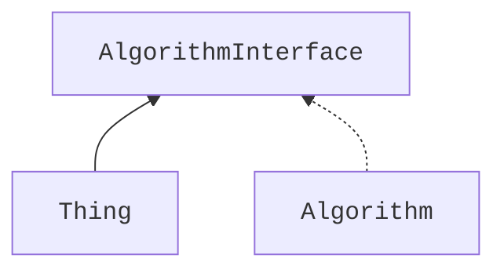
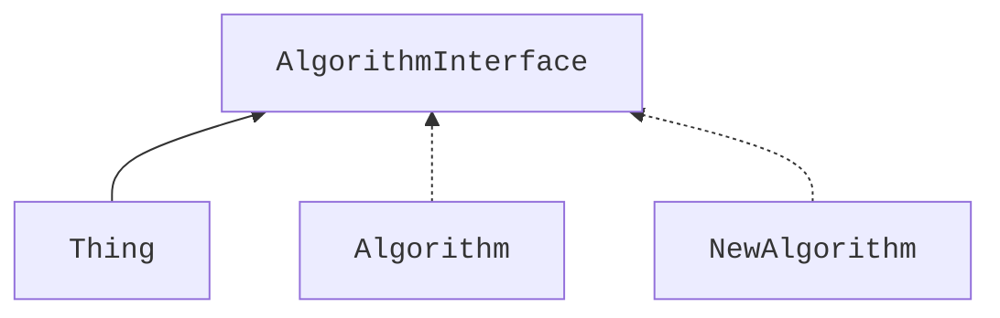
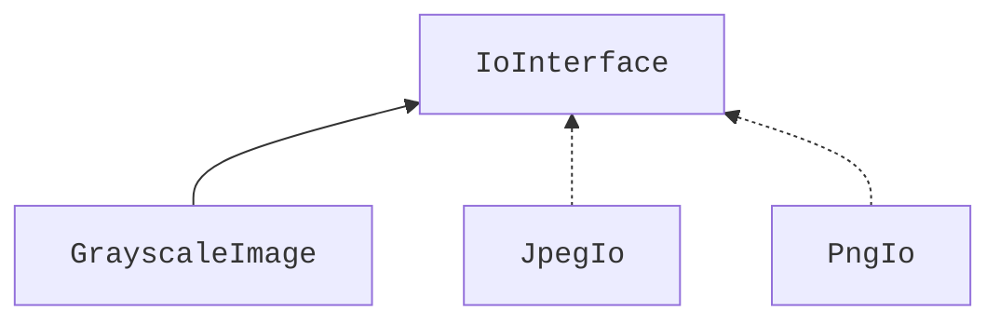
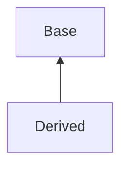

Inheritance and the idea of OOP
--

<p align="center">
  <a href="https://youtu.be/blah"></a>
</p>

- [Inheritance and the idea of OOP](#inheritance-and-the-idea-of-oop)
- [Interface inheritance enables dependency inversion](#interface-inheritance-enables-dependency-inversion)
  - [Concrete example of dependency inversion](#concrete-example-of-dependency-inversion)
- [How inheritance looks in C++](#how-inheritance-looks-in-c)
  - [Implementation inheritance](#implementation-inheritance)
    - [Real-world example of implementation inheritance](#real-world-example-of-implementation-inheritance)
- [Access control and inheritance](#access-control-and-inheritance)
    - [Implicit upcasting](#implicit-upcasting)
    - [Downcasting using the `dynamic_cast`](#downcasting-using-the-dynamic_cast)
  - [Interface inheritance](#interface-inheritance)
    - [Limitations of implementation inheritance](#limitations-of-implementation-inheritance)
    - [Using `virtual` for interface inheritance and proper polymorphism](#using-virtual-for-interface-inheritance-and-proper-polymorphism)
    - [How interface inheritance works](#how-interface-inheritance-works)
    - [Things to know about classes with `virtual` methods](#things-to-know-about-classes-with-virtual-methods)
      - [A `virtual` destructor](#a-virtual-destructor)
      - [Delete other special methods for polymorphic classes](#delete-other-special-methods-for-polymorphic-classes)
- [Don't mix implementation and interface inheritance](#dont-mix-implementation-and-interface-inheritance)
  - [Implement pure interfaces](#implement-pure-interfaces)
  - [Keyword `final`](#keyword-final)
- [Back to our `GrayscaleImage` example](#back-to-our-grayscaleimage-example)
- [Multiple inheritance](#multiple-inheritance)
- [Back to our example](#back-to-our-example)


Inheritance is an important concept that enables a lot of techniques that we use in C++. It is also **the** mechanism for **dynamic polymorphism** that is one of the staples that allows us to think about design of our systems in very abstract and elegant ways. It also enables what is known as Object Oriented Programming or OOP when applied to C++.

Largely speaking, we distinguish between two types of inheritance, which are not very much different syntax-wise but are _very_ different in what they allow us to achieve:
- Implementation inheritance
- Interface inheritance

So let's talk about these: what interface inheritance allows us to achieve and why we mostly don't use the implementation inheritance!

<!-- Intro -->

## Interface inheritance enables dependency inversion
Essentially, we mostly care about inheritance because it, just like using templates, allows us to **invert dependencies** between our components. You might have heard people talking about this as, well, the **dependency inversion principle**.

Now this term sounds a bit scary but the concept under the hood actually makes a lot of sense!

Let's assume that we have some class `Thing` that depends on some other class `Algorithm` indicating this relationship by an arrow in a dependency diagram:


This reads as "`Thing` depends on the `Algorithm`" and really just means that changes to the public API of our `Algorithm` require changes in the `Thing` class.

Such a dependency in itself might not be a huge problem if there are no changes expected from a system that we are designing. We probably will talk about this in one of the upcoming lectures on the software design guiding principles so I won't cover this in-depth here.
<!-- Leave a comment below this video if you are interested in that! What would you like me to cover? And maybe subscribe if you haven't already while you're at it! -->

However, requiring that there would be no changes in the whole future lifetime of a system is a _very strong requirement_. And, as such, it is also the one that rarely holds. It happens often that systems actually need to change and even for the most experienced folks these changes are hard to anticipate. Add on top of this the fact that different components of complex systems are often developed by different people or even teams and we start getting the feeling that we usually want to avoid this type of strong inter-dependency between the components.

Furthermore, we might want to be able to change the algorithm used in the `Thing` class at runtime, allowing the user of our system to pick the one that they want. Currently, we would have to rewrite the `Thing` class itself, which makes our design quite rigid and brittle at the same time.

Dependency inversion allows to avoid both of these pitfalls. Instead of requiring `Thing` to rely on `Algorithm` directly, we can make both of these classes rely on an agreed upon **interface**, thus inverting the dependencies - there is no line that points from `Thing` to `Algorithm` anymore!

Here, our `Thing` class calls the public methods of the `AlgorithmInterface`, while the `Algorithm` **implements** this interface.

Now, as long as we designed a good interface (which to me is arguably the hardest part of software design), we can make changes to the `Algorithm` and `Thing` class independently from each other. Not only that but we can easily add more algorithms should we need to, say a `NewAlgorithm` class that implements the same interface, and the `Thing` doesn't need to know that anything changed under the hood.


🚨 So we really care about interface inheritance because it **enables this form of abstract software design**, which is also known as **O**bject **O**riented **P**rogramming, or **OOP**! And in the remainder of today's lecture we'll see **how** inheritance enables this design through **dynamic polymorphism**.

Now, those of you who were careful to follow the [lectures on templates in this course](templates_why.md) might get a feeling that something similar should be possible to achieve using templates too. After all, we did look at how we could replace an algorithm using a template strategy. And you _are_ right! We _can_ do it with templates **at compiler time** but **not at runtime**. Depending on our goals this might be more or less suitable for our needs.

So now with the gist of what we need inheritance for out of the way, let's see a more concrete example and dive into more details!

### Concrete example of dependency inversion
Imagine that our `Thing` class is actually a `GrayscaleImage` that represents its pixel values a [`std::vector`](more_useful_types.md) of `std::uint8` intensities. For the sake of this example, it also has a constructor and a `Save` method that both make use of some other class `JpegIo`, in place of the `Algorithm` class we used before, that allows us to read and write data in JPEG format. This `GrayscaleImage` class is not very useful but it will be enough for us to showcase the dependency inversion principle all the same.
```cpp
class GrayscaleImage {
   public:
    GrayscaleImage(const std::filesystem::path& path,
                   const JpegIo& io) {
        intensities_ = io.Read(path);
    }

    void Save(const std::filesystem::path& path, const JpegIo& io) const {
        io.Write(path, intensities_);
    }

   private:
    std::vector<std::uint8_t> intensities_{};
};

int main() {
    const GrayscaleImage image{"path.jpeg", JpegIo{}};
    image.Save("other_path.jpeg", JpegIo{});
}
```

Now, clearly, `GrayscaleImage` depends on `JpegIo`. We can see this by thinking about their public interfaces, i.e., their functions. If a `Read` or `Write` function of the `JpegIo` class changes, we _will have to change_ the implementation of the `GrayscaleImage`, but if just the public interface of the `GrayscaleImage` changes, no changes are required on the `JpegIo` side.


Working with JPEG files is nice, but this is not the only common image format, so it is very likely that we actually want to not only work with JPEG files, but also with PNG and maybe other formats. The naïve way is, of course, to just write a `PngIo` class similar to  the `JpegIo` class and compile the `GrayscaleImage` class with whichever io class we need. Supporting both of these io strategies would then require adding more functions to our image class. But this requires recompilation and lots of code changes! Not only that it also changes the public interface of our image class! We can do better!

This is where the dependency inversion principle really comes into play: it allows us to introduce an **interface**, say `IoInterface`, with a common public interface that `GrayscaleImage`, `JpegIo` and any other similar classes will depend on!

Note how there is no arrow pointing from `GrayscaleImage` to `JpegIo` or `PngIo`, just one pointing to the `IoInterface`.

In our example, the code changes to rely on a reference (or a pointer) to an `IoInterface` rather than on a concrete implementation:
```cpp
class GrayscaleImage {
   public:
    GrayscaleImage(const std::filesystem::path& path,
                   const IoInterface& io) {
        intensities_ = io.Read(path);
    }

    void Save(const std::filesystem::path& path, const IoInterface& io) const {
        io.Write(path, intensities_);
    }

   private:
    std::vector<std::uint8_t> intensities_{};
};

int main() {
    const GrayscaleImage image{"path.jpeg", JpegIo{}};
    image.Save("other_path.png", PngIo{});
}
```
Look how easy it is now to change the behavior of our `GrayscaleImage` without changing its code! We just pass a new **strategy** (i.e., one of the classes that implement our `IoInterface`) into it and it magically works!

Now, to achieve this, we need inheritance in C++!

As you have undoubtedly noticed, I have not provided any implementation of our io strategy classes just yet. We will of course fill them in towards the end of this lecture but for now we have to take a step back and see how inheritance works in modern C++.

## How inheritance looks in C++
### Implementation inheritance
In its simplest form, the so-called **implementation inheritance** is designed to simply extend one class, say `Base` with another, say `Derived`. We say that a `Derived` class inherits from a `Base` class which implies that any object of the `Derived` class contains a full copy of the `Base` class, including all of its methods and appending the data of the `Derived` class to the data stored in the `Base` object.
<!-- TODO: add image -->

Let's show it on a simple example as we always do. We have two structs: `Base` and `Derived` that inherits from `Base`. We show the inheritance by a `:` symbol after the name of the derived class followed by the name of its parent class, along with some access modifiers, here `public`, more on that later.

These classes have their corresponding methods `BaseMethod` and `DerivedMethod` and some data, which we keep `public` here for illustration purposes. They also have a function with the same name `DoSmth`. We then create an object of the `Derived` class and call both `Base`-specific and `Derived`-specific methods on it as well as print the address of the data it contains.
```cpp
#include <iostream>

// Using struct here but the same holds for classes
struct Base {
  void DoSmth() const { std::cout << "Base DoSmth" << std::endl; }
  void BaseMethod() const { std::cout << "BaseMethod" << std::endl; }
  // Doesn't have to be int
  int base_data{};
};

// Using struct here but the same holds for classes
struct Derived : public Base {
  void DoSmth() const { std::cout << "Derived DoSmth" << std::endl; }
  void DerivedMethod() const { std::cout << "DerivedMethod" << std::endl; }
  // Also can be any other type
  float derived_data{};
};

int main() {
  const Derived object{};
  object.BaseMethod();
  object.DerivedMethod();
  object.DoSmth();
  std::cout << "&object.base_data:    " << &object.base_data << std::endl;
  std::cout << "&object.derived_data: " << &object.derived_data << std::endl;
}
```
This produces the following output:
```output
BaseMethod
DerivedMethod
Derived DoSmth
&object.base_data:    0x7ffe8fff82d8
&object.derived_data: 0x7ffe8fff82dc
```
Looking at this output, we see that we can call both the `Base`-specific and the `Derived`-specific methods on an object of `Derived` type. Furthermore, because we work with an object of the `Derived` type, the `DoSmth` function shadows its counterpart from the `Base` class. As for the data, looking at their address, we see that the `Derived`-defined data follow right after the `Base`-defined ones.

#### Real-world example of implementation inheritance
The use of implementation inheritance is quite limited in modern C++. The only real-world examples that come to mind are the implementation of various type traits and maybe the [Curiously Recurring Template Pattern](https://en.wikipedia.org/wiki/Curiously_recurring_template_pattern), or CRTP. I will not focus on CRTP here <!--, feel free to read up on it following the link in the description to this video, --> but the usage of implementation inheritance in type traits is quite common and I'd like to briefly look at it here. So I would like to return to a small piece of code we wrote when we talked about [type traits](templates_how_classes.md#type-traits-and-how-to-implement-them-using-template-specialization) before.

This code shows our custom implementation of the [`std::is_integral`](https://en.cppreference.com/w/cpp/types/is_integral) type trait that checks if a type provided to it represents integer numbers.
<!--
`CPP_SETUP_START`
$PLACEHOLDER
`CPP_SETUP_END`
`CPP_COPY_SNIPPET` simple_trait_example/is_integral.cpp
`CPP_RUN_CMD` CWD:simple_trait_example c++ -std=c++17 -c is_integral.cpp
-->
```cpp
template <typename T>
struct is_integral {
  static constexpr inline bool value{};
};
```
This primary pattern implementation is perfectly fine but if we look at the standard library implementation it is actually implemented differently - through inheritance!

You see, there is another trait [`std::integral_constant`](https://en.cppreference.com/w/cpp/types/integral_constant), which furthermore has `std::true_type` and `std::false_type` specializations. The `std::integral_constant` trait already has a `static` member `value` defined with all the current best practices in mind, so why not reuse it?

And we _can_ reuse these already defined type traits by using implementation inheritance:
```cpp
template<class T, T v>
struct integral_constant {
    static constexpr inline T value = v;
};

using true_type = integral_constant<bool, true>;
using false_type = integral_constant<bool, false>;

template <typename T>
struct is_integral : public false_type {};

// Specializations for any types we deem integral.
template <>
struct is_integral<int> : public true_type {};
```
Here, we inherit our `struct` `is_integral` from the `false_type` **base** class. This has the effect that our `is_integral` struct gains the `value` that holds `false`. And, likewise, we can now specialize our struct for any type we want to be marked as integral type using another typedef `true_type`.

This is really the only use case in which implementation inheritance is routinely used in modern C++.
<!-- But if you know of other common examples, please tell me what they are in the comments! -->

## Access control and inheritance
Now is a good time for a short interlude about access control in classes when inheritance is at play. First of all, there is another class access modifier that we did not talk about. Before, we talked about `private` and `public` access to class methods and data. There is one more access modifier to think of - `protected`. It works just like private for anybody trying to access data from the outside of class hierarchy, while within the class hierarchy the data is accessible.
```cpp
#include <iostream>

// Using struct here but the same holds for classes
class Base {
   public:
    int public_base_data{};
   protected:
    int protected_base_data{};
   private:
    int private_base_data{};
};

// Using struct here but the same holds for classes
struct Derived : public Base {
    void PrintData() const {
        std::cout << "public_base_data: " << public_base_data
                  << " protected_base_data: " << protected_base_data
                  << std::endl;
        // ❌ Cannot access private_base_data from here!
    }
};

int main() {
    const Derived object{};
    std::cout << "object.public_base_data: " << object.public_base_data << std::endl;
    // ❌ Cannot access object.protected_base_data from here!
    // ❌ Cannot access object.private_base_data from here!
    return 0;
}
```

You might have also noticed that we used the word `public` after the `:` symbol when using inheritance. But we could also technically use `protected` or `private` there. The difference is the following:
- ✅ `[most common]` Using `public` maintains the access levels of all data and methods of the base class, **mimics an "is a" relationship** between classes
- Using `protected` makes all the `public` attributes of the base class `protected` and leaves its `protected` and `private` members as is
- Using `private` makes all the members of the base class `private`

These are a bit hard to grasp. For example, using `private` inheritance means that we don't have direct access to any member of the base class at all! So in reality, when using inheritance we mostly use `public` inheritance.

If you feel that there is a need to use `private` inheritance, in such cases it is better to use composition as opposed to inheritance, i.e., just store an object of the base class as a member of the previously derived class. This relationship is usually called **"implement in terms of"**. It makes sense, if we think about it - storing an object of another class achieves the same as inheriting privately from another object - we can only access the public methods of that other class while not exposing any of it to the outside!

<!-- TODO: need an example -->

For example, if we want to implement a class `Zombie`, it would be wrong to inherit from `Human` as a zombie is not a human. But we could implement a zombie in terms of a human, meaning that we would still use the internal state of a human but only expose part of the interface to the outside.


#### Implicit upcasting
Now one of the defining features of how inheritance was designed in C++ is that a pointer or a reference to any derived class can be **implicitly converted** to a pointer or a reference of the base class. This is commonly called **upcasting**, "up" referring to the dependency diagrams usually shown in such a way that an arrow points from `Derived` below to `Base` above.



To show how this works, we can change our main function by adding a `Base` reference that will point to a `Derived` object:
```cpp
int main() {
  const Derived derived{};
  const Base& base{derived};
  base.BaseMethod();
  base.DoSmth();
}
```
And, of course, we can call only `Base`-specific methods on this reference.

While this is neat, it does not really bring us much closer to our goal of being able to abstract the implementation away behind a pointer. You see, the `Base` reference "forgets" that it was created from a `Derived` object and so the `DoSmth` method calls its `Base` implementation. So such simple inheritance _is quite limited_.

:bulb: To actually be able to define and implement an interface like the one we talked about before, we will need to use **`virtual` functions**.

#### Downcasting using the `dynamic_cast`
Just like we can upcast our type along the hierarchy of classes we can downcast these classes too. This _is_ considered an antipattern though and breaks the so-called Liskov substitution principle stating that an object may be replaced by a sub-object without breaking the program.

So while usually when we see `dynamic_cast` in the code it is a code smell that indicates that design improvements are probably in order, it is still important to understand how it works should you encounter it in some program.

The `dynamic_cast` allows us to convert a pointer or a reference to a polymorphic `Base` class to a pointer or reference of the `Derived` class, derived from `Base`. We won't go too much into detail, but it is important to note that this conversion might fail! If this conversion fails while converting a pointer, a `nullptr` will be returned, while if the failure occurs while converting a reference, a `std::bad_cast` exception will be thrown.
```cpp
#include <iostream>

struct Base {
    virtual ~Base() {}
};

struct OtherBase {
    virtual ~OtherBase() {}
};

struct Derived : public Base {};

int main() {
    const Derived object{};
    const Base& base_ref{object};
    const OtherBase other_base{};
    const OtherBase& other_base_ref{other_base};
    const Derived& derived_ref = dynamic_cast<const Derived&>(base_ref);
    // other_derived_ptr will be nullptr because it is not derived from OtherBase.
    const Derived* other_derived_ptr = dynamic_cast<const Derived*>(&other_base_ref);
}
```

### Interface inheritance
#### Limitations of implementation inheritance
So I hope that we are on the same page that the implementation inheritance is quite limited. It does not on its own enable dynamic polymorphism that we seek. We can refer to an object of a `Derived` class by a pointer to a `Base` object, but even if we now call the `DoSmth` method we actually call the one defined in the `Base` class. This happens because the reference is to the `Base` type and it has no knowledge that it was created from a `Derived` object!
```cpp
#include <iostream>

// Using struct here but the same holds for classes
struct Base {
  void DoSmth() const { std::cout << "Base DoSmth" << std::endl; }
  void BaseMethod() const { std::cout << "BaseMethod" << std::endl; }
  // Doesn't have to be int.
  int base_data{};
};

// Using struct here but the same holds for classes
struct Derived : public Base {
  void DoSmth() const { std::cout << "Derived DoSmth" << std::endl; }
  void DerivedMethod() const { std::cout << "DerivedMethod" << std::endl; }
  // Also can be any other type.
  float derived_data{};
};

int main() {
  const Derived derived{};
  const Base& base_ref{derived};
  base_ref.DoSmth();  // Calls the Base implementation.
}
```
#### Using `virtual` for interface inheritance and proper polymorphism
What we really want though is to make sure that the compiler knows which function to call depending on which type in the hierarchy was used to create the object in the first place! For that we have to use the keyword `virtual` when declaring our `Base` function and `override` when declaring it in the `Derived` class. Note, that should we `override` a non-`virtual` function, we'll get an error!
```cpp
#include <iostream>

// 😱 We do not follow best practices for simplicity here.
// This struct misses lots of special functions.
// Some of them must be virtual, some deleted. Stay tuned.
struct Base {
  virtual void DoSmth() const { std::cout << "Base DoSmth" << std::endl; }
};

// 😱 We do not follow best practices for simplicity here.
// This struct misses lots of special functions.
// Some of them must be virtual, some deleted. Stay tuned.
struct Derived : public Base {
  void DoSmth() const override { std::cout << "Derived DoSmth" << std::endl; }
};

int main() {
  const Derived derived{};
  const Base base{};
  const Base& base_ref = derived;
  base.DoSmth();      // Calls Base implementation.
  derived.DoSmth();   // Calls Derived implementation.
  base_ref.DoSmth();  // Calls Derived implementation.
}
```
This works like magic! Now the `Base` reference "remembers" that it was created from a `Derived` object and when we call the `DoSmth` function it calls the `Derived` one! This is the core principle that enables **dynamic polymorphism** and **object oriented programming** in C++.

#### How interface inheritance works
Now that we know that it works, let us dig a bit into how it is implemented under the hood. How does our reference "remember" that it was created from a derived object?

And the answer is that it knows this "by looking up the correct function to call in a **virtual table**, or a **vtable**".

The vtable is not magic - it is just a table of pointers to functions. Whenever a compiler compiles a class that has any `virtual` functions, it creates a vtable for that class and adds a hidden pointer member that points to this vtable. Now, when we create a `Derived` object its vtable entry for `DoSmth` function points to its own implementation. Now when we set our derived object to a base reference, we **keep its hidden pointer to its vtable** intact. This way, when we call a `DoSmth` on the `base_ref`, we look up the correct function to call in the vtable, find the one that the `Derived` object put there and call the `Derived::DoSmth` function.

<!-- TODO: add picture -->

#### Things to know about classes with `virtual` methods
Now, adding `virtual` functions to classes introduced some constraints on how we should use these classes and creates a couple of pitfalls that we should be aware of. In the previous examples we omitted quite some details and it is time we cover those details now.

##### A `virtual` destructor
Generally speaking, every class that has a `virtual` function **must have a `virtual` destructor**. This becomes obvious once we move on from using references with our base and derived classes towards using pointers, especially owning ones.

To properly understand why the destructor must be virtual we have to answer the question: if we create a derived object and store it by a base pointer, which destructor will be called? Take a moment to think about it.

<!-- Pause a video here, look at the examples we just covered and really think about it! -->

And I'm sure that you got it right! If the _base destructor_ is not `virtual`, _it will be called_. But this destructor knows nothing about derived data! So those data will be leaked! Now if the destructor is virtual, a call to it will go through a vtable and so the correct derived destructor will be called.

<!-- TODO: create visualization and maybe a code example -->

##### Delete other special methods for polymorphic classes
So I hope that we see why we need a `virtual` destructor if we have any `virtual` functions. But, if you remember, we already talked about the ["rule of all or nothing"](all_or_nothing.md) before, which states that if we need a single special function, like the destructor, that deals with the object's lifetime, we need all of them. This is true in this case too. Alongside a virtual destructor we need to deal with the copy and move constructors and assignment operators.

This topic is slightly convoluted and I believe it is not talked about enough.

I believe that all of these special methods must be `delete`d because otherwise, if we try to copy or move a class that is designed with pointers and references in mind, we run a good risk of [**slicing**](https://www.learncpp.com/cpp-tutorial/object-slicing/) our object. Slicing happens when a copy or move constructor or an assignment operator is called on a base class when the actual allocated object is of a derived class that has more data stored in it. The base class only knows how to copy **its** data, **not the derived** data. So once we created a base pointer that points to a derived object, if we copy the object that the base pointer points to we will only copy part of the data that the base class knows about.

<!-- TODO: Create visualization -->

Some people still suggest making these copy/move constructors and assignment operators `protected`, so that they can still be used by the derived classes, but I would argue that we should mark them as `delete`d. If we implement dynamic polymorphism we _must_ work with **pointer and reference semantics**, while the copy/move constructors and assignment operators aim to implement **value semantics**. The two don't mix very well. I believe that we should really pick one paradigm - value semantics or pointer/reference semantics and stick with it.

Putting this all together a better way to implement our `Base` and `Derived` classes from before would be to add all the missing `deleted` special functions to the base class.
```cpp
#include <iostream>

struct Base {
  virtual void DoSmth() { std::cout << "Base DoSmth" << std::endl; }

  Base() = default;

  Base(const Base&) = delete;
  Base(Base&&) = delete;
  Base& operator=(const Base&) = delete;
  Base& operator=(Base&&) = delete;
  virtual ~Base() = default;
};

struct Derived : public Base {
  void DoSmth() override { std::cout << "Derived DoSmth" << std::endl; }
};

int main() {
  Derived derived{};
  Base base{};
  Base& base_ref = derived;
  base.DoSmth();      // Calls Base implementation.
  derived.DoSmth();   // Calls Derived implementation.
  base_ref.DoSmth();  // Calls Derived implementation.
}
```
This allows us to get rid of the annoying disclaimer comment.

There is also a quicker way to do this by inheriting from a simple `Noncopyable` class which can be reused for any class that is not supposed to be copyable or movable. Then we just need a `virtual` destructor because all the rest of the special functions are already taken care of.
```cpp
struct Noncopyable {
  Noncopyable() = default;
  Noncopyable(const Noncopyable&) = delete;
  Noncopyable(Noncopyable&&) = delete;
  Noncopyable& operator=(const Noncopyable&) = delete;
  Noncopyable& operator=(Noncopyable&&) = delete;
  ~Noncopyable() = default;
};

struct Base : public Noncopyable {
  virtual void DoSmth() const { std::cout << "Base DoSmth" << std::endl; }
  virtual ~Base() = default;
};

struct Derived : public Base {
  void DoSmth() const override { std::cout << "Derived DoSmth" << std::endl; }
};
```

## Don't mix implementation and interface inheritance
We are almost ready to return to our original `GrayscaleImage` example and finish its implementation with all the best practices in mind. There is just one more thing to cover for that.

In my experience, having virtual functions that have a base implementation and some overridden implementation in a derived class becomes confusing quite quickly. It becomes hard to find where in the hierarchy of the classes the actual implementation actually happens, and it seems that the experts who know much more about software design than I do agree with me on this.

C++ Core Guidelines suggests to keep implementation inheritance [separate from the interface inheritance](https://isocpp.github.io/CppCoreGuidelines/CppCoreGuidelines#c129-when-designing-a-class-hierarchy-distinguish-between-implementation-inheritance-and-interface-inheritance) and the Google C++ Code Style suggest to [not overuse implementation inheritance](https://google.github.io/styleguide/cppguide.html#Inheritance) and prefer composition instead, while some go as far as to call [implementation inheritance evil](http://whats-in-a-game.com/implementation-inheritance-is-evil/) altogether.

### Implement pure interfaces
So what is the solution to this problem? The solution is to separate interface inheritance and implementation inheritance alltogether. You see, there is one more trick up our sleeves with `virtual` - the **pure `virtual` functions**.

They allows us to define a `virtual` function that does not have any implementation by design and **must** be implemented by the descendants of the class it belongs to.

This is perfect for creating interfaces. We generally call a class that has at least one pure virtual function an **abstract class** and a class that has **all** of its function as pure virtual an **interface**.

In my experience, I prefer to define such interfaces and keep a shallow hierarchy of their concrete implementation using composition and function reusing to avoid code duplication.
<!-- But do tell me your experience with all of this! -->

### Keyword `final`
Speaking of keeping a shallow hierarchy, let's also briefly talk about the word `final`. We can use it to forbid any future extensions of a particular class. It _is_ helpful when implementing a shallow hierarchy of classes that all implement pure interfaces but I would suggest to be careful with the use of it as it is very hard to know the future and this is equivalent to a statement, "I'm 100% sure that nobody ever will need to extend this class". Which is a hard statement to make confidently.

## Back to our `GrayscaleImage` example
For completeness, using an interface `Base`, our simple example would look like this:
```cpp
#include <iostream>

struct Noncopyable {
  Noncopyable() = default;
  Noncopyable(const Noncopyable&) = delete;
  Noncopyable(Noncopyable&&) = delete;
  Noncopyable& operator=(const Noncopyable&) = delete;
  Noncopyable& operator=(Noncopyable&&) = delete;
  ~Noncopyable() = default;
};

struct Base : public Noncopyable {
  virtual void DoSmth() const = 0;
  virtual ~Base() = default;
};

struct Derived final : public Base {
  void DoSmth() const override { std::cout << "Derived DoSmth" << std::endl; }
};

struct AnotherDerived final : public Base {
  void DoSmth() const override { std::cout << "AnotherDerived DoSmth" << std::endl; }
};

int main() {
  const Derived derived{};
  const AnotherDerived another_derived{};
  const Base* base_ptr = &derived;
  base_ptr->DoSmth();  // Calls Derived implementation.
  base_ptr = &another_derived;
  base_ptr->DoSmth();  // Calls AnotherDerived implementation.
}
```
Here, we change `Base` to be an interface, add one more implementation class `AnotherDerived` and mark our derived implementations `final` to make sure nobody can build a deep hierarchy on top of them. We also convert the `main` to use pointers just to show that we can refer to two different implementations by the same pointer.

## Multiple inheritance
C++ also allows to use multiple inheritance. But do note that it is [heavily discouraged](https://google.github.io/styleguide/cppguide.html#Inheritance) in case of implementation inheritance. It is easy to show the reason. Imagine we have a class that inherits from a number of classes and we want to find the implementation of a certain functionality. How do we know where it is implemented? In bigger projects this becomes really cumbersome.

That being said, it is ok sometimes to use multiple inheritance when a class needs to implement multiple interfaces. It is easy to imagine that a game object can be both `Drawable` and, say `Moveable`.
```cpp
class Box: public Drawable, public Moveable {
 public:
  void Draw() override {}
  void Move(float distance) override {}
  // Rest of the implementation.
}
```

## Back to our example
Now we know everything there is to know about inheritance in modern C++. We know how simple (and a bit limited) implementation inheritance is, we know that the interface inheritance enabled dynamic polymorphism, we understand how it works under the hood and we know the best practices related to creating and using interfaces. So it is time to put it all to a small test and get back to our original example with the `GrayscaleImage`. We can now properly implement the missing parts.

```cpp
#include <filesystem>
#include <iostream>
#include <vector>

struct Noncopyable {
    Noncopyable() = default;
    Noncopyable(const Noncopyable&) = delete;
    Noncopyable(Noncopyable&&) = delete;
    Noncopyable& operator=(const Noncopyable&) = delete;
    Noncopyable& operator=(Noncopyable&&) = delete;
    ~Noncopyable() = default;
};

struct IoInterface : public Noncopyable {
    virtual std::vector<std::uint8_t> Read(
        const std::filesystem::path& path) const = 0;
    virtual void Write(const std::filesystem::path& path,
                       const std::vector<std::uint8_t>& data) const = 0;
    virtual IoInterface() = default;
};

struct JpegIo final : public IoInterface {
    std::vector<std::uint8_t> Read(
        const std::filesystem::path& path) const override {
        std::cout << "Reading JPEG from path: " << path << std::endl;
        return {};
    }
    virtual void Write(const std::filesystem::path& path,
                       const std::vector<std::uint8_t>& data) const override {
        std::cout << "Writing JPEG to path: " << path << std::endl;
    }
};

struct PngIo final : public IoInterface {
    std::vector<std::uint8_t> Read(
        const std::filesystem::path& path) const override {
        std::cout << "Reading PNG from path: " << path << std::endl;
        return {};
    }
    virtual void Write(const std::filesystem::path& path,
                       const std::vector<std::uint8_t>& data) const override {
        std::cout << "Writing PNG to path: " << path << std::endl;
    }
};

class GrayscaleImage {
   public:
    GrayscaleImage(const std::filesystem::path& path, const IoInterface& io) {
        intensities_ = io.Read(path);
    }

    void Save(const std::filesystem::path& path, const IoInterface& io) const {
        io.Write(path, intensities_);
    }

   private:
    std::vector<std::uint8_t> intensities_{};
};

int main() {
    const GrayscaleImage image{"path.jpeg", JpegIo{}};
    image.Save("other_path.png", PngIo{});
}
```
We reuse our `Noncopyable` base class to declare the `IoInterface` with our `Write` and `Read` functions, along with a `virtual` destructor. Note that our functions are both `const`-qualified as well as pure `virtual`. Then, our `JpegIo` and `PngIo` implement the interface by overriding the `Write` and `Read` functions. The actual implementation is not important right so they just print something to the terminal here. Finally, just as before, we use the reference to our interface in our `GrayscaleImage` class to refer to any implementation that we pass into it in our `main` function.

This, I believe, follows most of the current best practices when it comes to implementing an OOP-style system that relies on dynamic polymorphism.

<!-- And if you are interested in how to achieve very similar results with templates, please give a watch to the series of videos I recorded about templates, starting with why. Thanks a lot for your attention and bye! -->
