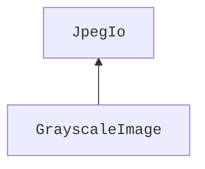
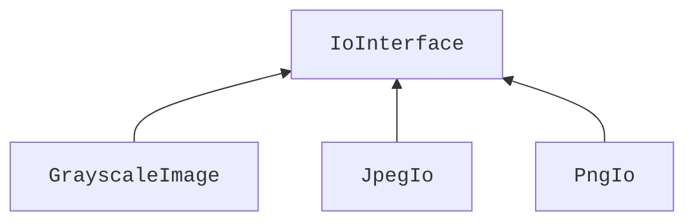

<!--
https://isocpp.org/wiki/faq/proper-inheritance - for fun proper inheritance

https://isocpp.org/wiki/faq/private-inheritance - when to use private inheritance

Designing an interface is hard

Virtual destructors!

Also info here: https://en.cppreference.com/w/cpp/language/derived_class

Google style: https://google.github.io/styleguide/cppguide.html#Inheritance

> Composition is often more appropriate than inheritance. When using inheritance, make it public.

https://isocpp.github.io/CppCoreGuidelines/CppCoreGuidelines#c129-when-designing-a-class-hierarchy-distinguish-between-implementation-inheritance-and-interface-inheritance

https://google.github.io/styleguide/cppguide.html#Access_Control

Object slicing: https://www.learncpp.com/cpp-tutorial/object-slicing/
 -->

# Inheritance

Inheritance is an important concept that enables a lot of techniques that we use in C++. It is also **the** mechanism for dynamic polymorphism that is one of the staples that allows us to think about design of our systems in a very abstract and elegant ways.

Largely speaking, we distinguish between two types of inheritance, which are not very much different syntax-wise but are _very_ different in what they allow us to achieve:
- Implementation inheritance
- Interface inheritance

So let's talk about these, what interface inheritance allows us to achieve and why we mostly don't use the implementation inheritance!

<!-- Intro -->

## Short agenda
I always try to start my lectures with a "why" - why anybody would care about the thing that I'm telling about. Today is not an exception. That being said, I'm afraid, that today we will need an agenda: we will start with "why" we are interested in inheritance in terms of what it allows us to do, then we'll talk about the inheritance mechanism and we'll finish on why we don't care that much about implementation inheritance and the rest of the details.

## Why we care about inheritance
Essentially, we mostly care about inheritance because it allows us to **invert dependencies** between our components. You might have heard people talking about this as the **dependency inversion principle**.

Now this term is a bit scary, people like to throw it around and it is easy to get lost, but it _is_ an important concept so let's unpack what it actually stands for using a simple example, as always.

Imagine we have a class `GrayscaleImage` that represents its pixel values as `std::uint8` intensities in range of $[0, 255)$. For the sake of this example, we will also have a constructor and a `Save` method in this class, that both make use of some other class `JpegIo` that allows us to read and write data in JPEG format. This `GrayscaleImage` class is not very useful but it will be enough for us to showcase the dependency inversion principle all the same.

```cpp
class GrayscaleImage {
   public:
    explicit GrayscaleImage(const std::filesystem::path& path,
                            const JpegIo& io) {
        intensities_ = io.Read(path);
    }

    void Save(const std::filesystem::path& path, const JpegIo& io) const {
        io.Write(path, intensities_);
    }

   private:
    std::vector<std::uint8_t> intensities_{};
};

int main() {
    const GrayscaleImage image{"path.jpeg", JpegIo{}};
    image.Save("other_path.jpeg", JpegIo{});
}
```

Now, clearly, the classes `GrayscaleImage` and the class `JpegIo` are locked in some form of relationship. Furthermore, we can state that one depends on the other by thinking what happens if either of these classes changes its public interface. If the public interface (the `Read` and `Write` functions) of the `JpegIo` class change, we _will_ have to change the implementation of the `GrayscaleImage`, but if just the public interface of the `GrayscaleImage` change, no changes are required on the `JpegIo` side.

This indicates to us that `GrayscaleImage` **depends** on `JpegIo`:


The dependency in itself might not be a huge problem if there are no changes expected from this system. We will talk about this in one of the upcoming lectures on the software design guiding principles using the tools at our disposal.
<!-- Leave a comment below this video if you are interested in that! What would you like me to cover? And maybe subscribe if you haven't already while you're at it! -->

In this particular case, we actually want to be able to not only work with JPEG files, but also with PNG and maybe other formats. The naïve way is, of course, to just rewrite the `JpegIo` into `PngIo` and replace it in the `GrayscaleImage` class.

But this, at the very least, requires recompilation of `GrayscaleImage` and we're left hanging if we need to support both strategies. Yuk!

And this is where the dependency inversion principle really comes into play: it allows us to introduce an **interface**, say `IoInterface`, with a common public interface that `GrayscaleImage`, `JpegIo` and any other similar classes will depend on!


Note how there is no arrow pointing from `GrayscaleImage` to `JpegIo` or `PngIo`, just one pointing to the `IoInterface`.

For those of you, who were careful to follow the [lectures on templates in this course](templates_why.md) might get a feeling that this should be possible to achieve using template. And you _are_ right! We _can_ do it with templates **at compiler time** but **not at runtime**. For this we need **dynamic polymorphism**, which in C++ is achieved through inheritances.

In our example, the code changes to rely on `IoInterface` rather than on a concrete implementation now:
```cpp
class GrayscaleImage {
   public:
    explicit GrayscaleImage(const std::filesystem::path& path,
                            const IoInterface& io) {
        intensities_ = io.Read(path);
    }

    void Save(const std::filesystem::path& path, const IoInterface& io) const {
        io.Write(path, intensities_);
    }

   private:
    std::vector<std::uint8_t> intensities_{};
};

int main() {
    const GrayscaleImage image{"path.jpeg", JpegIo{}};
    image.Save("other_path.png", PngIo{});
}
```

Note how easy it is now to change the behavior of our `GrayscaleImage` without changing its code! We just pass a new **strategy** into it and it magically works!

This is exactly what inheritance allows us to do and by far its main use-case.

So let's see how this is actually done!

## How inheritance looks in C++
### Implementation inheritance
In its simplest form, the so-called **implementation inheritance** is just making sure that if we have a `Derived` class that inherits from a `Base` class then the the object of the `Derived` class contains a full copy of the `Base` class, including all of its methods and appending its data to the data stored in the `Base` object.

But let's see it using an example. Here, we have two classes `Base` and `Derived` with `Derived` being inherited from `Base`. They also have their corresponding methods `BaseMethod` and `DerivedMethod` and some data, which we make `public` here for illustration purposes. We then create an object of the `Derived` class and call both `Base`-specific and `Derived`-specific methods on it as well as print the address of the data it contains.
```cpp
#include <iostream>

// Using struct here but the same holds for classes
struct Base {
  void BaseMethod() {
    std::cout << "BaseMethod" << std::endl;
  }
  // Doesn't have to be int
  int base_data{};
};

// Using struct here but the same holds for classes
struct Derived : public Base {
  void DerivedMethod() {
    std::cout << "DerivedMethod" << std::endl;
  }
  // Also can be any other type
  float derived_data{};
};

int main() {
  Derived object{};
  object.BaseMethod();
  object.DerivedMethod();
  std::cout << "&object.base_data:    " << &object.base_data << std::endl;
  std::cout << "&object.derived_data: " << &object.derived_data << std::endl;
}
```

As one real-world example, I'd like to return to a small piece of code we've already covered when we talked about [type traits](templates_how_classes.md#type-traits-and-how-to-implement-them-using-template-specialization).

This code shows our custom implementation of the [`std::is_integral`](https://en.cppreference.com/w/cpp/types/is_integral) type trait that checks if a type provided to it represents integer numbers.
<!--
`CPP_SETUP_START`
$PLACEHOLDER
`CPP_SETUP_END`
`CPP_COPY_SNIPPET` simple_trait_example/is_integral.cpp
`CPP_RUN_CMD` CWD:simple_trait_example c++ -std=c++17 -c is_integral.cpp
-->
```cpp
template <typename T>
struct is_integral {
  static constexpr inline bool value{};
};
```

This code is perfectly fine but if we look at the standard library implementation it is not implemented like this there!

You see, there is another trait `std::integral_constant`, which furthermore has `std::true_type` and `std::false_type` specializations. The [`std::integral_constant`](https://en.cppreference.com/w/cpp/types/integral_constant) trait already has a `static` member `value` defined with all the current best practices in mind, so why not reuse it?

And we _can_ reuse these already defined type traits by using implementation inheritance:
```cpp
template<class T, T v>
struct integral_constant {
    static constexpr inline T value = v;
};

using false_type = integral_constant<bool, false>;

template <typename T>
struct is_integral : public false_type {};
```
Here, the `: public false_type` indicates that our `struct is_integral` is a **derived** class that inherits its implementation from the `false_type` **base** class.

There are some more details to cover about implementation inheritance but we'll do that towards the end of this lecture.

### Interface inheritance
The implementation inheritance is quite limited. It does not on its own enable polymorphism. We can refer to an object of a `Derived` class by a pointer to a `Base` object, but even if they have the same method `DoSmth`, we just call the one defined in the `Base` class.
```cpp
int main() {
  Derived derived{};
  Base& base_ref = derived;
  base_ref.DoSmth();  // Calls the Base implementation.
}
```

What we really want is to make sure that the compiler knows which function to call! For that we have to use the keyword `virtual` when declaring our `Base` function and `override` when declaring it in the `Derived` class.

<!-- TODO:
- Same example as above (finish it) but with virtual and show how it works
- Talk about mixing implementation inheritance and interface inheritance
- Talk about interfaces and pure virtual functions
- Talk about slicing.
- Repeat the example at the start of the lecture.
 -->


## Why we don't often use implementation inheritance
Instead, I want to talk about the elephant in the room - implementation inheritance is not that popular!

C++ Core Guidelines suggests to keep implementation inheritance [separate from the interface inheritance](https://isocpp.github.io/CppCoreGuidelines/CppCoreGuidelines#c129-when-designing-a-class-hierarchy-distinguish-between-implementation-inheritance-and-interface-inheritance) and the Google C++ Code Style suggest to [not overuse implementation inheritance](https://google.github.io/styleguide/cppguide.html#Inheritance) and prefer composition instead, while some go as far as to call [implementation inheritance evil](http://whats-in-a-game.com/implementation-inheritance-is-evil/) altogether.

So, what gives?

The way I see this, the main problem with implementation inheritance (and, well, with inheritance in general, just to a lesser extent) is that we are not great at predicting the future. Let me explain what I mean by this.

Imagine that we want to represent a `Car` in our program. So we go ahead and write a class for it.
```cpp
// We assume that other classes, like Map, Liter, and Point
// are implemented and the constants we use are well defined.
class Car {
 public:
  void Drive(const Map& map, const Point& destination) {
    while (fuel_level_ > kMinimumComfortableFuelLevel) {
      // Implement driving using the map here.
    } else {
      // Navigate to a gas station.
    }
  }
 private:
  Liter fuel_level_{};
};
```

So far so good, but now it turns out that in our blissfulness, we automatically assumed that the `Car` actually means an internal combustion engine, or an ICE, one. But then in some time we also found out that we needed to represent an electric car!

<!-- intro -->

## What is implementation inheritance for
Honestly, as a design concept on its own it is not very useful and we will mostly use it as a start into understanding inheritance because the concept is quite simple. Although there are a couple of pretty advanced use cases that it enables, especially in combination with templates, like, for example, the [Curiously Recurring Template Pattern (aka CRTP)](https://en.wikipedia.org/wiki/Curiously_recurring_template_pattern), simplifying type trait implementations like [`std::is_integral`](https://en.cppreference.com/w/cpp/types/is_integral), most of these are quite niche topics.

Essentially the implementation inheritance technically allows us to avoid repeating ourselves and save us some typing. In reality its use cases are pretty limited and in most cases are better covered by other techniques.

Anyway, here is how it works.
> :bulb: In case you are confused by the `&` operator, do follow the lecture on [raw pointers](raw_pointers.md)

If we run the program it prints something like:
```
&object.base_data:    0x16d8dee18
&object.derived_data: 0x16d8dee1c
```
Which shows us that our derived class has access to the base methods and data as well as that the data actually lies consequently in the memory, as `0x16d8dee1c - 0x16d8dee18 = 4`, which fits to the size of one `float` number.

## What is `protected`
There is a new word there in our class: `protected`. It is an access modifier just like `public` or `private` and states that everything under this access modifier is available **only** to the descendants of the class it appears in.

## Design implications
While it can be used for many more things, we technically mostly use inheritance to express an **is-a** relationship between our types, e.g. `Programmer` is (arguably) a `Human`, a `Human` is an `Ape`, and `Ape` is an `Animal`


> :bulb: By the way, when drawing class diagrams we usually use this type of arrow to indicate the "is-a" relationship.

So we focus here on this use-case first and will touch upon the potential other use cases that are technically possible but are discouraged along with the suggestions of what to do instead towards the end of the video.

## public vs protected vs private inheritance
You might have noticed that we used the word `public` when using inheritance. But we could also technically use `protected` or `private` there. The difference is the following:
- Using `public` maintains the access levels of all data and methods of the base class
- Using `protected` makes all the `public` attributes of the base class `protected` and leaves its `protected` and `private` members as is
- Using `private` makes all the members of the base class `private`

These are a bit hard to grasp. For example, using `private` inheritance means that we don't have direct access to any member of the base class at all!

At this point, it is better to use composition as opposed to inheritance, i.e., just store an object of the base class as a member of the previously derived class. This relationship is usually called "implement in terms of". For example, if we want to implement a class `Zombie`, it would be wrong to inherit from `Human` as a zombie is not a human. But we could implement a zombie in terms of a human, meaning that we would still use the internal state of a human but only expose part of the interface to the outside.

## Multiple inheritance
There is a way to use multiple inheritance in C++ but it is heavily discouraged to use it with implementation inheritance. It is easy to show the reason. Imagine we have a class that inherits from a number of classes and we want to find an implementation of a certain function. How do we know where it is implemented? In bigger projects this becomes really cumbersome.

## final
We can also use the word `final` to forbid any future extensions of a particular class. I would suggest to be careful with the use of it as it is very hard to know the future and this is equivalent to a statement, "I'm 100% sure that nobody ever will need to extend this class"

## Summary
Overall, implmenetation inheritance can be useful to extend
