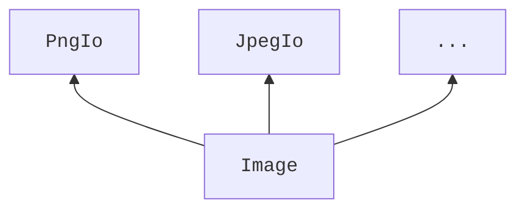
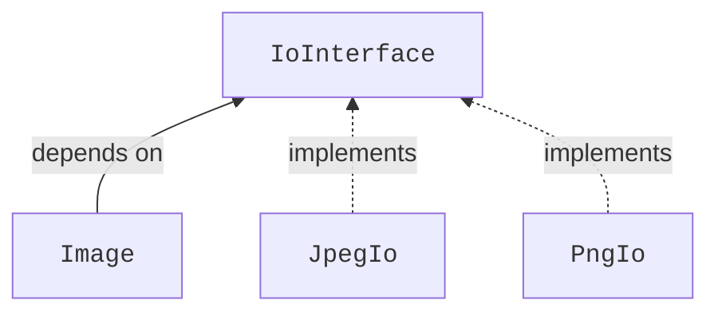
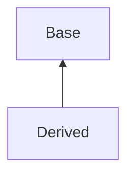

Inheritance and the idea of OOP
--

<p align="center">
  <a href="https://youtu.be/blah"></a>
</p>

- [Inheritance and the idea of OOP](#inheritance-and-the-idea-of-oop)
- [Inheritance enables dependency inversion](#inheritance-enables-dependency-inversion)
- [The idea behind dependency inversion](#the-idea-behind-dependency-inversion)
- [Similarity to static polymorphism with templates](#similarity-to-static-polymorphism-with-templates)
- [How inheritance looks in C++](#how-inheritance-looks-in-c)
  - [Implementation inheritance](#implementation-inheritance)
    - [Access control with inheritance](#access-control-with-inheritance)
    - [Implicit upcasting](#implicit-upcasting)
    - [Real-world example of implementation inheritance](#real-world-example-of-implementation-inheritance)
  - [Using `virtual` for interface inheritance and proper polymorphism](#using-virtual-for-interface-inheritance-and-proper-polymorphism)
  - [How interface inheritance works](#how-interface-inheritance-works)
  - [Things to know about classes with `virtual` methods](#things-to-know-about-classes-with-virtual-methods)
    - [A `virtual` destructor](#a-virtual-destructor)
    - [Delete other special methods for polymorphic classes](#delete-other-special-methods-for-polymorphic-classes)
  - [Downcasting using the `dynamic_cast`](#downcasting-using-the-dynamic_cast)
  - [Don't mix implementation and interface inheritance](#dont-mix-implementation-and-interface-inheritance)
  - [Implement pure interfaces](#implement-pure-interfaces)
  - [Keyword `final`](#keyword-final)
- [Simple polymorphic class example following best practices](#simple-polymorphic-class-example-following-best-practices)
- [Multiple inheritance](#multiple-inheritance)
- [Detailed `Image` example following best practices](#detailed-image-example-following-best-practices)


Inheritance is an important concept that enables a lot of techniques that we use in C++. It is also **the** mechanism for **dynamic polymorphism** which is one of the staples that allows us to think about design of our systems in very abstract and elegant ways within the C++ domain, enabling **Object Oriented Programming** or OOP.

Largely speaking, we distinguish between two types of inheritance:
- Implementation inheritance
- Interface inheritance

So let's talk about these: how interface inheritance enables abstract object oriented design and why we mostly don't use the implementation inheritance!

<!-- Intro -->

## Inheritance enables dependency inversion
Essentially, we mostly care about inheritance because it, allows us to **invert dependencies** between our components. You might have heard people talking about this as, well, the **dependency inversion principle**. This term might sound a bit scary but the concept under the hood actually makes a lot of sense!

Let's look at what it really means by following a small example.

Imagine that we have a class `Image` that represents its pixel values as a [`std::vector`](more_useful_types.md) of colors represented by a class `Color`. For the sake of this example, it also has a constructor and a `Save` method that both make use of another class `JpegIo` that allows us to read and write image-like data in JPEG format. We skip a lot of details of the implementation because we only want to showcase the dependency inversion principle here.
<!--
`CPP_SETUP_START`
#include <vector>
#include <filesystem>
using Color = int;

struct JpegIo {
  void Write(const std::filesystem::path&, const std::vector<Color>&) const {}
  std::vector<Color> Read(const std::filesystem::path&) const {}
};

$PLACEHOLDER
`CPP_SETUP_END`
`CPP_COPY_SNIPPET` inheritance/main.cpp
`CPP_RUN_CMD` CWD:inheritance c++ -std=c++17 main.cpp
-->
```cpp
#include <filesystem>
#include <vector>

class Image {
 public:
  Image(const std::filesystem::path& path, const JpegIo& io) {
    pixels_ = io.Read(path);
  }

  void Save(const std::filesystem::path& path, const JpegIo& io) const {
    io.Write(path, pixels_);
  }

 private:
  std::vector<Color> pixels_{};
};

int main() {
  const Image image{"path.jpeg", JpegIo{}};
  image.Save("other_path.jpeg", JpegIo{});
  return 0;
}
```
Now, we can say that the `Image` class **depends on** `JpegIo` class because `Image` uses the functionality of the `JpegIo` in its implementation. We can also think of this in terms of their public interfaces, i.e., their functions and how changes to these would propagate through our architecture. If a `Read` or `Write` function of the `JpegIo` class changes, we _will have to change_ the implementation of the `Image`, but if just the public interface of the `Image` changes, no changes are required on the `JpegIo` side.


Such a dependency in itself might be completely OK if there are no changes expected from a system that we are designing.

However, requiring that there would be no changes in the whole future lifetime of a system is a _very strong requirement_. And, as such, it is also the one that rarely holds. It happens often that systems actually _need_ to change and even for the most experienced folks these changes are hard to anticipate. We are just not that good at predicting the future. :shrug:

As an example of one such change, it is absolutely conceivable that we might want to replace the `JpegIo` with another class, like `PngIo` that allows us to read and write images in a PNG format.

<!--
`CPP_SETUP_START`
#include <vector>
#include <filesystem>
using Color = int;

struct PngIo {
  void Write(const std::filesystem::path&, const std::vector<Color>&) const {}
  std::vector<Color> Read(const std::filesystem::path&) const {}
};

$PLACEHOLDER
`CPP_SETUP_END`
`CPP_COPY_SNIPPET` inheritance/main.cpp
`CPP_RUN_CMD` CWD:inheritance c++ -std=c++17 main.cpp
-->
```cpp
#include <filesystem>
#include <vector>

class Image {
 public:
  Image(const std::filesystem::path& path, const PngIo& io) {
    pixels_ = io.Read(path);
  }

  void Save(const std::filesystem::path& path, const PngIo& io) const {
    io.Write(path, pixels_);
  }

 private:
  std::vector<Color> pixels_{};
};

int main() {
  const Image image{"path.png", PngIo{}};
  image.Save("other_path.png", PngIo{});
  return 0;
}
```
Furthermore, we might need to be able to change the io strategy used in the `Image` class at runtime, allowing to pick the one that we want in any particular situation based, say, on user actions at runtime. Currently, to allow for this, we would have to rewrite the `Image` class and even change its public interface to depend on more io components, which would make our design quite rigid and brittle at the same time.


<!-- Use stock footage -->
Add on top of this the fact that different components of complex systems are often developed by different people or even teams, which makes propagating changes even harder, and we start getting the feeling why we often want to avoid this type of strong inter-dependency between the components.

## The idea behind dependency inversion
Dependency inversion allows us to avoid all of these pitfalls. Instead of requiring the `Image` to rely on the `PngIo` or `JpegIo` directly, we can make all of these classes rely on an agreed upon **interface**, say `IoInterface`, thus inverting the dependencies - there is no path along the lines in our diagram from `Image` to `JpegIo` or to `PngIo` anymore!

Here, the `Image` class **calls** the public methods of the `IoInterface`, while the `JpegIo` and `PngIo` classes **implement** this interface.

Coming back to the code, our `Image` now receives a reference (or a pointer) to an `IoInterface` rather than on a concrete implementation:
<!--
`CPP_SETUP_START`

#include <filesystem>
#include <iostream>
#include <vector>

using Color = int;

struct Noncopyable {
    Noncopyable() = default;
    Noncopyable(const Noncopyable&) = delete;
    Noncopyable(Noncopyable&&) = delete;
    Noncopyable& operator=(const Noncopyable&) = delete;
    Noncopyable& operator=(Noncopyable&&) = delete;
    ~Noncopyable() = default;
};

struct IoInterface : public Noncopyable {
    virtual std::vector<Color> Read(
        const std::filesystem::path& path) const = 0;
    virtual void Write(const std::filesystem::path& path,
                       const std::vector<Color>& data) const = 0;
    virtual ~IoInterface() = default;
};

struct JpegIo final : public IoInterface {
    std::vector<Color> Read(
        const std::filesystem::path& path) const override {
        std::cout << "Reading JPEG from path: " << path << std::endl;
        return {};
    }
    virtual void Write(const std::filesystem::path& path,
                       const std::vector<Color>& data) const override {
        std::cout << "Writing JPEG to path: " << path << std::endl;
    }
};

struct PngIo final : public IoInterface {
    std::vector<Color> Read(
        const std::filesystem::path& path) const override {
        std::cout << "Reading PNG from path: " << path << std::endl;
        return {};
    }
    virtual void Write(const std::filesystem::path& path,
                       const std::vector<Color>& data) const override {
        std::cout << "Writing PNG to path: " << path << std::endl;
    }
};

$PLACEHOLDER
`CPP_SETUP_END`
`CPP_COPY_SNIPPET` inheritance_polymorphic/main.cpp
`CPP_RUN_CMD` CWD:inheritance_polymorphic c++ -std=c++17 main.cpp
-->
```cpp
class Image {
 public:
  Image(const std::filesystem::path& path, const IoInterface& io) {
    pixels_ = io.Read(path);
  }

  void Save(const std::filesystem::path& path, const IoInterface& io) const {
    io.Write(path, pixels_);
  }

 private:
  std::vector<Color> pixels_{};
};

int main() {
  const Image image{"path.jpeg", JpegIo{}};
  image.Save("other_path.png", PngIo{});
}
```
Once we design the `PngIo` and `JpegIo` classes to implement the `IoInterface` we are able to pass them interchangeably in place of the `IoInterface` reference! Look how easy it is now to change the behavior of our `Image` without changing its code! We just pass a new **strategy** (i.e., one of the classes that implement our `IoInterface`) into it and it magically works! And if we would want to work with some other image type we could just add another class that implements `IoInterface` and pass it instead! We could even condition the choice of the io strategy on a user action now! Neat, right?

In addition to all of this, as long as we designed a good interface (which to me is arguably the hardest part of designing software), we can make changes to the `JpegIo`, `PngIo` and `Image` classes independently from each other as long as they communicate exclusively through the `IoInterface`.

🚨 So we really care about inheritance because it is necessary for **this form of dynamic polymorphism**, which, along with encapsulation enables the **O**bject **O**riented **P**rogramming, or **OOP**! And just to make sure we're on the same page, polymorphism stands for "having multiple forms". In our case, the reference to an `IoInterface` can take many "forms": `JpegIo`, `PngIo` or any other implementation of this interface.

As you have undoubtedly noticed, I have not provided any implementation for our io strategy classes just yet as we only cared about the "why" here, not the "how". We will of course fill all the details in towards the end of this lecture and for that we'll need to take a step back and see how inheritance works in modern C++, because to achieve the behavior we've just seen in C++, **we need inheritance!**

## Similarity to static polymorphism with templates
Now, those of you who were careful to follow the [lectures on templates in this course](templates_why.md) might get a feeling that, design-wise, something similar should be possible to achieve using templates too. After all, we did look at how we could replace an algorithm using a template strategy before. And you _are_ right! We _can_ do it with templates **at compile time** but **not at runtime**.
<!--
`CPP_SETUP_START`
#include <vector>
#include <filesystem>
using Color = int;

class JpegSavingStrategy {
  public:
    JpegSavingStrategy(const std::filesystem::path& path) : path_{path} {}

    void Save(const std::vector<Color>& pixels) const {
      // Logic to save pixels to path_ as jpeg data.
    }

  private:
    std::filesystem::path path_{};
};

$PLACEHOLDER
`CPP_SETUP_END`
`CPP_COPY_SNIPPET` inheritance_template/main.cpp
`CPP_RUN_CMD` CWD:inheritance_template c++ -std=c++17 main.cpp
-->
```cpp
// Assuming the JpegSavingStrategy is implemented.

class Image {
 public:
  template <typename SavingStrategy>
  void Save(const SavingStrategy& strategy) const {
    strategy.Save(pixels_);
  }

 private:
  std::vector<Color> pixels_{};
};

int main() {
  Image image{}; // Somehow create an image.
  image.Save(JpegSavingStrategy{"image.jpg"});
  return 0;
}
```
Depending on our goals this might be more or less suitable for our needs. So, to cover the "runtime" path today we focus on dynamic polymorphism and how inheritance enables it.

## How inheritance looks in C++
### Implementation inheritance
We'll start talking about inheritance by talking about its simplest form, the so-called **implementation inheritance**. It is designed to simply extend one class, say `Base` with another, say `Derived`. We say that a `Derived` class inherits from a `Base` class which implies that any object of the `Derived` class contains a full copy of the `Base` class, including all of its methods and appending the data of the `Derived` class to the data stored in the `Base` object.
<!-- TODO: add image -->

Let's show it on a simple example as we always do. Let's say we have two structs: `Base` and `Derived` that inherits from `Base`. We show the inheritance by a `:` symbol after the name of the derived class followed by the name of its parent class, along with some access modifiers, here `public`, more on that later.

These classes have their corresponding methods `BaseMethod` and `DerivedMethod` and some data, which we keep `public` here for illustration purposes. They also each have a function `DoSmth` with the same signature. We then create an object of the `Derived` class and call both `Base`-specific and `Derived`-specific methods on it as well as print the address of the data it contains.
```cpp
#include <iostream>

// Using struct here but the same holds for classes
struct Base {
  void DoSmth() const { std::cout << "Base DoSmth" << std::endl; }
  void BaseMethod() const { std::cout << "BaseMethod" << std::endl; }
  // Doesn't have to be int
  int base_data{};
};

// Using struct here but the same holds for classes
struct Derived : public Base {
  void DoSmth() const { std::cout << "Derived DoSmth" << std::endl; }
  void DerivedMethod() const { std::cout << "DerivedMethod" << std::endl; }
  // Also can be any other type
  float derived_data{};
};

int main() {
  const Derived object{};
  object.BaseMethod();
  object.DerivedMethod();
  object.DoSmth();
  std::cout << "&object.base_data:    " << &object.base_data << std::endl;
  std::cout << "&object.derived_data: " << &object.derived_data << std::endl;
}
```
Looking at the output this code produces, we see that we can call both the `Base`-specific and the `Derived`-specific methods on an object of `Derived` type.
```output
BaseMethod
DerivedMethod
Derived DoSmth
&object.base_data:    0x7ffe8fff82d8
&object.derived_data: 0x7ffe8fff82dc
```
Furthermore, because we work with an object of the `Derived` type, the `DoSmth` function shadows its counterpart from the `Base` class. As for the data, looking at their address, we see that the `Derived`-defined data follow right after the `Base`-defined ones.

#### Access control with inheritance
Now is probably a good time for a relatively short interlude about access control in classes when inheritance is at play. First of all, there is another class access modifier that we did not talk about. Before, we talked about `private` and `public` access to class methods and data. There is one more access modifier to think of - `protected`. It works just like private for anybody trying to access data from the outside of class hierarchy, while within the class hierarchy the data is accessible.
```cpp
#include <iostream>

// Using struct here but the same holds for classes
class Base {
 public:
  int public_base_data{};
 protected:
  int protected_base_data{};
 private:
  int private_base_data{};
};

// Using struct here but the same holds for classes
struct Derived : public Base {
  void PrintData() const {
    std::cout << "public_base_data: " << public_base_data
              << " protected_base_data: " << protected_base_data << std::endl;
    // ❌ Cannot access private_base_data from here!
  }
};

int main() {
  const Derived object{};
  std::cout << "object.public_base_data: " << object.public_base_data
            << std::endl;
  // ❌ Cannot access object.protected_base_data from here!
  // ❌ Cannot access object.private_base_data from here!
  return 0;
}
```
That all being said, the Core Guidelines recommend to [avoid using `protected` data](https://isocpp.github.io/CppCoreGuidelines/CppCoreGuidelines#c133-avoid-protected-data), so please be mindful of this.

You might have also noticed that we used exclusively the word `public` after the `:` symbol when using inheritance. But we could also technically use `protected` or `private` there. The difference is the following:
- ✅ `[most common]` Using `public` maintains the access levels of all data and methods of the base class, **mimics an "is a" relationship** between classes. Arguably this is the relationship we mostly want to achieve.
- Using `protected` makes all the `public` attributes of the base class `protected` and leaves its `protected` and `private` members as is.
- Using `private` makes all the accessible members of the base class `private`, i.e., invisible to anybody including its own descendants.

All in all, we mostly use `public` inheritance and the reason is that composition usually is more readable and less error prone while achieves the same things as `private` and, to some degree, `protected` inheritance. It makes sense, if we think about it - storing an object of another class achieves nearly the same as inheriting privately from such an object. In both cases we can access that other class while not exposing any of its data or methods to the outside! The main difference is that with composition we only can access the stored object's public interface, while inheritance also gives us access the protected part of the class we inherit from.

As a small example, if we wanted to implement a class that would store just integer numbers by reusing the `std::vector<int>` implementation we could go either by privately inheriting from `std::vector<int>` and exposing its base `push_back` method or by using composition and having a `data_` member of type `std::vector<int>`, which would require us to implement our own `push_back` function.
```cpp
#include <vector>

class IntVectorInheritance : private std::vector<int> {
 public:
  using std::vector<int>::push_back;
};

class IntVectorComposition {
 public:
  void push_back(int number) { data_.push_back(number); }

 private:
  std::vector<int> data_{};
};

int main() {
  IntVectorInheritance vector{};
  vector.push_back(42);
}
```
I believe that people are split on this issue. Some argue that `private` inheritance is superior here as it allows us to avoid boilerplate code of reimplementing existing functions that are already implemented better than most of us can implement them, while the other argue that composition is superior instead as it gives us more control and keeps things a bit more explicit. I, for one, lean closer to the second group.
<!-- But please tell me what you think! Which way do you prefer? Why? -->

Anyway, in the remainder of this lecture we will assume that whenever we mention "inheritance" we actually mean its `public` flavor.

#### Implicit upcasting
Now one of the defining features of how inheritance was designed in C++ is that a pointer or a reference to any derived class can be **implicitly converted** to a pointer or a reference of the base class. This is commonly called **upcasting**, "up" referring to the dependency diagrams usually shown in such a way that an arrow points from `Derived` below to `Base` above.



Let's see how it works by changing our main function in our implementation inheritance example. We can add a `Base` reference that will point to a `Derived` object. And, of course, we can call only `Base`-specific methods on this reference:
<!--
`CPP_SETUP_START`
#include <iostream>

// Using struct here but the same holds for classes
struct Base {
  void DoSmth() const { std::cout << "Base DoSmth" << std::endl; }
  void BaseMethod() const { std::cout << "BaseMethod" << std::endl; }
  // Doesn't have to be int
  int base_data{};
};

// Using struct here but the same holds for classes
struct Derived : public Base {
  void DoSmth() const { std::cout << "Derived DoSmth" << std::endl; }
  void DerivedMethod() const { std::cout << "DerivedMethod" << std::endl; }
  // Also can be any other type
  float derived_data{};
};

$PLACEHOLDER
`CPP_SETUP_END`
`CPP_COPY_SNIPPET` inheritance_using_base_ref/main.cpp
`CPP_RUN_CMD` CWD:inheritance_using_base_ref c++ -std=c++17 main.cpp
-->
```cpp
int main() {
  const Derived derived{};
  const Base& base{derived};
  base.BaseMethod();
  base.DoSmth();
}
```
While this is neat, it does not really bring us much closer to our goal of being able to abstract the implementation away behind a pointer. You see, the `Base` reference "forgets" that it was created from a `Derived` object and so the `DoSmth` method calls its `Base` implementation. So such simple inheritance _is quite limited_.

:bulb: To actually be able to define and implement an interface like the one we talked about before, we will need to use **`virtual` functions**.

#### Real-world example of implementation inheritance
But before we do implement such an interface, I want to briefly mentions some legitimate uses of implementation inheritance that I've encountered. The only real-world examples that come to mind are the implementation of various [type traits](templates_how_classes.md#type-traits-and-how-to-implement-them-using-template-specialization) and maybe the [Curiously Recurring Template Pattern](https://en.wikipedia.org/wiki/Curiously_recurring_template_pattern), or CRTP. I will not focus on CRTP here <!--, feel free to read up on it following the link in the description to this video, --> but the usage of implementation inheritance in type traits is quite common and I'd like to briefly look at it here. So I would like to return to a small piece of code we wrote when we talked about [type traits](templates_how_classes.md#type-traits-and-how-to-implement-them-using-template-specialization) before.

This code shows our custom implementation of the [`std::is_integral`](https://en.cppreference.com/w/cpp/types/is_integral) type trait that checks if a type provided to it represents integer numbers.
<!--
`CPP_SETUP_START`
$PLACEHOLDER
`CPP_SETUP_END`
`CPP_COPY_SNIPPET` inheritance_simple_trait/is_integral.cpp
`CPP_RUN_CMD` CWD:inheritance_simple_trait c++ -std=c++17 -c is_integral.cpp
-->
```cpp
template <typename T>
struct is_integral {
  static constexpr inline bool value{};
};
```
Such primary pattern implementation is perfectly fine but if we look at the standard library implementation it is actually implemented differently - through inheritance!

You see, there is another trait [`std::integral_constant`](https://en.cppreference.com/w/cpp/types/integral_constant), which furthermore has `std::true_type` and `std::false_type` specializations. The `std::integral_constant` trait already has a `static` member `value` defined with all the current best practices in mind, so why not reuse it?

And we _can_ reuse these already defined type traits by using implementation inheritance:
<!--
`CPP_SETUP_START`
$PLACEHOLDER
`CPP_SETUP_END`
`CPP_COPY_SNIPPET` inheritance_traits/main.cpp
`CPP_RUN_CMD` CWD:inheritance_traits c++ -std=c++17 -c main.cpp
-->
```cpp
template<class T, T v>
struct integral_constant {
    static constexpr inline T value = v;
};

using true_type = integral_constant<bool, true>;
using false_type = integral_constant<bool, false>;

template <typename T>
struct is_integral : public false_type {};

// Specializations for any types we deem integral.
template <>
struct is_integral<int> : public true_type {};

static_assert(is_integral<int>::value);
static_assert(is_integral<float>::value == false);
```
Here, we inherit our `struct` `is_integral` from the `false_type` **base** class. This has the effect that our `is_integral` struct gains the `value` that holds `false`. And, likewise, we can now specialize our struct for any type we want to be marked as integral type using another typedef `true_type`.

This is really the only use case in which implementation inheritance is routinely used in modern C++.
<!-- But if you know of other common examples, please tell me what they are in the comments! -->

### Using `virtual` for interface inheritance and proper polymorphism
Now that we know what implementation inheritance is useful for and what its limits, are we can focus on what we really want. Which is to enable dynamic polymorphism! To make sure that when we call a function through a base class reference or pointer a correct function from a derived class is called depending on which type in the class hierarchy was used to create the base object reference or pointer in the first place!

For that we have to use the keyword `virtual` when declaring our `Base` function and `override` when declaring it in the `Derived` class. Note, that should we `override` a non-`virtual` function, we'll get an error!
```cpp
#include <iostream>

// 😱 We do not follow best practices for simplicity here.
// This struct misses lots of special functions.
// Some of them must be virtual, some deleted. Stay tuned.
struct Base {
  virtual void DoSmth() const { std::cout << "Base DoSmth" << std::endl; }
};

// 😱 We do not follow best practices for simplicity here.
// This struct misses lots of special functions.
// Some of them must be virtual, some deleted. Stay tuned.
struct Derived : public Base {
  void DoSmth() const override { std::cout << "Derived DoSmth" << std::endl; }
};

int main() {
  const Derived derived{};
  const Base base{};
  const Base& base_ref = derived;
  base.DoSmth();      // Calls Base implementation.
  derived.DoSmth();   // Calls Derived implementation.
  base_ref.DoSmth();  // Calls Derived implementation.
}
```
This works like magic! Now the `Base` reference "remembers" that it was created from a `Derived` object and when we call the `DoSmth` function it calls the `Derived` one! This is the core principle that enables **dynamic polymorphism** and **object oriented programming** in C++.

### How interface inheritance works
Now that we know that it works, let us dig a bit into **how** it is implemented under the hood. How does our reference "remember" that it was created from a derived object?

And the answer is that it knows this "by looking up the correct function to call in a [**virtual method table**](https://en.wikipedia.org/wiki/Virtual_method_table), or a **vtable**".

The vtable is not magic - it is just a table of pointers to functions. Whenever a compiler compiles a class that has any `virtual` functions, it creates a vtable for that class and adds a hidden pointer member that points to this vtable. Now, when we create a `Derived` object its vtable entry for `DoSmth` function points to its own implementation. Now when we set our derived object to a base reference, we **keep its hidden pointer to its vtable** intact. This way, when we call a `DoSmth` on the `base_ref`, we look up the correct function to call in the vtable, find the one that the `Derived` object put there and call the `Derived::DoSmth` function.

<!-- TODO: add picture -->

### Things to know about classes with `virtual` methods
Now, adding `virtual` functions to classes introduces some constraints on how we should use these classes and creates a couple of pitfalls that we should be aware of. In the previous examples we omitted quite some details and it is time we cover those details now.

#### A `virtual` destructor
Generally speaking, every class that has a `virtual` function **must have a `virtual` destructor**. This becomes obvious once we move on from using references with our base and derived classes towards using pointers, especially owning ones.

To properly understand why the destructor must be virtual we have to answer the question: if we create a derived object and store it by a base pointer, which destructor will be called? Take a moment to think about it.
<!-- Pause a video here, look at the examples we just covered and really think about it! -->

And I'm sure that you got it right! If the _base destructor_ is not `virtual` then _this base destructor will be called_. But this destructor knows nothing about derived data! So those data will be leaked!
```cpp
#include <iostream>

struct Base {
  // 😱 Careful! No virtual destructor! Other methods missing!
  ~Base() { std::cout << "Base cleanup" << std::endl; }
};

struct Derived : public Base {
  ~Derived() { std::cout << "Important cleanup" << std::endl; }
};

int main() {
  // 😱 Code for illustrating a memory leak only! Avoid using new!
  Base* ptr = new Derived;
  delete ptr;  // Important cleanup is never printed!
}
```
Now if the destructor is virtual, a call to it will go through a vtable and so the correct derived destructor will be called.
```cpp
#include <iostream>

struct Base {
  // 😱 Still other method missing!
  virtual ~Base() { std::cout << "Base cleanup" << std::endl; }
};

struct Derived : public Base {
  ~Derived() override { std::cout << "Important cleanup" << std::endl; }
};

int main() {
  // 😱 This will work but please don't use new!
  Base* ptr = new Derived;
  delete ptr;
}
```

#### Delete other special methods for polymorphic classes
So I hope that we see why we need a `virtual` destructor if we ever expect the object to be deleted by a pointer to its base class. But, if you remember, we already talked about the ["rule of all or nothing"](all_or_nothing.md) before, which states that if we need a single special function, like the destructor, that deals with the object's lifetime, we need all of them. This is true in this case too. Alongside a virtual destructor we need to deal with the copy and move constructors and assignment operators.

This topic is slightly convoluted and I believe it is not talked about enough.

I believe that all of these special methods must be `delete`d because classes with `virtual` methods are **designed to be used through a pointer**, i.e., they have pointer or reference semantics. They are not designed to be moved or copied, i.e., they do not have value semantics. If we try to copy or move a class that is designed with pointers and references in mind, we run a good risk of [**slicing**](https://www.learncpp.com/cpp-tutorial/object-slicing/) our object. Slicing happens when a copy or move constructor or an assignment operator is called on a base class when the actual allocated object was of a derived class that has more data stored in it. The base class only knows how to copy **its** data, **not the derived** data. This can only lead to confusion.

Putting this all together a better way to implement our `Base` and `Derived` classes from before would be to add all the missing `deleted` special functions to the base class. We'll also add a default constructor too for a good measure.
```cpp
#include <iostream>

struct Base {
  virtual void DoSmth() { std::cout << "Base DoSmth" << std::endl; }

  Base() = default;

  Base(const Base&) = delete;
  Base(Base&&) = delete;
  Base& operator=(const Base&) = delete;
  Base& operator=(Base&&) = delete;
  virtual ~Base() = default;
};

struct Derived : public Base {
  void DoSmth() override { std::cout << "Derived DoSmth" << std::endl; }
};

int main() {
  Derived derived{};
  Base base{};
  Base& base_ref = derived;
  base.DoSmth();      // Calls Base implementation.
  derived.DoSmth();   // Calls Derived implementation.
  base_ref.DoSmth();  // Calls Derived implementation.
}
```
This allows us to get rid of the annoying disclaimer comment.

There is also a quicker way to do this by inheriting from a simple `Noncopyable` class which can be reused for any class that is not supposed to be copyable or movable. Then we just need a `virtual` destructor because all the rest of the special functions are already taken care of.
<!--
`CPP_SETUP_START`
$PLACEHOLDER
`CPP_SETUP_END`
`CPP_COPY_SNIPPET` inheritance_noncopyable/main.cpp
`CPP_RUN_CMD` CWD:inheritance_noncopyable c++ -std=c++17 main.cpp
-->
```cpp
#include <iostream>

struct Noncopyable {
  Noncopyable() = default;
  Noncopyable(const Noncopyable&) = delete;
  Noncopyable(Noncopyable&&) = delete;
  Noncopyable& operator=(const Noncopyable&) = delete;
  Noncopyable& operator=(Noncopyable&&) = delete;
  ~Noncopyable() = default;
};

struct Base : public Noncopyable {
  virtual void DoSmth() const { std::cout << "Base DoSmth" << std::endl; }
  virtual ~Base() = default;
};

struct Derived : public Base {
  void DoSmth() const override { std::cout << "Derived DoSmth" << std::endl; }
};

int main() {
  Derived derived{};
  Base base{};
  Base& base_ref = derived;
  base.DoSmth();      // Calls Base implementation.
  derived.DoSmth();   // Calls Derived implementation.
  base_ref.DoSmth();  // Calls Derived implementation.
}
```

### Downcasting using the `dynamic_cast`
It is also important to mention that for [polymorphic classes](https://en.cppreference.com/w/cpp/language/object#Polymorphic_objects), i.e., those that have a vtable pointer, just like we can upcast our type along the hierarchy of classes we can downcast too. For that we use a `dynamic_cast`.

This _is_ considered an anti-pattern though and breaks the so-called [Liskov Substitution Principle](https://en.wikipedia.org/wiki/Liskov_substitution_principle) that, applied to C++, states that when we work with a pointer or a reference to base type we should have no need to know which derived type is actually being used. If this principle is broken the programs usually become more brittle, meaning that making changes to them without breaking things requires more work. That being said, it is probably still important to understand how `dynamic_cast` works.

`dynamic_cast` allows us to downcast a pointer or a reference of a polymorphic `Base` class into a pointer or reference of the `Derived` class, derived from `Base`. We won't go too much into detail, but it is important to note that this conversion might fail! If this conversion fails while converting a pointer, a `nullptr` will be returned, while if the failure occurs while converting a reference, a `std::bad_cast` exception will be thrown.
<!--
`CPP_SETUP_START`
struct Noncopyable {
  Noncopyable() = default;
  Noncopyable(const Noncopyable&) = delete;
  Noncopyable(Noncopyable&&) = delete;
  Noncopyable& operator=(const Noncopyable&) = delete;
  Noncopyable& operator=(Noncopyable&&) = delete;
  ~Noncopyable() = default;
};

$PLACEHOLDER
`CPP_SETUP_END`
`CPP_COPY_SNIPPET` inheritance_dynamic_cast/main.cpp
`CPP_RUN_CMD` CWD:inheritance_dynamic_cast c++ -std=c++17 main.cpp
-->
```cpp
#include <iostream>

struct Base : public Noncopyable {
  virtual ~Base() {}
};

struct OtherBase : public Noncopyable {
  virtual ~OtherBase() {}
};

struct Derived : public Base {};

int main() {
  const Derived object{};
  const Base& base_ref{object};
  const OtherBase other_base{};
  const OtherBase& other_base_ref{other_base};
  const Derived& derived_ref = dynamic_cast<const Derived&>(base_ref);
  // other_derived_ptr will be nullptr because it is not derived from OtherBase.
  const Derived* other_derived_ptr =
      dynamic_cast<const Derived*>(&other_base_ref);
  // ❌ The following will throw a std::bad_cast.
  // const Derived& other_derived_ref = dynamic_cast<const
  // Derived&>(other_base_ref);
}
```

### Don't mix implementation and interface inheritance
We are almost ready to return to our original `Image` example and finish its implementation with all the best practices in mind. There is just one more thing to cover before that.

In my experience, having virtual functions that have a base implementation and some overridden implementation in a derived class becomes confusing quite quickly. It becomes hard to find where in the class hierarchy the actual implementation lives and I've spent hours and hours on this in code bases that had deep polymorphic object hierarchies. And it seems that the experts who know much more about software design than I do agree with me on this.

C++ Core Guidelines suggest to distinguish [between implementation inheritance and the interface inheritance](https://isocpp.github.io/CppCoreGuidelines/CppCoreGuidelines#c129-when-designing-a-class-hierarchy-distinguish-between-implementation-inheritance-and-interface-inheritance) and the Google C++ Code Style suggest to [not overuse implementation inheritance](https://google.github.io/styleguide/cppguide.html#Inheritance) and prefer composition instead, while some go as far as to call [implementation inheritance evil](http://whats-in-a-game.com/implementation-inheritance-is-evil/) altogether.

### Implement pure interfaces
So what is the solution to this problem? The solution is to separate interface inheritance and implementation inheritance alltogether. You see, there is one more trick up our sleeves with `virtual` - the **pure `virtual` functions**.

They allows us to define a `virtual` function that does not have any implementation by design and **must** be implemented by the descendants of the class it belongs to.

This is perfect for creating interfaces. We generally call a class that has at least one pure virtual function an **abstract class** and a class that has **all** of its function as pure virtual an **interface**.

In my experience, I prefer to make sure that if my class is abstract - it is an interface. This allows to keep a shallow hierarchy of concrete implementations of such interfaces. In combination with using composition and function reusing in the actual implementation this allows us to have a hierarchy that is easy to read while avoiding code duplication.
<!-- But do tell me your experience with all of this! What is your preference if you have any? -->

### Keyword `final`
Speaking of keeping a shallow hierarchy, let's also briefly talk about the word `final`. We can use it to forbid any future extensions of a particular class. It _is_ helpful when implementing a shallow hierarchy of classes that all implement pure interfaces but I would suggest to be careful with the use of it as it is very hard to know the future and this is equivalent to a statement, "I'm 100% sure that nobody ever will need to extend this class". Which is a hard statement to make confidently.

## Simple polymorphic class example following best practices
For completeness, let's see how our polymorphic classes example changes if we follow all of the practices we've just talked about:
```cpp
#include <iostream>

struct Noncopyable {
  Noncopyable() = default;
  Noncopyable(const Noncopyable&) = delete;
  Noncopyable(Noncopyable&&) = delete;
  Noncopyable& operator=(const Noncopyable&) = delete;
  Noncopyable& operator=(Noncopyable&&) = delete;
  ~Noncopyable() = default;
};

struct Base : public Noncopyable {
  virtual void DoSmth() const = 0;
  virtual ~Base() = default;
};

struct Derived final : public Base {
  void DoSmth() const override { std::cout << "Derived DoSmth" << std::endl; }
};

struct AnotherDerived final : public Base {
  void DoSmth() const override { std::cout << "AnotherDerived DoSmth" << std::endl; }
};

int main() {
  const Derived derived{};
  const AnotherDerived another_derived{};
  const Base* base_ptr = &derived;
  base_ptr->DoSmth();  // Calls Derived implementation.
  base_ptr = &another_derived;
  base_ptr->DoSmth();  // Calls AnotherDerived implementation.
}
```
Here, we change `Base` to be an interface, add one more implementation class `AnotherDerived` and mark our derived implementations `final` to make sure nobody can build a deep hierarchy on top of them. We also convert the `main` to use pointers just to show that we can refer to two different implementations by the same pointer.

## Multiple inheritance
C++ also allows to use multiple inheritance. But do note that it is [heavily discouraged](https://google.github.io/styleguide/cppguide.html#Inheritance) in case of implementation inheritance. It is easy to show the reason. Imagine we have a class that inherits from a number of classes and we want to find the implementation of a certain functionality. How do we know where it is implemented? In bigger projects this becomes really cumbersome.

That being said, it is ok sometimes to use multiple inheritance when a class needs to [implement multiple interfaces](https://isocpp.github.io/CppCoreGuidelines/CppCoreGuidelines#c135-use-multiple-inheritance-to-represent-multiple-distinct-interfaces). It is easy to imagine that a game object can be both `Drawable` and, say `Moveable`.
<!--
`CPP_SETUP_START`

$PLACEHOLDER
`CPP_SETUP_END`
`CPP_COPY_SNIPPET` inheritance_multiple/main.cpp
`CPP_RUN_CMD` CWD:inheritance_multiple c++ -std=c++17 -c main.cpp
-->
```cpp
struct Drawable {
  virtual void Draw() = 0;
};

struct Moveable {
  virtual void Move(float distance) = 0;
};

class Box: public Drawable, public Moveable {
 public:
  void Draw() override {}
  void Move(float distance) override {}
  // Rest of the implementation.
};

void Move(Moveable* moveable, float distance) {
  moveable->Move(distance);
}

void Draw(Drawable* drawable) {
  drawable->Draw();
}

int main() {
  Box box{};
  Move(&box, 42.42F);
  Draw(&box);
  return 0;
}
```
This allows us to separate the concerns in our design. The standalone functions `Move` and `Draw` need to know nothing about the objects being passed into them as long as those correspond to the required interface and our `Box` satisfies both.

## Detailed `Image` example following best practices
Now we really know everything there is to know about inheritance in modern C++. We know how simple (and a bit limited) implementation inheritance is, we know that the interface inheritance enables dynamic polymorphism, we understand how it works under the hood and we know the best practices related to creating and using interfaces. So it is time to put it all to a small test and get back to our original example with the `Image` class. We can now properly implement the missing parts.
<!--
`CPP_SETUP_START`
using Color = int;
$PLACEHOLDER
`CPP_SETUP_END`
`CPP_COPY_SNIPPET` inheritance_final_example/main.cpp
`CPP_RUN_CMD` CWD:inheritance_final_example c++ -std=c++17 main.cpp
-->
```cpp
#include <filesystem>
#include <iostream>
#include <vector>

struct Noncopyable {
  Noncopyable() = default;
  Noncopyable(const Noncopyable&) = delete;
  Noncopyable(Noncopyable&&) = delete;
  Noncopyable& operator=(const Noncopyable&) = delete;
  Noncopyable& operator=(Noncopyable&&) = delete;
  ~Noncopyable() = default;
};

struct IoInterface : public Noncopyable {
  virtual std::vector<Color> Read(const std::filesystem::path& path) const = 0;
  virtual void Write(const std::filesystem::path& path,
                     const std::vector<Color>& data) const = 0;
  virtual ~IoInterface() = default;
};

struct JpegIo final : public IoInterface {
  std::vector<Color> Read(const std::filesystem::path& path) const override {
    std::cout << "Reading JPEG from path: " << path << std::endl;
    return {};
  }
  virtual void Write(const std::filesystem::path& path,
                     const std::vector<Color>& data) const override {
    std::cout << "Writing JPEG to path: " << path << std::endl;
  }
};

struct PngIo final : public IoInterface {
  std::vector<Color> Read(const std::filesystem::path& path) const override {
    std::cout << "Reading PNG from path: " << path << std::endl;
    return {};
  }
  virtual void Write(const std::filesystem::path& path,
                     const std::vector<Color>& data) const override {
    std::cout << "Writing PNG to path: " << path << std::endl;
  }
};

class Image {
 public:
  Image(const std::filesystem::path& path, const IoInterface& io) {
    pixels_ = io.Read(path);
  }

  void Save(const std::filesystem::path& path, const IoInterface& io) const {
    io.Write(path, pixels_);
  }

 private:
  std::vector<Color> pixels_{};
};

int main() {
  const Image image{"path.jpeg", JpegIo{}};
  image.Save("other_path.png", PngIo{});
}
```
We make use of the `Noncopyable` base class to declare the `IoInterface` with the `Write` and `Read` functions, along with a `virtual` destructor. Note that our functions are both `const`-qualified as well as pure `virtual`. Then, our `JpegIo` and `PngIo` implement the interface by overriding the `Write` and `Read` functions. The actual implementation is not important to understand inheritance so they just print something to the terminal here. Finally, just as before, we use the reference to our interface in our `Image` class to refer to any implementation that we pass into it in our `main` function.

This, I believe, follows most of the current best practices when it comes to implementing an OOP-style system that relies on dynamic polymorphism. So I guess we can close this lecture with this example as the one that encapsulates everything that we covered today.

<!-- And if you are interested in how to achieve very similar results with templates, please give a watch to the series of videos I recorded about templates, starting with why. Thanks a lot for your attention and bye! -->
