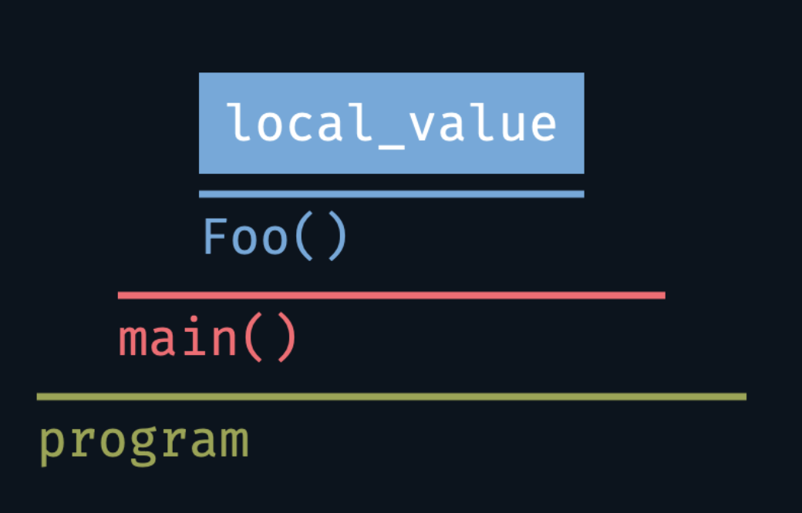

Keyword `static` outside of classes
---

<p align="center">
  <a href="https://youtu.be/blah"></a>
</p>


- [Keyword `static` outside of classes](#keyword-static-outside-of-classes)
- [Storage duration](#storage-duration)
  - [Automatic storage duration an local namespace scope](#automatic-storage-duration-an-local-namespace-scope)
  - [Static storage duration at namespace scope](#static-storage-duration-at-namespace-scope)
  - [Static storage duration at function scope](#static-storage-duration-at-function-scope)
  - [Very rare use of `static` to create mutable variables with static storage duration from a function](#very-rare-use-of-static-to-create-mutable-variables-with-static-storage-duration-from-a-function)
  - [Summary of controlling storage duration with `static`](#summary-of-controlling-storage-duration-with-static)
- [Linkage](#linkage)
  - [What is linkage](#what-is-linkage)
  - [Levels of linkage](#levels-of-linkage)
  - [Why we need external linkage](#why-we-need-external-linkage)
    - [Naive example](#naive-example)
    - [What went wrong?](#what-went-wrong)
    - [How to fix the ODR violation?](#how-to-fix-the-odr-violation)
    - [Prefer `inline` to `static`](#prefer-inline-to-static)
  - [Data linkage control](#data-linkage-control)
- [Conclusion and a rule of thumb](#conclusion-and-a-rule-of-thumb)
- [Final words](#final-words)


The keyword [`static`](https://en.cppreference.com/w/cpp/keyword/static) is a very important keyword in C++ and is used a lot. Honestly, because of a very general name, it is probably a bit overused. Largely speaking, it can be used outside of classes and inside classes and these two cases are slightly different. Today we focus on the former - using `static` outside of classes. If you are interested in how and when to use `static` _inside_ of classes, I will link this lecture here when it's out.

Anyway, as for using `static` _outside_ of classes, I have good news for you. If you follow my advices about best practices from before then the rule-of-thumb for using `static` outside of classes in modern C++ (that is at least C++17) is very simple - don't! **Don't use `static` at all!**

Technically, that's all you need to know. But if you want to learn _why_ then keep watching this video and see how deep this rabbit hole goes :wink:

<!-- Intro -->

In order to explain why we mostly don't want to use `static` for anything outside of classes we will need to think about _why_ we want to use `static` in the first place. The keyword `static` really controls just two things:
- The storage duration
- The linkage

I can already feel the confused faces on the other side of the screen from me :wink: So... what do these words mean?

## Storage duration
We'll start with "storage duration" Every object declared in C++ has a certain lifetime, or, in other words, a _storage duration_. There is a number of storage durations that any variable can have. At this point, we care about these two:
- Automatic storage duration
- Static storage duration

Let's look at an example.

We start with a simple `main` function that calls another function `Foo` that has a single local variable in it:



```cpp
void Foo() {
  int local_value{};
}

int main() {
  Foo();
  return 0;
}
```
We can then draw the execution time of the program, `main` and `Foo` functions as lines that indicate that most of the time that the program runs is spent int `main`, while most of the time in `main` is spend executing the `Foo` function.

### Automatic storage duration an local namespace scope

If we focus now on the lifetime of the `local_value` variable, shown as a blue box in the image, it lives as long as the execution of the `Foo` function. It's memory is allocated at the start of the function and is freed at the end of the scope.

We say that a variable `local_value` and any other variable that lives in some local scope, be it one of a function or a class, has **automatic storage duration**

But what happens with those variables declared outside of a class or a function scope?

### Static storage duration at namespace scope
Let's extend our example by adding some value `kValue` that is defined at **namespace scope** and using to initialize our `local_value`. We will introduce it in an unnamed namespace following the best practices, but it could live in any namespace including the global one.


```cpp
namespace {
constexpr int kValue{42};
}  // namespace

void Foo() {
  int local_value{kValue};
}

int main() {
  Foo();
  return 0;
}
```
The `kValue` here has what is called the **static storage duration** and lives for the whole duration of the program. Its data gets allocated at the start of the program and feed at the end of the program. I believe that this is what inspired the name `static` back when it was introduced in C. Anyway, we _can_ use `static` for an object declaration at namespace scope to indicate that it has the static storage duration **but we don't have to**, as any such object has this storage duration by default. So the following definitions are equivalent in terms of storage duration:
<!--
`CPP_SETUP_START`
$PLACEHOLDER
int main(){}
`CPP_SETUP_END`
`CPP_COPY_SNIPPET` consts/main.cpp
`CPP_RUN_CMD` CWD:consts c++ -std=c++17 -c main.cpp
-->
```cpp
constexpr auto answer_1 = 42;
const auto answer_2 = 42;
auto answer_3 = 42;  // 😱 please don't create non-const globals...

// 😱 please don't use static like this ...
static constexpr auto answer_4 = 42;
static const auto answer_5 = 42;
static auto answer_6 = 42;  // 😱 please don't create non-const globals...
```

### Static storage duration at function scope
Finally, use of `static` can extend the storage duration of a local variable within some function scope to have the static storage duration.

If we add `static` in front of our `local_value` definition, it will have **static storage duration** again. It will get allocated when the function `Foo` is called for the first time and will get deallocated at the end of the program.


```cpp
namespace {
constexpr int kValue{42};
}  // namespace

void Foo() {
  static int local_value{kValue};
}

int main() {
  Foo();
  return 0;
}
```

Such a `static` variable will be initialized when first encountered during the program flow and destroyed when the program exits.

One interesting peculiarity of using `static` to extend the storage duration of a local variable is that if the flow of our program encounters the line that defines the `static` variable multiple times, this line will **only be executed once**.

You can easily see this for yourself if you replace the creation of a `static` `int` object to the creation of a `static` object of your custom type that prints something on construction and destruction and calling the function `Foo` a couple of times from `main`. Your object will only print once. Really, give this a try, it should take you no more than a couple of minutes by now :wink:

### Very rare use of `static` to create mutable variables with static storage duration from a function
Now this is where I lied to you a bit about _never_ needing to use `static`. There _are_ situations when you might want to create a static object within a function. In our `Foo` function we could have returned a non-const reference and essentially model a global variable that will live for the rest of the program lifetime.
<!--
`CPP_SETUP_START`
$PLACEHOLDER
int main() {
  int& a = Foo();
  return 0;
}
`CPP_SETUP_END`
`CPP_COPY_SNIPPET` singleton/main.cpp
`CPP_RUN_CMD` CWD:singleton c++ -std=c++17 -c main.cpp
-->
```cpp
int& Foo() {
  static int local_value{};
  return local_value;
}
```

This is also very similar to the **singleton** design pattern and we will talk about what it is and why you probably don't want to use it later in the course. Anyway, if you remember what we talked about before, you will know that using non-`const` global variables tends to wreak havoc and we probably don't want to do this.

For completeness, one use for such an improvised singleton is to deal with the *"static initialization order fiasco"*. It should not hit you as long as you only create variables that rely *exclusively* on values within the same translation unit file and not across translation unit boundaries.
<!--
`CPP_SKIP_SNIPPET`
-->
```cpp
constexpr int kAnswer = 42;  // ✅ this is ok.
constexpr int kValue = kValueFromOtherCppFile;  // ❌ not ok!
```

I won't go into details here, but tell me in the comments if you are interested to learn more about it!

### Summary of controlling storage duration with `static`
Let's sum up where `static` can be used and what it gives us in terms of changing the storage duration of variables. Generally speaking, when used outside of classes, `static` can be used in two places:
- outside of functions which adds nothing as any such variables or functions declared at namespace scope already have static storage duration.
- inside of functions to extend the local variable's automatic storage duration to static storage duration, which we mostly don't want to do.

:bulb: So, all in all, there is really **no good reason** to use `static` to change storage duration of our variables!

## Linkage
Now it's time to talk about the second thing that `static` controls - linkage. We touched upon linkage before, when we talked about [libraries](headers_and_libraries.md), and especially the `inline` keyword.

### What is linkage
First, let me explain what linkage is. Any name that denotes some entity, be it an object, function, namespace, type, etc., _can_ have linkage but doesn't have to have it. So if we have a program that consists of multiple translation units, there might be different entities that have the same name introduced by a declaration in one or another scope throughout the program. Linkage controls if these names refer to the same entity.

### Levels of linkage
To decide this, "levels" of linkage are used. Any name of some entity can have one of the following three options:
- **No linkage** - a name can only be referred to from the same scope. Any mentions of the same name from other scopes will refer to other entities. You might have guessed that any local variable that lives within some local scope (say, of a function or a class) usually has this linkage.
- **Internal linkage** - a name can be referred to from any scope within the same translation unit (think, same cpp file). Other translation units can have their own separate entities with the same name without issues. Largely speaking, any `const` or `constexpr` data defined at namespace scope has internal linkage. This is also where `static` plays its role as functions and *non-`const`* data that are declared as `static` will also have internal linkage, more on that in a minute. Oh, and anything declared in an [unnamed namespace](namespaces_using.md#use-unnamed-namespaces) (remember we talked about those?) will too have internal linkage!
- **External linkage** - a name can be referred to from other translation units, i.e., it is globally visible. The typical examples are everything that does not fit to the previous categories, i.e., non-`static` functions and non-`const`, non-`static` variables at namespace scopes, enums, and a bunch of stuff related to classes that we will discuss in the next video. Oh, and also, crucially, `inline` data and functions.

Intuitively speaking, if we want some name to be available only in the current scope, it should have **no linkage**. If it should be available **only** from within the same translation unit - it should have **internal linkage**. Finally, **external linkage** is needed for symbols that need to be available globally throughout the program.

In the cases of **no linkage** it is relatively hard to do anything wrong on our side. But using **internal linkage** and **external linkage** requires some care. So let's dive into all of the details.

### Why we need external linkage
#### Naive example
Let's start with a pretty naive [example](code/static_no_classes/odr_violation/).
<!-- The code for the whole example is as always in the repository linked below the video -->
Say we have a large project and in it we write a library that has a declaration of a function `SayHello` in a header file `our_cool_lib.hpp` which prints "Hello!" to the terminal when we call it:

`our_cool_lib.hpp`
<!--
`CPP_SETUP_START`
$PLACEHOLDER
`CPP_SETUP_END`
`CPP_COPY_SNIPPET` linkage/our_cool_lib.hpp
-->
```cpp
void SayHello();  // 😱 This really should be inline
```

We further write a definition of our function in a corresponding source file `our_cool_lib.cpp`:
<!--
`CPP_SETUP_START`
$PLACEHOLDER
`CPP_SETUP_END`
`CPP_COPY_SNIPPET` linkage/our_cool_lib.cpp
-->
```cpp
#include "our_cool_lib.hpp"

#include <iostream>

void SayHello() { std::cout << "Hello!" << std::endl; }
```

And we also add another file `main.cpp` that includes our header and calls the `SayHello` function in the `main` function:
<!--
`CPP_SETUP_START`
$PLACEHOLDER
`CPP_SETUP_END`
`CPP_COPY_SNIPPET` linkage/main.cpp
`CPP_RUN_CMD` CWD:linkage c++ -std=c++17 -c main.cpp
-->
```cpp
#include "our_cool_lib.hpp"

int main() {
  SayHello();
  return 0;
}
```

Now, we just need to instruct the compiler and the linker on how to build and link this code and we do that using CMake. Let's further assume that we implement this as part of some large project so we also link to some `other_lib` that might link to other libraries too.
<!--
`CPP_SKIP_SNIPPET`
-->
```cmake
# Omitting CMake boilerplate and creation of other_lib

add_library(our_cool_lib our_cool_lib.cpp)
target_link_libraries(our_cool_lib PUBLIC cxx_setup)

add_executable(main main.cpp)
target_link_libraries(main PRIVATE other_lib our_cool_lib)
```

So far so good. Now, we build it and run it:
```cmd
λ › cmake  -S . -B build
λ › cmake --build build -j 12
λ › ./build/main
What??? 🤯
```

#### What went wrong?
Wait... What? Why did it not print "Hello!" as we expected?

Well, I hid something from you before. But only because this can happen in real projects! You might have guessed that the `other_lib` is somehow involved. Somehow, somebody had a header `other_lib.hpp` that had exactly the same declaration of the `SayHello` function as we did!
<!--
`CPP_SETUP_START`
$PLACEHOLDER
`CPP_SETUP_END`
`CPP_COPY_SNIPPET` other_lib/other_lib.hpp
-->
```cpp
void SayHello();  // 😱 This really should be inline
```

However, in the corresponding source file `other_lib.cpp` they had a different printout!
<!--
`CPP_SETUP_START`
$PLACEHOLDER

int main() {
  SayHello();
}
`CPP_SETUP_END`
`CPP_COPY_SNIPPET` other_lib/other_lib.cpp
`CPP_RUN_CMD` CWD:other_lib c++ -std=c++17 -c other_lib.cpp
-->
```cpp
#include "other_lib.hpp"

#include <iostream>

void SayHello() { std::cout << "What??? 🤯" << std::endl; }
```

Ok, so we start getting the feeling that something _might_ go wrong here, but why does it?

The reason for this is that the linkage of the `SayHello` function is **external** as it is a function in the namespace scope. And there are now two definitions of the `SayHello` function in two different libraries. And these definitions are different. This means that we get into trouble because of the [One Definition Rule (ODR)](https://en.cppreference.com/w/cpp/language/definition) violation. That rule states roughly this: that any symbol must have exactly one definition in the entire program, i.e., across all of its translation units. Only `inline` symbols can have more than one definition which are then all assumed to be exactly the same.

So, here is a slightly simplified explanation of what happens when we compile our code. First, the compiler sees the declaration of the function in our `our_cool_lib.hpp` file, understands that the linkage of the `SayHello` symbol is external and calmly continues, knowing that the linker will take care of finding where the implementation of `SayHello` lives. Which the linker does. The issue arises because the linked sees the `SayHello` symbol from the `other_lib` first. As that symbol also has external linkage and expecting that we know about ODR, it happily links these symbols together and stops. So we end up calling a wrong function!

:bulb: Note that _which_ function is called in such a situation is pure luck as the way the linker will search for the proper symbol is implementation defined. It is implicitly assumed that we follow the ODR and nobody double checks it. Which is to say, that we are firmly in the "Undefined behavior land" 🌈🦄

This is why it is so important to have the right muscle memory when writing C++ code to never end up in such a situation!

#### How to fix the ODR violation?
Now that we understand _what_ went wrong, how can we fix this?

And this is, I believe, where `static` historically, that is before C++11, has been used. Remember how I mentioned that `static` functions have **internal** linkage? We can make use of this.

First, let's consider what would happen if we added `static` before the declaration and the definition of _our_ `SayHello` function?

`our_cool_lib.hpp`
<!--
`CPP_SKIP_SNIPPET`
-->
```cpp
static void SayHello();  // 😱 This really should be inline
```

`our_cool_lib.cpp`:
<!--
`CPP_SKIP_SNIPPET`
-->
```cpp
#include "our_cool_lib.hpp"

#include <iostream>

static void SayHello() { std::cout << "Hello!" << std::endl; }
```

If we try to compile this, we get a couple of warnings and an error (note that I'm using clang so if you are using gcc your error might be different):
```cmd
λ › cmake --build build -j 12                                                                                                                                                               static_no_classes/odr_violation static
Consolidate compiler generated dependencies of target our_cool_lib
[ 50%] Building CXX object CMakeFiles/our_cool_lib.dir/our_cool_lib.cpp.o
/Users/igor/Documents/C++ Course/Slides/lectures/code/static_no_classes/odr_violation/our_cool_lib.cpp:5:13: warning: unused function 'SayHello' [-Wunused-function]
static void SayHello() { std::cout << "Hello!" << std::endl; }
            ^
1 warning generated.
...
[100%] Linking CXX executable main
ld: Undefined symbols:
  SayHello(), referenced from:
      _main in main.cpp.o
clang: error: linker command failed with exit code 1 (use -v to see invocation)
make[2]: *** [main] Error 1
```

Overall, the important thing to note here is that our `main` executable sees that there is a function `SayHello` declared as `static`. Which is to say that its linkage is **internal**. So the linker tries to find the definition of this function **within the same translation unit**, aka `main.cpp`. But our definition lives in a **different** translation unit `our_cool_lib.cpp`. So in that translation unit our function is unused, thus the warning, while there is no implementation for the `static void SayHello()` function within the `main.cpp` file which makes the linker fail.

The typical thing that people used to do before C++11 to solve this is to move the implementation of the function into the header file `our_cool_lib.hpp` while marking the function `static`:
<!--
`CPP_SETUP_START`
$PLACEHOLDER

int main() {
  SayHello();
}
`CPP_SETUP_END`
`CPP_COPY_SNIPPET` cool_lib_static/main.cpp
`CPP_RUN_CMD` CWD:cool_lib_static c++ -std=c++17 -c main.cpp
-->
```cpp
#include <iostream>
// 😱 Should really be inline instead
static void SayHello() { std::cout << "Hello!" << std::endl; }
```

If we do that, we don't need the `our_cool_lib` target in CMake anymore and just include this file into `main.cpp` directly.

Now our code builds without issues and when we run it, we get the correct output.

Seems like we've solved everything, right? Well, technically yes, but there is a minor issue with using `static` like this which might or might not be important to us depending on the application.

#### Prefer `inline` to `static`
The issue with `static` is that it **enforces** internal linkage. This means that in our example, if we include our `our_cool_lib.hpp` file into multiple translation units, we will have a **copy** of the compiled binary code of the `SayHello` function in every single translation unit. This takes space which might become problematic on constrained hardware.

This is where `inline` comes to the rescue! It implies **external** linkage but, as stated in the ODR formulation, multiple definitions _are_ allowed for `inline` functions (🔼 C++11) and data (🔼 C++17). So in our case, if we replace `static` with `inline` for our `SayHello` function, we will only ever have one instance of the compiled binary code for this function that the linker will happily link everywhere.

This is the best way to declare functions and data that should be visible globally in modern C++. So, you see, there is no reason to mark functions as `static` anymore due to linkage reasons.

### Data linkage control
But what about the data, I hear you ask! Here, the situation is similar if a bit simpler. We cannot declare data without defining them at the same time, unless we use the keyword `extern`, which we did not discuss and should avoid in most cases. The fact that we cannot _declare_ data removes most of the issues that we discussed above.

Furthermore, if we define `const` data at namespace scope they get **internal linkage** by default. So, you see, there is no need for `static` at all.

Still, the best way with 🔼 C++17 and onward is, similarly to functions, to define our data as `inline const` or `constexpr` (which implies `inline`) with exactly the same reasoning.

## Conclusion and a rule of thumb
So, I hope that by now you see that there is no need to use `static` outside of classes at all in modern C++. Here is a guideline to follow along with this:

- When defining variables at namespace scope always mark them as `inline const` or, even better `constexpr`. Do **not** mark them `static`!
- When defining variables at local scope, do not mark them `static` unless you are explicitly implementing a singleton-like design pattern (which you probably shouldn't do anyway)
- When declaring functions at namespace scope, declare (and define) them as `inline`. Do **not** declare them as `static`!

This will guarantee that all data with static storage duration lives in namespace scope and has external linkage, i.e., visibility across the whole program for the duration of the whole program, while not violating the ODR.

## Final words
Understanding the key role that ODR plays here is crucial to understanding why `static` was introduced into the language in the first place. It was in the times when `inline` meant something different and could not be used as it can be now. So it was the only way to provide a definition of a function or a variable directly in the header. Thankfully, we live in better times now, which makes `static` close to obsolete when used outside of classes. Now if you want to know how to use `static` in classes you can see a video about that once it's ready and maybe also go back and refresh how `inline` plays a huge role in creating libraries in C++.
