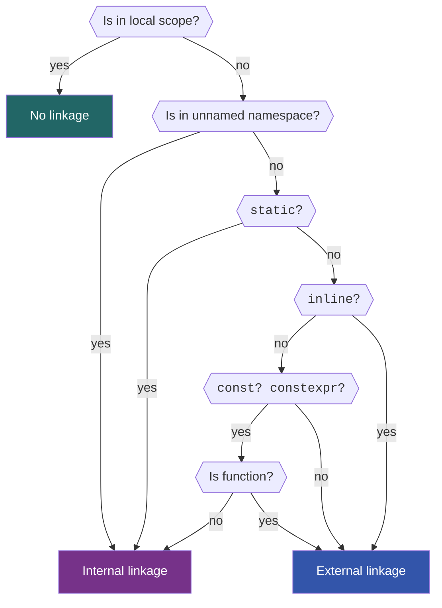

Keyword `static` outside of classes
---

<p align="center">
  <a href="https://youtu.be/7cpPQunjv4s"></a>
</p>


- [Keyword `static` outside of classes](#keyword-static-outside-of-classes)
- [Storage duration](#storage-duration)
  - [Automatic storage duration an local namespace scope](#automatic-storage-duration-an-local-namespace-scope)
  - [Static storage duration at namespace scope](#static-storage-duration-at-namespace-scope)
  - [Static storage duration at function scope](#static-storage-duration-at-function-scope)
  - [Very rare use of `static` to create mutable variables with static storage duration from a function](#very-rare-use-of-static-to-create-mutable-variables-with-static-storage-duration-from-a-function)
  - [Summary of controlling storage duration with `static`](#summary-of-controlling-storage-duration-with-static)
- [Linkage](#linkage)
  - [What is linkage](#what-is-linkage)
  - [Levels of linkage](#levels-of-linkage)
  - [How to understand what linkage a name has](#how-to-understand-what-linkage-a-name-has)
  - [Back to `static`](#back-to-static)
    - [Don't use `static` to declare functions in header files](#dont-use-static-to-declare-functions-in-header-files)
    - [Don't define functions and data `static` in a source file, use unnamed namespace instead](#dont-define-functions-and-data-static-in-a-source-file-use-unnamed-namespace-instead)
    - [Don't define functions and data as `static` in header files, use `inline` instead](#dont-define-functions-and-data-as-static-in-header-files-use-inline-instead)
- [Conclusion and a rule of thumb](#conclusion-and-a-rule-of-thumb)
- [Final words](#final-words)


The keyword [`static`](https://en.cppreference.com/w/cpp/keyword/static) is a very important keyword in C++ and is used a lot. Honestly, because of a very general name, it is probably a bit _overused_. Largely speaking, it can be used outside of classes and inside classes and these two cases are slightly different. Today we focus on the former - using `static` outside of classes. If you are interested in how and when to use `static` _inside_ of classes, I'm linking that [lecture here](static_in_classes.md).

Anyway, as for using `static` _outside_ of classes, I have good news for you. If you follow my advices about best practices from before then the rule-of-thumb for using `static` outside of classes in modern C++ (that is at least C++17) is very simple - don't! **Don't use `static` at all!**

Technically, that's all you need to know. But if you want to learn _why_ you shouldn't use `static` outside of classes then keep watching this video and see how deep this rabbit hole goes :wink:

<!-- Intro -->

In order to explain why we mostly don't want to use `static` for anything outside of classes we will need to talk about why we _might_ want to use `static` in the first place. The keyword `static` really controls just two things:
- The storage duration
- The linkage

These terms feel a bit technical and I can already feel the confused faces on the other side of the screen from me :wink: So... what do these words mean?

## Storage duration
We'll start with "storage duration". Every object declared in C++ has a certain lifetime, or, in other words, a _storage duration_. There is a number of storage durations that any variable can have. At this point, we care about these two:
- Automatic storage duration
- Static storage duration

To explain the difference between the two we start with a simple `main` function that calls another function `Foo` that has a single local variable in it:


```cpp
void Foo() {
  int local_value{};
  // Use local_value
}

int main() {
  Foo();
  return 0;
}
```
We can then draw the execution time of the program, `main` and `Foo` functions as lines that indicate that most of the time that the program runs is spends in `main`, while most of the time in `main` is spent executing the `Foo` function.

### Automatic storage duration an local namespace scope

If we focus now on the lifetime of the `local_value` variable, shown as a blue box in the image, it lives as long as is needed for the execution of the `Foo` function. It's memory is allocated at the start of the function and is freed at the end of the scope.

We say that a variable `local_value` and any other variable that lives in some local scope, has **automatic storage duration**.

### Static storage duration at namespace scope
Let's further extend our example by adding some value `kValue`, that is defined at **namespace scope**, and use it to initialize our `local_value`. We will introduce it in an unnamed namespace following the best practices, but it could live in any namespace including the global one.


```cpp
namespace {
constexpr int kValue{42};
}  // namespace

void Foo() {
  int local_value{kValue};
  // Use local_value
}

int main() {
  Foo();
  return 0;
}
```
The `kValue` here has what is called the **static storage duration** and lives for the whole duration of the program. Its data gets allocated at the start of the program and freed at the end of the program.

:bulb: While we _can_ use `static` for an object definition at namespace scope to indicate that it has the static storage duration **we don't have to**, as any such object has **static storage duration** by default. So all of these definitions are equivalent in terms of storage duration:
<!--
`CPP_SETUP_START`
$PLACEHOLDER
int main(){}
`CPP_SETUP_END`
`CPP_COPY_SNIPPET` consts/main.cpp
`CPP_RUN_CMD` CWD:consts c++ -std=c++17 -c main.cpp
-->
```cpp
constexpr auto answer_1 = 42;
const auto answer_2 = 42;
auto answer_3 = 42;  // 😱 please don't create non-const globals...

// 😱 please don't use static like this ...
static constexpr auto answer_4 = 42;
static const auto answer_5 = 42;
static auto answer_6 = 42;  // 😱 please don't create non-const globals...
```

### Static storage duration at function scope
Finally, use of `static` can extend the storage duration of a local variable within some function scope to have the static storage duration.

If we add `static` in front of our `local_value` definition, it will have **static storage duration** again even though it is defined in a local scope. Now `local_value` will get allocated when the function `Foo` is called for the first time and will get de-allocated at the end of the program.


```cpp
namespace {
constexpr int kValue{42};
}  // namespace

void Foo() {
  static int local_value{kValue};
  // Use local_value
}

int main() {
  Foo();
  return 0;
}
```

Such a `static` variable will be initialized when first encountered during the program flow and destroyed when the program exits.

One interesting peculiarity of using `static` to extend the storage duration of a local variable is that if the flow of our program encounters the line that defines the `static` variable multiple times, this line will **only be executed once**. The reason being is that the variable already exists when the program flow reaches the variable definition for the second time, so the definition is skipped and the existing `static` variable is simply used further.


```cpp
namespace {
constexpr int kValue{42};
}  // namespace

void Foo() {
  static int local_value{kValue};
  // Use local_value
}

int main() {
  Foo();
  Foo();
  return 0;
}
```

You can easily see (*C++) this for yourself if you replace the creation of a `static` `int` object by the creation of a `static` object of your custom type that prints something on construction and destruction and calling the function `Foo` a couple of times from `main`, like we just discussed. Your object will only print once from its constructor and destructor. Really, give this a try, it should take you no more than a couple of minutes by now :wink:

### Very rare use of `static` to create mutable variables with static storage duration from a function
Now this is where I lied to you a bit about _never_ needing to use `static`. There _are_ situations when you might want to create a static object within a function. In our `Foo` function we could have returned a non-const reference and essentially model a global mutable variable that will live for the rest of the program lifetime.
```cpp
int& Foo() {
  static int local_value{};
  return local_value;
}

int main() {
  // Reference to our static variable.
  auto& ref_to_static = Foo();
  return 0;
}
```

This is also very similar to the **singleton** design pattern and we will talk about what it is and why you probably don't want to use it later in the course. Anyway, if you remember what we talked about before, you will know that using non-`const` global variables tends to wreak havoc and we probably don't want to do this.

> For completeness, one use for such an improvised singleton is to deal with the **"static initialization order fiasco"**. It should not hit you as long as you only create variables that rely *exclusively* on values within the same translation unit and not across translation unit boundaries.
> <!--
> `CPP_SKIP_SNIPPET`
> -->
> ```cpp
> constexpr int kAnswer = 42;  // ✅ this is ok.
> constexpr int kValue = kValueFromOtherCppFile;  // ❌ not ok!
> ```
>
> I won't go into details here, but tell me in the comments if you are interested to learn more about it!

### Summary of controlling storage duration with `static`
It's time we sum up where `static` can be used and what it gives us in terms of changing the storage duration of variables. Generally speaking, when used outside of classes, `static` can be used in two places:
- at namespace scope which adds nothing as any such variable already has the static storage duration
- inside of functions to extend the local variable's automatic storage duration to static storage duration, which we mostly don't want to do

:bulb: So, all in all, there is really **no good reason** to use `static` to change storage duration of our variables!

## Linkage
Now it's time to talk about the second thing that `static` controls - linkage.

<!-- The topic of linkage is a bit nuanced and I tried to simplify it as much as I could here, but if I missed something or made a mistake in my strive for simplicity, please comment below this video. Oh, and maybe subscribe once you're at it? You did make it this far, right? Anyway, back to linkage. -->

### What is linkage
First, let me try to explain what linkage is by describing what it is used for. When we write programs we name things like our variables, classes, functions etc. We can think of linkage as of a property of any given name. This property basically controls if a name of any symbol can correspond (in other words - be linked) to its declaration in a different scope. We distinguish linkage of several levels that control which boundaries such links can cross:
- No linkage
- Internal linkage
- External linkage

Let's dive into these.

### Levels of linkage
Intuitively speaking, if we want some name to be available only in the current scope, it should have **no linkage**. As an example, any variable defined in any local scope usually has no linkage.
<!--
`CPP_SETUP_START`
$PLACEHOLDER

int main() {
  Foo();
}
`CPP_SETUP_END`
`CPP_COPY_SNIPPET` no_linkage/main.cpp
`CPP_RUN_CMD` CWD:no_linkage c++ -std=c++17 -c main.cpp
-->
```cpp
void Foo() {
  int bar;  // bar has no linkage
}
```

If a name should be available beyond local scopes but still **only** from within the same translation unit (think, within one `.cpp` file) - it should have **internal linkage**. The typical examples of these are constants defined at namespace scope, any data and functions put into an unnamed namespaces within a `.cpp` file. Oh, and also any `static` data and functions, but more on that in a minute.
<!--
`CPP_SETUP_START`
#include <string>
$PLACEHOLDER

int main() {}
`CPP_SETUP_END`
`CPP_COPY_SNIPPET` internal_linkage/main.cpp
`CPP_RUN_CMD` CWD:internal_linkage c++ -std=c++17 -c main.cpp
-->
```cpp
// Constants have internal linkage by default
constexpr int kGlobalConst{};  // 😱 should be inline
const std::string kGlobalWord{};  // 😱 should be inline


// In some cpp file
namespace {
// Everything within unnamed namespaces has internal linkage
constexpr int kNumber{};
const std::string kWord{};
void Foo() {}
}  // namespace

// Any static variable or function has internal linkage
static int kStaticVariable{};  // 😱 don't use static like this
static void StaticFoo(){}  // 😱 don't use static like this
```

Finally, **external linkage** is needed for symbols that need to be available globally throughout the program. These are usually classes, enums, non-`static`  (usually `inline`) functions and `inline` constants declared at namespace scope in some header files.
<!--
`CPP_SETUP_START`
#include <string>
$PLACEHOLDER

int main() {}
`CPP_SETUP_END`
`CPP_COPY_SNIPPET` external_linkage/main.cpp
`CPP_RUN_CMD` CWD:external_linkage c++ -std=c++17 -c main.cpp
-->
```cpp
// In some header file
// All of the below have external linkage
inline void GlobalFoo() {}
inline constexpr int kGlobalNumber{};
inline const std::string kGlobalString{};

void OtherGlobalFoo() {}  // 😱 should be inline
```

### How to understand what linkage a name has
In the end it is up to us which linkage our entities have. We can pick linkage of anything that we declare at declaration time by choosing **where** we put our declarations (local scope, namespace scope, unnamed namespace etc.) and by using keywords `const`, `constexpr`, `static` and `inline` all of which have their influence on linkage.

As you might start to suspect, the complete rules of how linkage is selected are slightly convoluted. If you want to figure out these rules in all details you can always read the cppreference pages for [linkage](https://en.cppreference.com/w/cpp/language/storage_duration) and [inline](https://en.cppreference.com/w/cpp/language/inline). The good news is that when _we_ write the code the rules to follow the best practices are pretty simple and I will summarize them at the end of this lecture.

However, in order to read the code written by others we have to dive a bit deeper into these convoluted rules. So, to save you the trouble of figuring out all of the intricate details, I came up with a flow chart. If we follow it, we can find out the linkage of any symbol we are looking at. This is helpful to debug code that we did not write and see issues in the code _before_ they happen as well as to know how to make sure the symbol we want to write has the linkage we want.



Here is how to read it. This chart should work with any function or data declaration you might encounter. First, if you are looking at a function, ignore the return type along with any const qualifiers it might have. Then, follow the chart by answering the questions.

Let's see a couple of examples that follow best practices:
<!--
`CPP_SETUP_START`
#include <string>
$PLACEHOLDER

int main(){}
`CPP_SETUP_END`
`CPP_COPY_SNIPPET` flow_char/main.cpp
`CPP_RUN_CMD` CWD:flow_char c++ -std=c++17 -c main.cpp
-->
```cpp
// In some hpp file
inline constexpr int kNumber{};  // external linkage
inline const std::string kWord{};  // external linkage
inline void Func();  // external linkage

// Lives in some cpp file
namespace {
constexpr int kOtherNumber{};  // internal linkage

void OtherFunc() {  // internal linkage
  int local_variable{};  // no linkage
}
}  // namespace
```
<!-- So, looking at the kNumber here, we can follow the chart: Is in in local scope? No, it's not! Is it in unnamed namespace? Nope! Does it use the static keyword? No, it doesn't. Is it inline? Yeah it is, which brings us to it having external linkage. Feel free to do this for all other examples or any other ones that you see in any code you encounter. -->

### Back to `static`
Now that we understand more about linkage, let's return back to the topic we actually wanted to chat about: `static` and why we mostly don't want to use it for free standing functions and data. As you can see from the flow chart that we just looked at, `static` has something of a superpower to decide if some entity has internal or external linkage. Anything that we mark as `static` will definitely have internal linkage and will only be visible within the same translation unit it is defined in. Which has its consequences.

#### Don't use `static` to declare functions in header files
One of these consequences is that it makes very little sense to **declare** (and not define) a `static` function in a header file:
<!--
`CPP_SETUP_START`
$PLACEHOLDER
static void Foo() {}

int main() {}
`CPP_SETUP_END`
`CPP_COPY_SNIPPET` static_declaration/main.cpp
`CPP_RUN_CMD` CWD:static_declaration c++ -std=c++17 -c main.cpp
-->
```cpp
// In some header file
// 😱 Don't do this...
static void Foo();
```
Any such function will have to be defined in _every source file_ this header will be included in. Not only that, but such a definition will only be seen from _within_ that same source file due to internal linkage that `static` enforces. Which means that we could have just defined this function in any such source file directly. So, don't declare functions in header files as `static`. Which brings us to my next point.

#### Don't define functions and data `static` in a source file, use unnamed namespace instead
When we _do_ define functions and data in a source file, we can still find some advice on the internet to use `static` in such definitions. I would argue that this advice is obsolete. If we go back to our chart, we can easily see that while `static` has a "superpower" to make anything have internal linkage, the unnamed namespaces have the same superpower. Without going too deep into details, it turns out that they are usually even more powerful in this regard. So, if we define some data or functions in some `.cpp` file, we should put them into an **unnamed namespace** instead of defining them as `static` (although technically, it won't be a bug):
<!--
`CPP_SETUP_START`
$PLACEHOLDER

int main() {}
`CPP_SETUP_END`
`CPP_COPY_SNIPPET` ok_not_ok/main.cpp
`CPP_RUN_CMD` CWD:ok_not_ok c++ -std=c++17 -c main.cpp
-->
```cpp
// In some source (cpp) file

// ❌ Don't
static constexpr int kStaticNumber{};
static void StaticFoo() {}

// ✅ Do
namespace {
  constexpr int kNumber{};
  void StaticFoo() {}
}
```

#### Don't define functions and data as `static` in header files, use `inline` instead
One final place where I could imagine `static` being used is when **defining** functions or data **in a header file**. Now, you might wonder why would anybody want to do this and the answer is: to avoid [One Definition Rule (ODR)](https://en.cppreference.com/w/cpp/language/definition) violations. Let's dig a bit into this.

ODR states roughly this: that any symbol must have **exactly one** definition in the entire program, i.e., across all of its translation units. Only `inline` symbols can have more than one definition which are then all assumed to be exactly the same.

If we naively define a function in a header file `foo.hpp`:
<!--
`CPP_SETUP_START`
$PLACEHOLDER

int main() {}
`CPP_SETUP_END`
`CPP_COPY_SNIPPET` raw_func/main.cpp
`CPP_RUN_CMD` CWD:raw_func c++ -std=c++17 -c main.cpp
-->
```cpp
// 😱 Use inline instead
void Foo() {}
```
And include this file into two source files `foo_1.cpp` and `foo_2.cpp` which are then compiled into two libraries, then we already violate ODR - we have two definitions of the function `Foo` in two different translation units. Granted, in this situation, these definitions are the same but there is a awful lot of things that can go wrong from this point on. Considering that ODR violations are not required to be checked by the linker, this can quickly lead to us finding ourselves in the undefined behavior land, which is typically a very painful experience. But that warrants a separate video. Please comment if you'd like to see a separate video on various ODR violations.

One way that people sometimes, I would say wrongly, fix this is by marking their function `static`, so in our case we would make our `Foo` function `static` in the `foo.h` header:
<!--
`CPP_SETUP_START`
$PLACEHOLDER

int main() {}
`CPP_SETUP_END`
`CPP_COPY_SNIPPET` static_raw_func/main.cpp
`CPP_RUN_CMD` CWD:static_raw_func c++ -std=c++17 -c main.cpp
-->
```cpp
// 😱 Use inline instead
static void Foo() {}
```
The reason people do this is that it _does_ help to avoid the ODR violation. Because `static` enforces internal linkage, the two translation units related to `foo_1.cpp` and `foo_2.cpp` that include our header will have their own **different** versions of the `Foo` definition not visible beyond their respective translation unit. Which means that ODR would not be violated.

This approach has one major downside though. Now every translation unit that includes our header will have it's own implementation of `Foo` baked in. Which, depending on what functions or data we define, can have a significant impact on the binary size. This can be a problem if we develop for, say, constrained hardware.

A proper way to fix this, would be to use `inline` instead of `static` here. Returning back to our flow chart, the "superpower" of `inline` is to enforce **external linkage** but one that is explicitly allowed by the ODR formulation. So, we can change the definition of our `Foo` function to `inline` inside of our `foo.hpp` file. And the same holds for any data. We should mark it as `inline constexpr` or `inline const`:
<!--
`CPP_SETUP_START`
$PLACEHOLDER

int main() {}
`CPP_SETUP_END`
`CPP_COPY_SNIPPET` inline_func_data/main.cpp
`CPP_RUN_CMD` CWD:inline_func_data c++ -std=c++17 -c main.cpp
-->
```cpp
// At namespace scope
inline void Foo() {}
inline constexpr int kNumber{};
```

<p align="center">
  <a href="https://youtu.be/QVHwOOrSh3w"></a>
</p>

This will lead the binary code for such functions and data to only exist once and to be linked everywhere they are needed, while still not violating ODR.

Note, though, that using `inline` is only safe **in header files**. Avoid using `inline` in source files as this can lead to its own ODR violations. But that is again probably a story for another video.

For another intuitive explanations on this, I urge you to watch [this video](https://www.youtube.com/watch?v=QVHwOOrSh3w) by Jason Turner on his C++ Weekly chanel about the differences between `static` and `inline` in this context.

## Conclusion and a rule of thumb
And I guess this pretty much sums up everything I wanted to talk about with regard to using, or rather **NOT** using `static` outside of classes. This has led us down a couple of rabbit holes, linkage being a pretty deep one.

But I hope that by now you see that **there is no need to use `static` outside of classes at all in modern C++**. Here is a guideline to follow along with this:

- When defining variables at namespace scope always mark them as `inline const` or, even better `inline constexpr`. Do **not** mark them `static`!
- When defining variables at local scope, do **not** mark them `static` unless you are explicitly implementing a singleton-like design pattern (which you probably shouldn't do anyway, stay tuned...)
- When declaring functions at namespace scope, declare (and define) them as `inline`. Do **not** use `static` for this!
- When declaring data or functions in an unnamed namespace, do not mark them as `static` or `inline`. Data should still be `const` or `constexpr`

## Final words
Understanding the key role that linkage and ODR play here is crucial to understanding what `inline` and, previously, `static` were designed to solve. Initially `static` was introduced into the C programming language and then was inherited by C++. It was in the times when C did not have `inline` and in C++ it meant something different and could not be used as it can be now. Thankfully, we live in better times now, which makes `static` close to obsolete when used outside of classes. Now if you want to know how to use `static` *in classes* you can see a video about that once it's ready and maybe also go back and refresh how `inline` plays a huge role in creating [libraries](headers_and_libraries.md) in C++.
