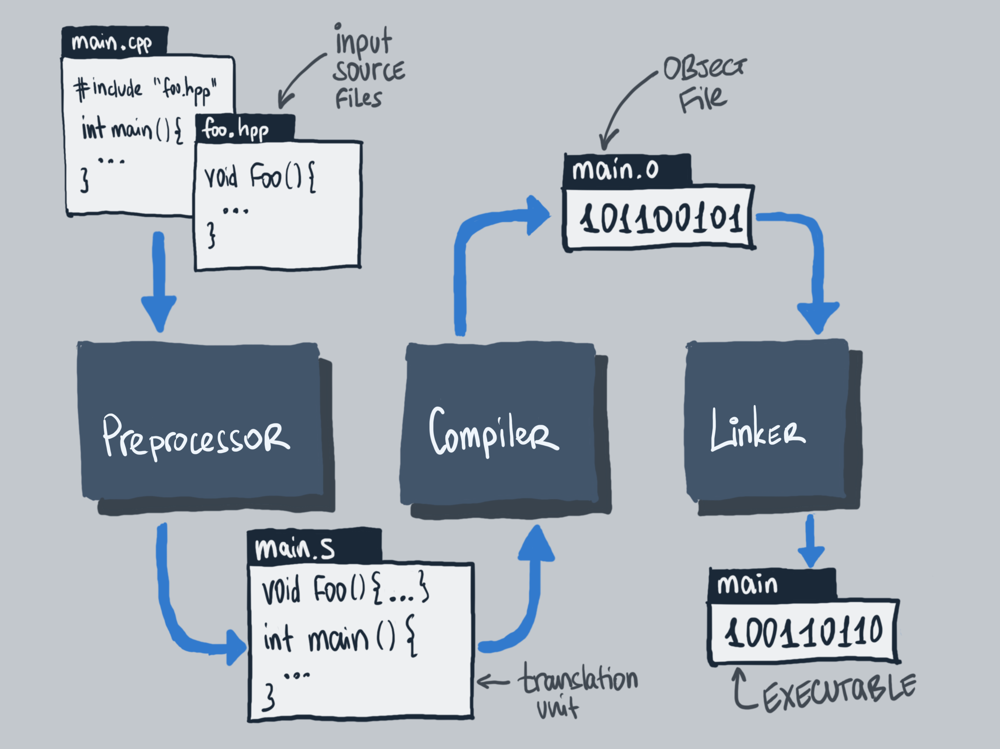
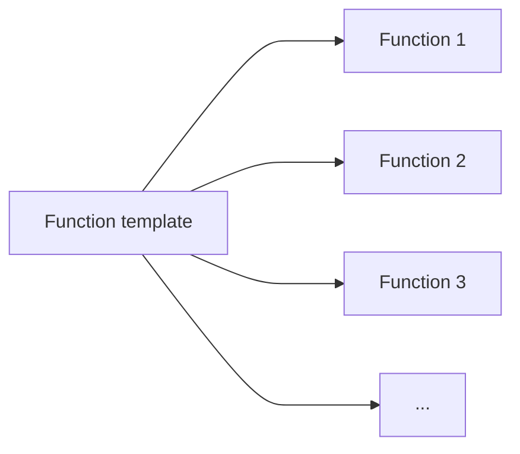
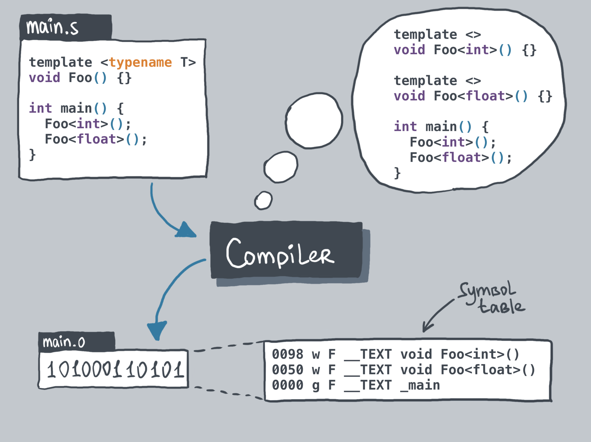

What templates do under the hood
---

<p align="center">
  <a href="https://youtu.be/blah"></a>
</p>

- [What templates do under the hood](#what-templates-do-under-the-hood)
- [Compilation process recap](#compilation-process-recap)
- [Compiler uses templates to generate code](#compiler-uses-templates-to-generate-code)
- [Hands-on example](#hands-on-example)
- [Try it out!](#try-it-out)
- [Compiler is lazy](#compiler-is-lazy)
- [Summary](#summary)


We've talked a little bit about **why** we need templates [in the previous lecture](templates_why.md) but to properly use them we are still missing two important parts of the equation: the **what**, as in what is it that they **actually** do and the **how**, as in how to use them without shooting our leg off.

Today, we focus on the **what**. We will try to build an intuition about what the compiler does when we write templated code so that we all are on the same page that templates are not black magic and the intuition behind what they do is actually easier to understand than many fear it to be.

<!-- Intro -->

## Compilation process recap
First, let's do a small recap of how our executables are generated. We already talked about the full compilation process [before](headers_and_libraries.md) but the gist is that all of our input source files pass through three stages to become executable files:

<p align="center">

</p>

They start by going through the **preprocessor** that unwraps any macros and includes and creates translation units from our source files. These files are then transformed into object files by the **compiler**. Finally, the object files get linked together by the **linker** to form the actual executables.

## Compiler uses templates to generate code
Everything that we discuss today happens in the **compiler**. So, let's discuss what it does when we use a function or class template.

<!-- The intuition is that -->
> 🚨 **Intuition:** compiler uses templates to generate code. Which also explains their name. A function, struct or a class template is just that - a template for a normal function, struct or a class.



While this **is** a simplified rule of thumb, it serves as a good intuition for what happens to our templates during compilation.

<!-- Use animation -->
To be slightly more precise, let us illustrate what happens to a simple function template `Foo` during the compilation.

<p align="center">

</p>

Any time the compiler encounters a call that it associates to a template, it **instantiates** a concrete **specialization** of that function, substituting all of its template arguments for the actually used types. Such specializations are then compiled into their binary form and for all means and purposes behave just like normal functions. If we inspect the resulting object file, we will see all of our concrete functions in it!

This, however, means that if we have, say, a function template and use it with many types we will have many specializations of that function compiled into our binary - one for each combination of types it is used with.

## Hands-on example
For completeness, let's now see how we can check these things by compiling some real code by hand. Well, ok, not by hand but by using a compiler directly from the command line :smile:. For that we will go back to our `maximum.cpp` file from the previous lecture:
```cpp
template <typename NumberType>
NumberType Maximum(NumberType first, NumberType second) {
  if (first < second) { return second; }
  return first;
}

int main() {
  Maximum(42, 23);
  Maximum(3.14F, 42.42F);
  Maximum(3.14, 42.42);
}
```
It defines the `Maximum` function template and uses it with 3 different types. Not the most useful code but a good illustration.
We can compile it from the terminal in the same way we compiled code into object files before (note the `-c` flag, we are only interested in compilation into an object file):
```bash
# Generates maximum.o object file
c++ -std=c++17 -c maximum.cpp
```
This produces an object file `maximum.o`. This object file is just a binary file in [`ELF`](https://en.wikipedia.org/wiki/Executable_and_Linkable_Format) format on Linux, or [`Mach-O`](https://en.wikipedia.org/wiki/Mach-O) format on MacOS, at least by default. But for our purposes, both will equally do. We can inspect these files with the `objdump` command. At this point, we are interested in looking at the part of this file that lists all the available symbols - **a symbols table**. We can read it by providing the appropriate flags to the `objdump` executable (`-t` to get a symbols table and `-C` to get better looking symbol names) and we expect to see all the compiled function names briefly mentioned there:
<!--
`CPP_SKIP_SNIPPET`
-->
```cpp
λ › objdump -tC maximum.o

maximum.o:      file format mach-o arm64

SYMBOL TABLE:
...
00000000000000e0  w    F __TEXT,__text double Maximum<double>(double, double)
0000000000000098  w    F __TEXT,__text float Maximum<float>(float, float)
0000000000000050  w    F __TEXT,__text int Maximum<int>(int, int)
0000000000000000 g     F __TEXT,__text _main
```
Now if we look carefully at this output (which I trimmed a little), we see that there is the `_main` symbol for our `main` function as well as three different `Maximum` functions with the types that match those that we used in the `main` function: `int`, `double`, and `float`.

Furthermore, if we run this code in the excellent [compiler explorer](https://godbolt.org/z/9zjoTh7Kq) (link <!--below--> brings you to this same example) we can also see the actual calls to the compiler-generated concrete function specializations. We just have to look for `call` statements in the instructions generated by the compiler. The other details in the output are not too important for us for now.

## Try it out!
Please do try it all out yourself, so that you're sure that I'm not lying to you :wink: Really, you see that these examples take minutes to write and you can learn so much from them! Don't be afraid to fail, try other functions, try more types, try class and struct templates and call their methods that might have templates of their own! You don't even need to read the documentation at this point, just try what feels like it should work!
<!-- And if anything doesn't work that you think should work, please feel free to ask any clarifying questions under this video! -->

## Compiler is lazy
After we've experimented with all of this for a while, we might start noticing something...

> 🚨 Note, and this is very important, that the compiler is **lazy**! Only those specializations are generated that are **actually used**!

If we didn't use the `Maximum` function it would not have been compiled at all! Now if we think about it for a minute it becomes clear why this is so --- looking at the `Maximum` function template itself, in isolation, the compiler doesn't know which types it will be used with!
<!-- Add a travolta meme -->

Technically, it could be any type we want! So the compiler cannot (and should not) compile the code for **all** the types it knows about. There are multiple reasons for this:
1. It would take ages --- it would need to compile **a lot** of code!
2. The binary size would be huge --- it would need to contain all that binary code!
3. It might still not be enough as maybe we will give out our template function as part of a header-only library and we simply don't know which types it might be used with!

This is actually something that plays a lead role in making splitting templated code between header and source files confusing for beginners. We'll talk about this very soon, but if you understand everything that we talked about here, you should face no issues there too, when the time comes.

## Summary
Ok, time for a short recap and after it we can be sure that we know the most important bits about what is it that the compiler does to our templated code.

Long story short, the compiler generates concrete functions, classes or structs for any template instantiation whenever it encounters such instantiations in the code. It then treats these as any other ordinary functions, classes or structs and proceeds by compiling them into binary object files. From this point on these symbols in the object files behave just like any normal class or function and those we already know about :wink:

And that's it, conceptually, this is everything that happens under the hood when we use templates. Now, there are a lot of intricate details on which exact concrete binary code gets generated depending on how we declare and define our templates and we will cover this in the next video!

<!-- Until then, please feel free to watch the video about why we might want to use templates in the first place if you haven't already!

And at this, time to end this video, so, as always, thanks for watching and see you in the next one! Bye! -->
