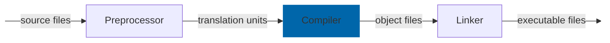

What templates do under the hood
---

<p align="center">
  <a href="https://youtu.be/blah"></a>
</p>

- [What templates do under the hood](#what-templates-do-under-the-hood)
- [Short overview](#short-overview)
- [Compiler generates binaries with code generated from templates](#compiler-generates-binaries-with-code-generated-from-templates)
  - [Illustration of this process](#illustration-of-this-process)
  - [Hands-on example of this process](#hands-on-example-of-this-process)
  - [Compiler generates code from templates in a lazy way](#compiler-generates-code-from-templates-in-a-lazy-way)
- [Summary](#summary)


We've talked a little bit about why we need templates [in the previous lecture](templates_why.md) but to properly use them we are still missing two important parts of the equation: the **what** as in what is it that they **actually** do and the **how** as in how to use them without shooting our leg off.

Today, we focus on that **what** that I just mentioned. We will try to build an intuition what the compiler does when we write templated code so that we all are on the same page that templates are not black magic and actually are easier to understand than many fear them to be.

<!-- Intro -->

## Short overview
<!-- TODO: explain this better -->
So, let's discuss **what** happens under the hood when we use a function or class template.

And the simplified answer is surprisingly easy:
> 🚨 Templates are used by the compiler to generate code. Which also explains their name. A function or a class template is just that - a template for a normal function or a class.

Let's look at this graphically. We already talked about the full compilation process [before](headers_and_libraries.md) but the gist is that all of our input source files pass through three stages to become executable files:

They start by going through the **preprocessor** that unwraps any macros and includes and creates translation units out of our source files. These files are then transformed into object files by the **compiler**. Finally, the object files get linked together by the **linker** to form the actual executables.

## Compiler generates binaries with code generated from templates
### Illustration of this process
<!-- Animate this using a Foo example -->
Out of all these stages, **compiler** is the one we care about today as its the one that **generates concrete functions and classes from their templates**. Any time the compiler encounters a call that it associates to such a template, it **instantiates** a concrete implementation of that function or class substituting all of our template arguments for the actually used types. This means that if we have a template function and use it with many types we will have many copies of that function compiled into our binary - one for each combination of types it is used with.

### Hands-on example of this process
For completeness, let's also illustrate it one more time by inspecting a binary that we get from actual code that we compile by hand. Well, at least the compiler does :smile:. For that we will go back to our `maximum.cpp` file from before:
```cpp
template <typename NumberType>
NumberType Maximum(NumberType first, NumberType second) {
  if (first < second) { return second; }
  return first;
}

int main() {
  Maximum(42, 23);
  Maximum(3.14F, 42.42F);
  Maximum(3.14, 42.42);
}
```
Which we can compile from the terminal in the same way we compiled examples before:
```cmd
c++ -std=c++17 -o maximum maximum.cpp
```
This produces an object file `maximum.o`. This object file is just a binary file in `ELF` format on Linux, or `Mach-O` format on MacOS, at least by default. But for our purposes, both will equally do. We can inspect these files with `objdump` command. At this point, we are interested in looking at the part of this file that lists all the available symbols - *a symbols table*. We can read it by providing the appropriate flags (`-t` to get a symbols table and `-C` to get better looking symbol names):
<!--
`CPP_SKIP_SNIPPET`
-->
```cpp
λ › objdump -tC maximum.o

maximum.o:      file format mach-o arm64

SYMBOL TABLE:
...
00000000000000e0  w    F __TEXT,__text double Maximum<double>(double, double)
0000000000000098  w    F __TEXT,__text float Maximum<float>(float, float)
0000000000000050  w    F __TEXT,__text int Maximum<int>(int, int)
0000000000000000 g     F __TEXT,__text _main
```
Now if we look carefully at this output (I trimmed it a little), we see that there is the `_main` symbol for our `main` function as well as three different `Maximum` functions with the types that match those that we used in the `main` function. Which is exactly what we expect to happen.

Please try it out yourself, so that you're sure that I'm not lying to you :wink: Really, you see that these examples take minutes to write and you can learn so much from them! Don't be afraid to fail, try other functions, try more types, try classes and structs! You don't even need to read the documentation at this point, just try what feels logical!
<!-- And if anything doesn't work after you tried to understand why it doesn't, please feel free to ask any clarifying questions under this video! -->

### Compiler generates code from templates in a lazy way
After you've experimented with all of this for a while, you might start noticing something...

> 🚨 Note, and this is very important, that the compiler is **lazy**! Only those functions, classes or structs are generated that are actually used!

If we didn't use the `Maximum` function it would not have been compiled at all! Now if we think about it for a minute it becomes clear why this is so --- looking at the `Maximum` function itself, in isolation, the compiler doesn't know which types it will be used with! Technically, it could be any type we want! So the compiler cannot (and should not) compile the code for **all** the types it knows about. There are multiple reasons for this:
1. It would take ages --- it would need to compile **a lot** of code!
2. The binary size would be huge --- it would need to contain all that binary code!
3. It might still not be enough as maybe we will give out our template function as a header-only library and we simply don't know which types it might be used with!

This is actually something that makes splitting templated code between header and source files confusing for beginners. We'll talk about this very soon, but if we understand everything that we talked about here, we should face no issues there too.

## Summary
Ok, time for a short recap and after it we can be sure that we know the most important bits about what is it that transforms templates into actual binary code.

Long story short, the compiler generates concrete functions, classes or structs for any template instantiation whenever it encounters such instantiations in the code. It then treats them as any other ordinary function, class or struct and proceeds by compiling them into binary object files. From this point on these symbols are indistinguishable from any normal class or function and those we already know about :wink:
<!-- Check the last phrase -->

And that's it, conceptually, this is everything that happens under the hood when we use templates. Now, there are a lot of intricate details on which exact concrete binary code gets generated depending on how we declare and define our templates and we will cover this in the next video!

<!-- Until then, please feel free to watch the video about why we might want to use templates in the first place if you haven't already or jump to the next video about how to write templated code as soon as I record and upload it!

As always, thanks for watching and see you in the next one! Bye! -->
