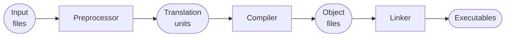

Intro
---

<p align="center">
  <a href="https://youtu.be/blah"></a>
</p>

- [Intro](#intro)
- [Why we want to use templates](#why-we-want-to-use-templates)
  - [Generic functions](#generic-functions)
  - [Generic classes](#generic-classes)
  - [Generic algorithms and design patterns](#generic-algorithms-and-design-patterns)
  - [Compile-time meta programming](#compile-time-meta-programming)
  - [All of the above provide zero-runtime-cost abstractions](#all-of-the-above-provide-zero-runtime-cost-abstractions)
- [What happens under the hood?](#what-happens-under-the-hood)


[Templates](https://en.cppreference.com/w/cpp/language/templates) are definitely one of the features that make C++ so popular and powerful. They provide an extremely versatile mechanism to write truly generic code and allow building meaningful abstractions only paying for these benefits with some compilation time (well, at least in theory)!
<!-- Link Chandler's talk -->

Speaking of compilation time, using templates rigorously in our code makes sure that we catch most of our bugs at compile time, even before our code gets to run, let alone shipped to any users! If you ask me, I'd say that compile-time errors are the best errors to be had.

However, with great power come long error messages, so historically, templates were met with fear and anxiety by the beginners in C++. Which is a pity because I believe that templates are **the** way to write modern C++ code. Oh, and speaking of modern C++, if your main flavor of C++ is C++20, then you'll probably use concepts as opposed to raw templates most of your time. So we'll probably talk about concepts soon too.

But today I want to start with templates, what they are useful for, and how to avoid typical pitfalls when using them.

<!-- Intro -->

## Why we want to use templates
Ok, so, as always, let's start with **why**. To put it simply:
> 🚨 Templates are used to abstract algorithms (or logic) away from a concrete implementation, which improves code reusability and readability while having little to no runtime impact.

Such abstractions can take various forms of different complexity, varying on **what** we abstract away and **how** we create our abstractions. These range from abstracting away the type for some simple algorithms or containers to a full fledged abstraction of a whole algorithm conditioned on some compile-time computed logic.

And you've already seen (and used) templates in this very course! Remember `std::array` and other STL containers? Well, they are all implemented as class templates which allows them to store any type you want in them. Also, we've used operator `<<` with `std::cout` for a while now and guess what - it is nothing else than a function template. This is what allows it to print so many values of so many types!

Anyway, one thing is to know that _somebody_ can write function and class templates and another thing is to know that we can do it ourselves, so let's have a look at a couple examples.

### Generic functions
The first, somewhat classical use-case, allows us to abstract our function logic from the actual argument types. For example, think about a `Max` function that must compute a maximum of two numbers. These numbers can of course be of various types, like `int`, `float`, `double` or any other type for which `Max` makes sense. Naïvely, we would need to explicitly implement this function for any type we want to use with it:
```cpp
// Not a great idea to repeat the code so many times! 😱
// Imagine changing the implementation later!
int Max(int first, int second) {
  if (first < second) { return second; }
  return first;
}
float Max(float first, float second) {
  if (first < second) { return second; }
  return first;
}
double Max(double first, double second) {
  if (first < second) { return second; }
  return first;
}
// And so on for any other type we care about 😱

int main() {
  Max(42, 23);
  Max(3.14F, 42.42F);
  Max(3.14, 42.42);
}
```


<!-- Animate rename to Maximum one by one -->
Due to function overloading that we touched upon before, the compiler will be able to pick the correct function for each of our function calls. But think what will happen if we ever need to change the name of this function, say to `Maximum`. We would have to make sure that we change it everywhere and don't miss a single implementation. And while in this case it looks easy, believe me that this is one of the major sources of errors in the real-world big projects. I, for one, don't trust myself on this. Whenever there are manual actions to be taken, I can guarantee you that I will make a mistake, so it would be cool to reduce such manual repetitions and let something else do our work for us.

<!-- Animate by removing code from before -->
It turns out that this is one of those typical situations when templates come to the rescue! Look how neatly we can rewrite it all using the keyword `template`:
```cpp
// Works for any type as long as the implementation compiles ✅
template <typename NumberType>
NumberType Maximum(NumberType first, NumberType second) {
  if (first < second) { return second; }
  return first;
}

int main() {
  Maximum(42, 23);          // int
  Maximum(3.14F, 42.42F);   // float
  Maximum(3.14, 42.42);     // double
}
```
Let's unpack what we see. The body of the function looks just as before. The only difference is the part **before** the function:
<!--
`CPP_SKIP_SNIPPET`
-->
```cpp
template <typename NumberType>
```
This is what makes this a **function template**. The `typename NumberType` is a [template parameter](https://en.cppreference.com/w/cpp/language/template_parameters) that represents a type to be used in our function. We called this type `NumberType` but this name is just for our convenience, the compiler does not care about it. It just knows that this is a definition of a function template `Maximum` with two parameters of the same type `NumberType` which in this case is guessed by the compiler based on the types of the provided parameters. And as long as the code inside of this function compiles for any given type `NumberType` it will do what it is supposed to do. An by the way, because `NumberType` represents a type, we will name it as we name our types, using `PascalCase`. So now, when we call our `Maximum` function with parameters of `int`, `float`, or `double` it just magically works! Neat, right?

At this point, I want to make sure that we are on the same page about templates allowing us to write the code once that will work for many different types as long as they logically fit to what we want to do. We will talk about all of the details later.

### Generic classes
The same story holds for generic classes too. As an example, think about the `std::array` class that we touched upon before. By the way, this class is part of STL, which stands for **S**tandard **T**emplate **L**ibrary :wink:. For such a class, we want to be able to store **any** type of data in it and we don't want to have a separate implementation for all of those situations:
<!--
`CPP_SETUP_START`
#include <cstddef>
$PLACEHOLDER
`CPP_SETUP_END`
`CPP_COPY_SNIPPET` array/main.cpp
`CPP_RUN_CMD` CWD:array c++ -std=c++17 main.cpp
-->
```cpp
template <typename UnderlyingType, std::size_t kSize>
struct Array {
  // Some implementation
};

int main() {
  Array<int, 20> int_array;
  Array<double, 20> double_array;
}
```
<!-- Talk about naming -->
Note how we have two template parameters here instead of one. The first one, `UnderlyingType` is a type and the second one, `kSize`, is a `std::size_t` number. There can be any number of such parameters, but more on that later in this lecture. Oh, and we name the number-like template parameters just like constants: in `CamelCase` with the prefix `k`, following the [Google C++ Style Guide](https://google.github.io/styleguide/cppguide.html#Constant_Names).

### Generic algorithms and design patterns
Anyway, apart from these "simple" abstractions, templates can be used for so much more, like implementing abstract design ideas in a composable and separable fashion. Just to give you one concrete example, we could think about an `Image` class, just like the one that we implemented in this course before, and implement a method `Save` for this class that takes in the `SavingStrategy` instance which will take care of the actual saving logic, separating the concerns of our classes better:
<!--
`CPP_SETUP_START`
#include <vector>
using Color = int;
$PLACEHOLDER
`CPP_SETUP_END`
`CPP_COPY_SNIPPET` image/image.hpp
-->
```cpp
class Image {
  public:
    // Note how a member function can also be a template function
    template <typename SavingStrategy>
    void Save(const SavingStrategy& strategy) const {
      strategy.Save(pixels_);
    }
    // Skipping any other class details for the sake of example.

  private:
    std::vector<Color> pixels_{};
};
```
This way we could have two (or more) different classes, say `JpegSavingStrategy` and `PngSavingStrategy` that would implement their own logic to save an array of pixels to disk and the reason we want this is that as long as they have their own `Save` method, we would not need to touch our `Image` class should we want to change how the images are stored to disk at some point in the future.

For completeness, let's have a look an example implementation of one of these strategies and see how it ties into our new `Image` class. I will omit the actual saving to disk as this is not important for understand for the topic that we have at hand today.
<!--
`CPP_SETUP_START`
#include "image.hpp"
#include <filesystem>
#include <vector>
$PLACEHOLDER
`CPP_SETUP_END`
`CPP_COPY_SNIPPET` image/main.cpp
`CPP_RUN_CMD` CWD:image c++ -std=c++17 main.cpp
-->
```cpp
class JpegSavingStrategy {
  public:
    JpegSavingStrategy(const std::filesystem::path& path) : path_{path} {}

    void Save(const std::vector<Color>& pixels) const {
      // Logic to save pixels to path_ as jpeg data.
    }

  private:
    std::filesystem::path path_{};
};

int main() {
  Image image{}; // Somehow create an image.
  image.Save(JpegSavingStrategy{"image.jpg"});
  return 0;
}
```
While not the most elegant implementation it still separates the concerns of these classes while maintaining code readability and having little to no runtime overhead. Here, we pass a `JpegSavingStrategy` object into our `Image` class, so the image does not need to know anything about such a strategy apart from the fact that it needs to have a method `Save`. There are other ways to implement similar behaviors in C++ without using templates, by embracing **O**bject **O**riented **P**rogramming (OOP) and we will talk about this extensively later, but there are other trade-offs to be made there and I believe that in modern C++ we embrace templates more and more.

Anyway, stay tuned for more about this and similar concepts.

### Compile-time meta programming
Finally, we can also do really advanced things, like compile-time meta-programming, but I won't talk about it much at the moment because this is a bit of an esoteric and advanced knowledge.

But, just to not leave you hanging it allows us to create complex logic that happens **during compilation**, allowing to further reduce the runtime of our programs. There are many dedicated keywords in this topic like SFINAE (that allows conditional compilation), type traits (that allow to tell certain things about types, like `std::is_integral` etc.) and many more but these do add complexity to our code and the resulting code is generally less readable, so I'll leave it for some future time as it probably warrants a separate lecture in the future. That being said, I believe that these advanced features have paved a way to the C++20 concepts which are much more pleasant to use and we will definitely talk about those too.

### All of the above provide zero-runtime-cost abstractions
Anyway, even without going into the details, I hope that it was easy to grasp why we would want to have a mechanism like this. I also hope, that looking at those functions and classes the syntax was more or less self explanatory. If you understand the gist of what we've just talked about, then you understand why templates are so important.
<!-- Probably end of the first video -->

## What happens under the hood?
<!-- TODO: explain this better -->
Now that we've discussed the **why**, let's discuss **what** happens under the hood when we use a function or class template.

And the simplified answer is surprisingly easy:
> 🚨 Templates are used by the compiler to generate code. Which also explains their name. A function or a class template is just that - a template for a normal function or a class.

Let's look at this graphically. We already talked about the full compilation process [before](headers_and_libraries.md) but the gist is that all of our input text files pass through three stages to become executable files:

They start by going through the preprocessor that unwraps any macros and includes and creates translation units out of our cpp files. These files are then transformed into object files by the compiler. Finally, the object files get linked together to form the actual executables.

Out of all these stages, **compiler** is the one we care about here as its the one that **generates concrete functions and classes from their templates**. Any time the compiler encounters a call that it associates to such a template, it **instantiates** a concrete implementation of that function or class substituting all of our template arguments for the actually used types. This means that if we have a template function and use it with many types we will have many copies of that function in our binary - one for each combination of types it is used with.

For completeness, let's go back to our `maximum.cpp` file from before:
```cpp
template <typename NumberType>
NumberType Maximum(NumberType first, NumberType second) {
  if (first < second) { return second; }
  return first;
}

int main() {
  Maximum(42, 23);
  Maximum(3.14F, 42.42F);
  Maximum(3.14, 42.42);
}
```
Which we can compile from the terminal in the same way we compiled examples before:
```cmd
c++ -std=c++17 -o maximum maximum.cpp
```
This produces an object file `maximum.o`. This object file is just a binary file in `ELF` format on Linux, or `Mach-O` format on MacOS. But for our purposes, both will equally do. We can inspect these files with `objdump` command. At this point, we are interested in looking at the part of this file that lists all the available symbols - *a symbols table*. We can read it by providing the appropriate flags (`-t` to get a symbols table and `-C` to get better looking symbol names):
<!--
`CPP_SKIP_SNIPPET`
-->
```cpp
λ › objdump -tC maximum.o

maximum.o:      file format mach-o arm64

SYMBOL TABLE:
...
00000000000000e0  w    F __TEXT,__text double Maximum<double>(double, double)
0000000000000098  w    F __TEXT,__text float Maximum<float>(float, float)
0000000000000050  w    F __TEXT,__text int Maximum<int>(int, int)
0000000000000000 g     F __TEXT,__text _main
```
Now if we look carefully at this output (I trimmed it a little), we see that there is the `_main` symbol for our `main` function as well as three different `Maximum` functions with the types that match those that we used in the `main` function. Which is exactly what we expect to happen. Note that only those functions are generated that are actually used, so template generation is lazy and if we didn't use the `Maximum` function it would not have been compiled at all. Please try it out yourself, so that you're sure that I'm not lying to you :wink:

Ok, time for a short recap and after it you know the most important bits about how templates become actual binary code. Long story short, the compiler generates a concrete function or class for any template instantiation and compiles them into a binary object file. From this point on these symbols are indistinguishable from any normal class or function and those we already know about :wink:

<!-- Create an animation for this -->
